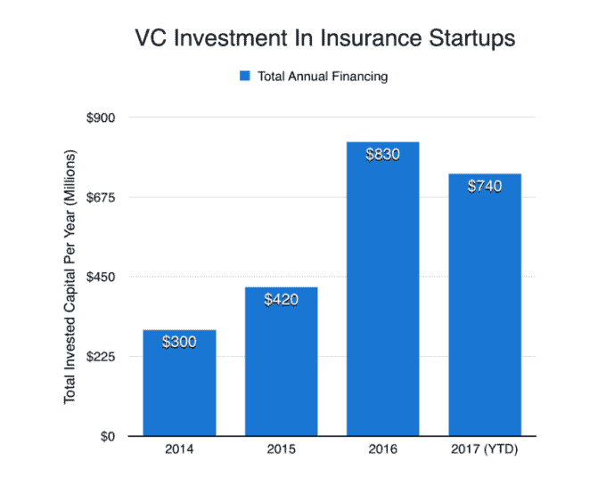
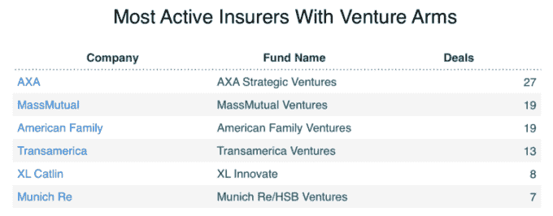

# 风投喜欢保险，即使你不喜欢 

> 原文：<https://web.archive.org/web/https://techcrunch.com/2017/07/22/vcs-love-insurance-even-if-you-dont/>

乔安娜·格拉斯纳撰稿人

More posts by this contributor

大多数人讨厌购买保险，他们也不喜欢谈论它。这可能就是为什么你不太可能在谈话中听到这个行业目前的转变，即使是在创业圈子里。

但毫无疑问，保险交易中有大量的风险资金。投资大幅增加，风投们认为，在未来几年，我们将看到购买保险的方式和投保项目类型都将发生重大变化。

今年到目前为止，专注于保险的初创公司(不包括亚洲大陆 ***** )已经筹集了超过 7 亿美元，几乎相当于他们在 2016 年全年筹集的资金，而 2016 年本身就是该领域特别繁忙的一年。大部分融资热潮来自大型保险公司本身，它们正在支持和领导保险初创公司以及金融服务等相关领域的公司的更多轮融资。在下图中，我们看到了过去四年的资金增长情况:

保险投资总额在很大程度上是由几个大轮驱动的。在过去的一年中，两个最大的资金接受者是技术支持的健康保险公司 Bright Health 和按英里付费的汽车保险公司 Metromile，它们分别为 T2 和 T4 筹集了 1.6 亿美元和 1.53 亿美元。2016 年，健康保险提供商 [Oscar Health](https://web.archive.org/web/20221005181748/https://www.crunchbase.com/organization/oscar#/entity?utm_source=cb_daily&utm_term=content&utm_content=intro&utm_medium=email&utm_campaign=20170719) 获得了[4 亿](https://web.archive.org/web/20221005181748/https://www.crunchbase.com/funding-round/a97cb14b7501982b460fd8fe7c567049?utm_source=cb_daily&utm_term=content&utm_content=intro&utm_medium=email&utm_campaign=20170719)美元的增长资金，超过所有保险初创投资的 40%。

> 乍一看，保险和风险投资似乎是奇怪的一对。

也有很多小型和中型的回合正在进行。过去一年，保险领域至少有 75 家公司融资 100 万美元或以上，其中约四分之一的融资额为 2000 万美元或以上。它们还涵盖了广泛的商业模式，包括新的保险类别、用于比较和购买保险的在线平台以及供提供商更好地评估风险的工具。

人们可能倾向于将这些初创公司称为行业颠覆者——只不过它们最大的支持者似乎是该领域的老牌参与者。

## 我们听说你喜欢保险

如上所述，相当大一部分融资来自保险公司本身，其中许多公司都有专门的风险部门。按轮次计算，最活跃的似乎是法国跨国保险公司安盛的风险投资部门安盛战略投资公司。这只成立两年的基金在过去两年里投资了[二十几家公司](https://web.archive.org/web/20221005181748/https://www.crunchbase.com/organization/axa-strategic-ventures/investments?utm_source=cb_daily&utm_term=content&utm_content=intro&utm_medium=email&utm_campaign=20170719)，包括本月领投的[650 万美元](https://web.archive.org/web/20221005181748/https://www.crunchbase.com/funding-round/78826718db1e874eff59ad27bdc38134?utm_source=cb_daily&utm_term=content&utm_content=intro&utm_medium=email&utm_campaign=20170719)给 [QLoo](https://web.archive.org/web/20221005181748/https://www.crunchbase.com/organization/qloo?utm_source=cb_daily&utm_term=content&utm_content=intro&utm_medium=email&utm_campaign=20170719) 的一轮融资，QLoo 是一家名人支持的开发人工智能工具的开发商，用于绘制文化品味。保险巨头 MassMutual 的风险投资部门 MassMutual Ventures 也很忙，在过去的三年里支持了 16 家公司。在下面的图表中，我们来看几个例子:

著名的风险投资公司也在主导重要的几轮融资。例如，新企业联盟(New Enterprise Associates)支持 Metromile 和光明健康(Bright Health)，以及种子期商业保险初创公司[因迪奥](https://web.archive.org/web/20221005181748/https://www.crunchbase.com/organization/indio#/entity?utm_source=cb_daily&utm_term=content&utm_content=intro&utm_medium=email&utm_campaign=20170719)。Accel 和 Bessemer 在过去几年里也分别进行了三项保险投资。多年来，大多数最大的硅谷公司在这个领域至少有一项投资。

但是，尽管看起来有大笔资金进入保险交易，这些数字可能低估了活动的广度。一个原因是，保险领域许多快速增长的参与者也在其他行业开展业务，比如金融服务业。一个恰当的例子是信用评分独角兽 [Credit Karma](https://web.archive.org/web/20221005181748/https://www.crunchbase.com/organization/credit-karma#/entity?utm_source=cb_daily&utm_term=content&utm_content=intro&utm_medium=email&utm_campaign=20170719) ，它现在提供汽车保险报价以及信用卡和其他金融产品的报价。

## 接下来呢？

乍一看，保险和风险投资似乎是奇怪的一对。风险投资就是为了未来更高的回报而冒大风险，而保险就是量化和降低风险。

然而，在小额配置中，风险投资实际上可能是一种降低风险的策略，因为它允许大型、根深蒂固的参与者跟踪并入股可能重塑其行业的新贵企业。值得注意的是，当今许多最大的保险公司的历史可以追溯到几个世纪前。如果没有一些适应时代变化的能力，他们不会坚持这么久。

***** Crunchbase 对保险投资总额的统计不包括亚洲，亚洲的交易较少，但有一些大型交易。迄今为止规模最大的是中国在线保险公司众安，两年前融资逾 9 亿美元。