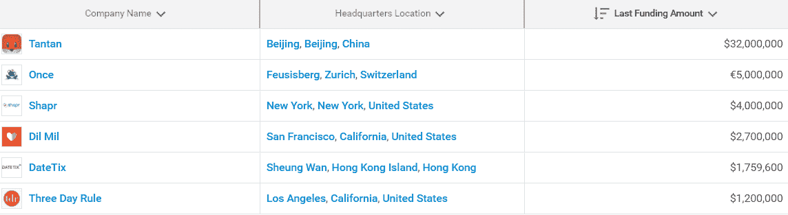

# 风投在约会应用上向左滑动

> 原文：<https://web.archive.org/web/https://techcrunch.com/2017/02/14/vcs-swipe-left-on-dating-apps/>

乔安娜·格拉斯纳撰稿人

More posts by this contributor

风险投资家和约会初创公司之间的爱情似乎遇到了困难。

根据 Crunchbase company profile 的数据，过去一年，风险投资在该领域的投资有所下降，平均轮次减少，获得资助的公司减少。特别是，美国的初创公司资金匮乏，只有不到 700 万美元投资于自称为约会公司的早期前景。

在全球范围内，过去 12 个月，自称为约会公司的已披露风险、种子和增长资金总计约 4700 万美元。(最大的资助在下表中突出显示。)

全互动列表[此处](https://web.archive.org/web/20230228044952/https://www.crunchbase.com/app/lists/dating/508b48a6-2ca3-4151-9a3d-f1b336b94220/company?new=false)。

过去一年的资金投入低于前 12 个月的 2.8 亿美元[。(尽管公平地说，其中最大的一部分(2.4 亿美元)流向了中国的约会应用百合网，这是一个有十年历史的类别领导者。)](https://web.archive.org/web/20230228044952/https://www.crunchbase.com/app/lists/dating-2015/4e83d3d2-b39f-4cd3-81a3-d8e4e62f2e07/company?new=false)

虽然最近的数字看起来很低，但应该注意的是，风投和约会初创公司从未有过特别成功的关系史。通常它们在战略上是不匹配的。风投寻找的是忠诚、活跃、长期的用户群，约会类应用往往会吸引周期性的短期用户。货币化也是一个挑战，因为付费应用必须与免费应用竞争。也很少有资金雄厚的收购者对这个领域感兴趣。

此外，风险资本家并没有从约会中赚到很多钱。近年来在美国推出的最成功的约会应用 [Tinder](https://web.archive.org/web/20230228044952/https://www.crunchbase.com/organization/tinder#/entity) ，是由互联网出版巨头 IAC 在 2012 年孵化的，并没有依赖风险投资。该领域唯一的美国大型上市公司 [Match Group](https://web.archive.org/web/20230228044952/https://www.crunchbase.com/organization/match-group#/entity) ，也是 IAC 的一个分支。

几年前，风险投资者曾希望移动约会应用程序 Zoosk 能够进行一次大规模的 IPO，但是失败了。这家旧金山公司已经筹集了超过 6000 万美元的风险资金，一年多前以不利的市场条件为由取消了计划中的公开募股。自那以后，它再也没有结束过一轮比赛。

对于过去几年获得融资的公司来说，有一些共同的属性可以揭示投资者对约会初创公司的要求。

最重要的是，总部设在中国很有帮助。在过去的两年里，迄今为止最大规模的约会初创公司融资流向了中国公司。过去一年最大的一笔资金，3200 万美元，流向了以 Tinder 为原型的移动约会应用软件。 [Blued](https://web.archive.org/web/20230228044952/https://www.crunchbase.com/organization/blued#/entity) 是一款基于 [Grindr](https://web.archive.org/web/20230228044952/https://www.crunchbase.com/organization/grindr#/entity) 为同性恋用户开发的应用程序，它以 3 亿美元的估值募集了一轮未披露规模的 C 系列。

投资者似乎也被提供工具缩小和简化约会选择的初创公司所吸引。这个阵营中有[咖啡遇见百吉饼](https://web.archive.org/web/20230228044952/https://www.crunchbase.com/organization/coffee-meets-bagel#/entity)，它将女性和少数对她们感兴趣的男性配对。到目前为止，它已经筹集了 1100 万美元。[三天规则](https://web.archive.org/web/20230228044952/https://www.crunchbase.com/organization/three-day-rule#/entity)为用户提供私人媒人，是去年为数不多的获得 A 系列资金的美国约会公司之一，收入达 120 万美元。总部位于苏黎世的[one](https://web.archive.org/web/20230228044952/https://www.crunchbase.com/organization/once-3#/entity)每天为订户配对一场精挑细选的比赛，筹集了 560 万美元。  

或许如果廷德的母公司 Match 能够证明约会应用能够推动每用户收入的长期增长，国内投资者会对该行业产生更多兴趣。就目前而言，这个情人节看起来像是当地风险投资界和那些认为每个人都有爱情机会的企业家之间取消的约会。