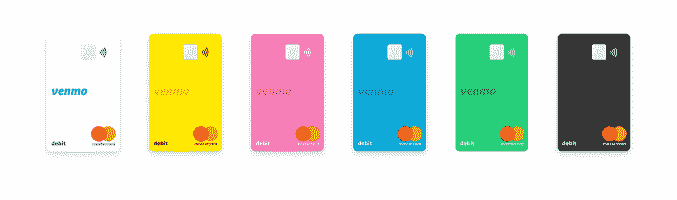
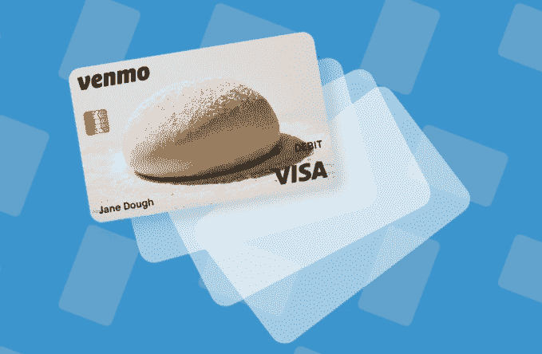
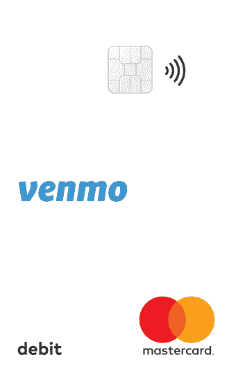

# Venmo 正式推出自己的万事达品牌借记卡 

> 原文：<https://web.archive.org/web/https://techcrunch.com/2018/06/25/venmo-officially-launches-its-own-mastercard-branded-debit-card/>

继去年 [Visa 品牌借记卡](https://web.archive.org/web/20221207050624/https://techcrunch.com/2017/09/11/venmo-is-offering-users-an-ugly-physical-debit-card/)的 beta 测试之后，Venmo 今天正式与万事达卡合作推出自己的借记卡。新卡将允许 Venmo 用户在美国任何接受万事达卡的地方支付，并将交易记录到用户的 Venmo 账户，以便与朋友分享。它也可以在 ATM 上使用，从 Venmo 的帐户余额中提取资金。

拥有 Venmo 的 PayPal 拒绝解释该公司为何在测试期间从与 Visa 合作转向现在与 MasterCard 合作，只回答没有回答，称“继续与两家公司保持有价值的合作关系。”

然而，由于这一变化，现有的测试版客户将无法继续使用他们的 Visa 品牌 Venmo 卡，而是被邀请注册 Bancorp 银行发行的新 Venmo MasterCard。

*上图:Venmo 的新卡*

使用新卡的一个好处是，它的正面将不再有一团难看的面团(明白吗？面团？*呻吟…* )。更新后的卡片不再开玩笑，有六种颜色可供选择，包括黑色或白色，以及黄色、粉色、蓝色或绿色等亮色。

该公司解释说，它从测试版客户那里了解到，用户更喜欢“更简化的外观”，同时还提供个性化选项。

更年轻的千禧一代客户是 Venmo 的目标市场，他们[确实倾向于关心](https://web.archive.org/web/20221207050624/https://thefinancialbrand.com/61696/chase-sapphire-reserve-millennial-travel-rewards-credit-card/)他们的卡片看起来像什么，最近[偏爱](https://web.archive.org/web/20221207050624/https://www.nytimes.com/2017/04/14/business/american-express-chase-sapphire-reserve.html?mcubz=0&login=email&auth=login-email)金属卡片。但是 Venmo 的测试卡[在很大程度上错过了时尚的标志](https://web.archive.org/web/20221207050624/https://techcrunch.com/2017/09/11/venmo-is-offering-users-an-ugly-physical-debit-card/)。与此同时，竞争对手 Square 的现金卡[看起来更高档](https://web.archive.org/web/20221207050624/https://www.recode.net/2017/5/4/15552912/square-cash-debit-card-black-rollout-launch-jack-dorsey)是一种黑色卡，正面有用户自己的激光打印签名。

*上图:Venmo 的老卡*

当然，使用 Venmo 卡的主要好处不在于它的外观，而在于它可以更容易地分摊晚餐、饮料和其他购物。

Venmo 卡购买的商品将显示在您的帐户上，并提供与朋友分享的选项，而不必记得向您的朋友收取任何费用。(卡交易默认为私有，但您可以选择在 Venmo feed 中共享它们，即使它们没有被拆分。)

为了充分利用这一功能，您需要打开充值功能，当您需要购买时，该功能会自动使用您的默认资金来源(即您的银行帐户)向您的 Venmo 余额中添加资金。

与测试版的卡不同，万事达品牌的 Venmo 卡可以用来在显示万事达卡、Cirrus、PULSE 或 MoneyPass 接受标志的 ATM 上每天提取高达 400 美元。美国 MoneyPass 自动柜员机不收取任何费用，而其他自动柜员机将收取 2.50 美元的国内取款费。

该卡还可以从 Venmo 应用程序中进行管理，允许用户激活他们的新卡，重置他们的 PIN 码，甚至禁用丢失或被盗的卡。

使用该卡购物是免费的，即使你在销售点获得现金返还。然而，该公司表示，如果在银行取回现金需要签名，你将比柜台国内取款费多支付 3.00 澳元。

虽然这种卡可以取代 Venmo 用户钱包中的信用卡，但它不能取代你的银行卡——无法像在银行那样将现金或支票存入你的 Venmo 账户，也没有账单支付功能。

该产品的推出正值年轻消费者使用支付卡和银行服务的方式发生转变之际。许多人转向在线银行，如 Simple、Varo 和 Chime，并通过点对点(p2p)支付应用程序转移资金，如 PayPal、Venmo 以及现在由银行支持的应用程序 Zelle。苹果和谷歌等科技公司也在进入 p2p 领域，例如，他们有自己的服务，如 [Apple Pay Cash](https://web.archive.org/web/20221207050624/https://support.apple.com/explore/apple-pay-cash) 和 [Google Pay Send](https://web.archive.org/web/20221207050624/https://pay.google.com/send/home) 。

Venmo 表示，其新卡从今天开始限量发行。测试版客户将被邀请注册，其他人需要填写表格来保留他们的位置。