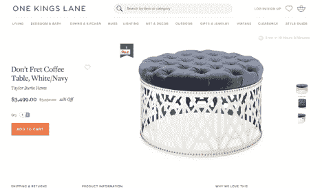
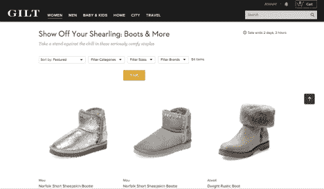
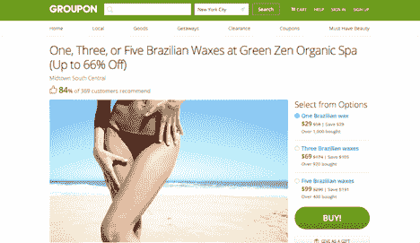
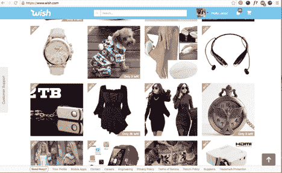

# 风险投资在网上购物方面很糟糕

> 原文：<https://web.archive.org/web/http://techcrunch.com/2016/01/15/venture-capital-is-terrible-at-online-shopping/>

杰斯·金博尔·莱斯利撰稿人

More posts by this contributor

又是一天，硅谷的电子商务爆发了:Gilt Groupe [刚刚以其估值的一小部分出售了](https://web.archive.org/web/20230402043108/https://techcrunch.com/2016/01/07/gilts-unicorn-tale-comes-to-an-end-after-being-acquired-for-250m/)(并筹集了资本)，据报道，One Kings Lane 是下一个死亡的。之前是 Fab.com 在表现严重不佳后被无偿出售——啊，Fab，第一只十亿美元的零售“独角兽”,生来就有斗鸡眼和恶作剧的膝盖。

就在 Fab 被杀的 24 个月前，马克·安德森，硅谷的大懒虫 Fratelli 霸王，称 Fab 为“[电子商务类别杀手](https://web.archive.org/web/20230402043108/http://www.businessinsider.com/marc-andreessen-picks-three-companies-he-thinks-will-break-out-next-2012-3)”。在 Fab 之前，Groupon 与证券交易所进行了极其尴尬的交易，市值损失了 90%。然后是 Living Social，我认为它正处于一个超级悲伤的商业枢纽，现在它向名人的家里出售地图或类似的东西。

网购失败比比皆是。

那么，为什么这么多拥有如此多重要风险投资资金的零售创业公司会如此命运多舛呢？让我们仔细阅读这些数字垃圾场中的产品，自己找出答案。

## **国王巷一号**

请看这个来自国王巷奇才队的“不要烦恼咖啡桌”。因为很明显，有几千美元可以花在一个搁脚凳上的人会对自己说，“为什么要去一个声誉好的商店并得到很好的客户服务，而我可以在这里，在一个国王巷的未经证实的土地上挥霍，并节省 11%！？！毕竟，像大多数价格在 3400 美元以上的仿维多利亚奥斯曼帝国的人一样，我是一个打折购物者。钉钉那种客户心态，1KL。搞定了。

**硅谷评估:**

*   One Kings Lane 最高价值:10 亿美元以上
*   迄今投入资本:2.25 亿美元
*   传闻售价:1.5 亿美元

## **镀金**

2016 年 Gilt 上有什么卖的？为什么这些看起来像被困在工厂传送带上的肮脏闪亮的靴子。Ugg 靴子——很像 Gilt 的闪购本身——正好在九年前流行。

**硅谷评估:**

*   金边债券的最高价值:10 亿美元
*   迄今投入资本:2.71 亿美元
*   售价:2.5 亿美元

## **Groupon**

来 Groupon 购买打折比基尼蜡吧！因为如果一个陌生人要把滚烫的岩浆倒在你的比基尼部位，没有什么比知道你付给他们的钱比他或她的价值少更能减轻你的恐惧了。事实上，减少了 66%。

**硅谷评估:**

*   Groupon 上市时的价值:126 亿美元
*   投资资本:11.4 亿美元

**证券交易所评估:**

*   IPO 时的股价:26.11 美元
*   今日股价:2.86 美元

## **祝愿**

现在我们来认识一下垃圾场电商类的最高领袖——[Wish.com](https://web.archive.org/web/20230402043108/http://wish.com/)。愿望就是做以前不可能的事情:筹集一大笔钱，甚至不假装自己很棒或很好。

忘记那些关于叛逆的年轻马克·扎克伯格穿着帽衫而不是西装去见风险投资家的传说吧。愿望甚至没有淋浴或穿衣服。Wish.com 没有“不要烦恼咖啡桌”出售——哦，当然没有！！Wish.com 是一家价值数十亿美元的公司。这是它的主页，我认为这是放弃的安德烈亚斯·古尔斯基:

那只狗要死了吗？有人能叫兽医吗？这是一款什么样的手表，我甚至看不到商标，等等让我放大，一款*时尚日内瓦罗马数字人造革模拟水晶腕表？*这是为你最大的敌人购物的地方吗？

**硅谷评估:**

*   愿望的价值:超过太阳系(我估计)
*   迄今投入的资本:5.78 亿美元(这不是一个错别字；因此，上述估价)

想知道他们会损失那 5.78 亿美元中的多少吗？我的猜测是，全部。我无法想象一个需要愿望的世界，即使是在第一次星际战争期间。

为什么我把这些失败的大部分归咎于风险投资，而不是创始人本人？因为大多数这些网站(愚蠢的科技泡沫副产品废话【Wish.com 不包括在内)曾经是有趣的产品。曾经有一段时间吉尔特绝对统治着纽约。曾几何时，Fab 是我们在屏幕上发现的最伟大、最漂亮的东西。在一个早期的转折点，在一个国王巷的背后有一个有趣且可行的想法。

所有这些业务的麻烦都来自类固醇的扩展过程，而不是业务启动过程。有时候，对于中小型零售商来说，一个好主意对于大型零售商来说是一个糟糕且不可能的主意。

这一系列糟糕透顶的失败的另一个原因可能与性别有关。所有这些电子商务网站的一个共同点是，它们面向女性销售:

*   **One Kings Lane:** 没有找到数字，但首席执行官道格·麦克[说，](https://web.archive.org/web/20230402043108/http://zurb.com/soapbox/events/40/Doug-Mack-ZURBsoapbox)“我们有一个非常女性、非常富裕、非常 i-device 的观众群。”
*   **Fab:** 自称[60%的](https://web.archive.org/web/20230402043108/https://gigaom.com/2012/05/16/fab-steps-up-social-dumps-google-for-pinterest/)用户是女性。
*   Groupon:宣称 67%的用户是女性。
*   吉尔特:宣称 70%的用户是女性。

硅谷虚荣的风险投资体系缺少什么？女人！在硅谷从事交易的风险资本家中，女性仅占 4%。也许是出于支持但不理解女性在其中扮演重要角色的傲慢，硅谷现在得到了它应得的奖赏。

所有自我意识越来越强的硅谷风投:购物比你想象的更难。当你落后时，承认失败并放弃。