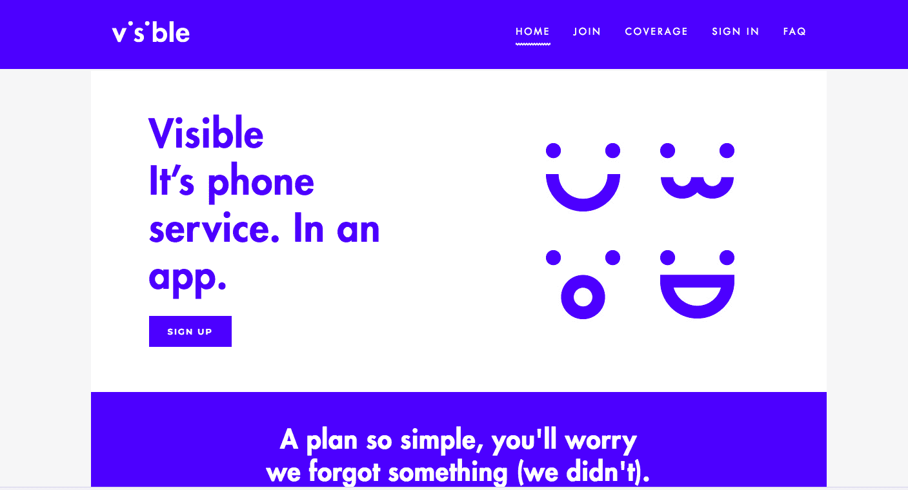
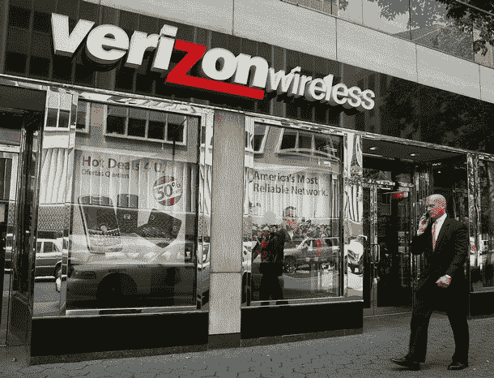

# 威瑞森悄悄推出了一家初创公司，提供每月 40 美元的无限数据、短信和通话时间 

> 原文：<https://web.archive.org/web/https://techcrunch.com/2018/05/10/verizon-stealthily-launched-a-startup-offering-40-per-month-unlimited-data-messaging-and-minutes/>

今年早些时候，[威瑞森](https://web.archive.org/web/20221210045026/https://www.verizonwireless.com/)悄悄推出了一家名为 [Visible](https://web.archive.org/web/20221210045026/https://www.bevisible.com/) 的新创公司，以 40 美元的极低价格提供无限数据、分钟和消息服务。

要订阅该服务，用户只需下载 Visible 应用程序(目前仅在 iOS 上可用)并注册即可。目前，订阅只接受邀请，潜在订户必须从已经是当前可见成员的人那里获得邀请。

一旦注册完成，Visible 将在第二天发送一张 sim 卡，一旦安装，用户就可以访问威瑞森的 4G LTE 网络，随心所欲地播放视频、发送短信和打电话。

Visible 表示，月底没有节流，用户可以使用基于互联网的支付服务支付，如 PayPal 和 Venmo(由 PayPal 所有)。

这项服务只能在解锁的设备上使用——目前，几乎只有 iPhone 用户可以使用。

Visible 的营销主管明宰奥姆斯(Minjae Ormes)表示:“这是一个已经酝酿了一年左右的想法。“战略方面有一个核心团队。有一个由五到十人组成的核心小组提出了这个想法。”

该公司不愿透露威瑞森为启动业务投入了多少资金，但领导团队主要由前员工组成，比如公司首席执行官米格尔·基罗加(Miguel Quiroga)。

“我会这样想的..我们是平台中的电话服务，让你做任何事情。我们的发布方式和应用信息。你在手机上做其他一切事情，如果你问别人手机是你的生活，你会花很多时间，”Ormes 说。他们的想法是，“让我们给你一部手机，你可以直接从你的手机上激活它，并准备好去看看它是如何产生共鸣的。”

这是我们公司霸主(威瑞森拥有 Oath，它拥有 TechCrunch)的一个有趣的举动，它已经是无线服务领域的老大，拥有大约 1.5 亿用户，而美国电话电报公司为 1.416 亿用户，[即将合并的](https://web.archive.org/web/20221210045026/https://techcrunch.com/2018/04/29/t-mobile-and-sprint-have-finally-announced-a-merger-agreement/) Sprint 和 T-Mobile 的用户基数为 1.262 亿。

对威瑞森来说，新公司可能会推迟裁员。据 *[【华尔街日报】](https://web.archive.org/web/20221210045026/https://www.wsj.com/articles/verizon-holds-its-ground-in-wireless-market-1524582013)* 称，该公司上个季度减少了 24000 个后付费电话连接，这给其客户群带来了一些压力(但实际上并没有那么大)。

移动电信仍然是威瑞森未来商业计划的核心，即使美国电话电报公司等其他运营商希望更深入地挖掘内容(虽然 Go90 已经失败，但威瑞森[并没有完全放弃内容计划](https://web.archive.org/web/20221210045026/https://techcrunch.com/2018/01/11/source-verizon-to-sharpen-content-strategy-with-ott-video-service-iot-platform/)*)。收购 Oath 增加了约 12 亿美元的品牌收入(？)到威瑞森，但它远非美国电话电报公司收购时代华纳时那种媒体巨头。*

 *威瑞森似乎正在通过联网设备、工业设备、自动驾驶汽车和 5G 网络的发展来寻求其他移动服务，以实现未来的增长。

每个无线运营商都在努力开发 5G 技术，预计今年年底将在全国范围内推广。威瑞森最近完成了其 11 个城市的试运行，并指望扩大网络的能力，以推动新的服务。

正如 [Motely Fool 指出的](https://web.archive.org/web/20221210045026/https://www.fool.com/investing/2018/05/10/verizon-aims-to-be-much-more-than-a-phone-company.aspx)，所有这一切都发生在威瑞森通过其威瑞森连接部门为工业和商业应用增加新的网络功能——部分来自于[以 24 亿美元收购 Fleetmatics，](https://web.archive.org/web/20221210045026/https://techcrunch.com/2016/08/01/verizon-buys-fleetmatics-for-2-4b-in-cash-to-step-up-in-telematics/)，威瑞森在 2016 年收购了 Telogis，Sensity Systems 和 LQD Wifi，以加强其移动设备连接服务。

与此同时，挑战大型无线运营商的新贵正来自四面八方。2015 年，[谷歌推出了自己的无线服务 Project Fi，](https://web.archive.org/web/20221210045026/https://techcrunch.com/2015/04/22/google-launches-its-own-wireless-service-project-fi/)与传统运营商竞争，商业内幕[刚刚报道了](https://web.archive.org/web/20221210045026/http://www.businessinsider.com/wing-cell-phone-service-versus-verizon-att-2018-5)另一个潜在的无线战士 Wing。

由创建媒体网站 Elite Daily 的团队创建的 [Wing](https://web.archive.org/web/20221210045026/https://www.wingalpha.com/) 使用 Sprint 手机信号塔提供服务。

大卫·阿拉博夫(David Arabov)和联合创始人乔纳森·弗朗西斯(Jonathan Francis)在为之前的业务支付了 2600 万美元后，没多久就又回到了初创企业的竞争中。与 Visible 不同，Wing 不是一个一刀切的计划，而是一个更加传统的 MVNO。根据该公司的网站，该公司有一系列计划，从 17 美元的翻盖手机开始，增加到每月 27 美元的无限制计划。

随着运营商继续面临服务费、合同锁定和可怕选项的投诉，新的选项必将出现。在这种情况下，看起来威瑞森正试图使自己成为这些航空母舰之一。*