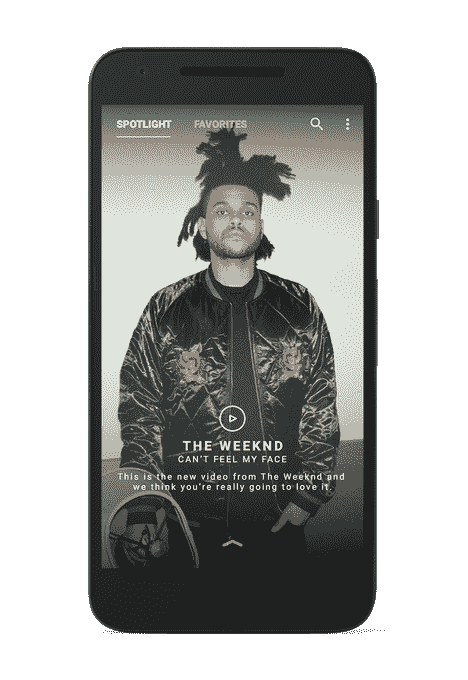

# Vevo 的新的更个性化的音乐应用程序来到 Android & Apple TV 

> 原文：<https://web.archive.org/web/https://techcrunch.com/2016/02/11/vevos-new-more-personalized-music-app-comes-to-android-apple-tv/>

最近几个月，Vevo 一直在努力扩展其品牌，从 YouTube 上最知名的原创音乐视频提供商，发展成为一家独立的音乐发现服务提供商。该公司在 11 月推出了升级的 iOS 体验，作为这一更大愿景的一部分，今天已经将这一体验扩展到 Android 和 Apple TV。

与 iOS 版本类似，新的 Vevo Android 应用程序也更加注重个性化。在首次推出时，该应用程序将提示用户选择他们最喜欢的艺术家，以便开始训练 Vevo 的推荐算法。这一过程允许该应用程序创建一个特殊的“聚焦”订阅源，其中包含根据个人兴趣定制的播放列表和视频。作为定制的结果，该应用程序立即创建了一个名为“我的第一个播放列表”的播放列表。

还有一个“收藏夹”部分，用来记录你最喜欢的歌曲，还有一个“新的你”播放列表，灵感来自 Spotify 的“探索周刊”。像它的竞争对手一样，Vevo 也定期发布这个新的播放列表——它每周一更新，该公司说。

除了将改进后的移动用户界面从 iOS 扩展到 Android，Vevo 今天还在 Apple TV 上推出了。这个 tvOS 应用程序与用户的移动应用程序同步，以便将他们的播放列表和收藏夹带到大屏幕上。但这款应用不仅仅是其手机版的放大版。

相反，Vevo 设计了 Apple TV 应用程序，以便在你只想观看最喜欢的视频，而不是必须主动管理播放列表和曲目选择的时候，提供更多的向后倾斜体验。由于 Vevo 现在能够更好地了解用户的个人口味，Apple TV 应用程序可以轻松地自动播放你喜欢的视频。

然而，如果你想控制，你也可以这样做。tvOS 应用程序还支持浏览视频、搜索，以及管理收藏夹和播放列表的能力。当然，你在 Apple TV 上所做的更改也会同步回你的移动应用程序。

Vevo 是一家由环球和索尼控股的合资企业，多年来与 YouTube 一直保持着共生但有时紧张的关系。例如，Vevo [在 YouTube 发布自己的音乐视频应用的同一天发布了更新的 iOS 应用](https://web.archive.org/web/20220930214634/https://beta.techcrunch.com/2015/11/12/vevo-follows-youtube-musics-debut-with-an-upgraded-music-app-of-its-own/),这很能说明问题。

在新任首席执行官埃里克·休斯(Erik Huggers)的领导下，该公司一直试图摆脱 YouTube 的阴影，成为自己的目的地。埃里克·休斯之前创建并推出了 BBC 的 iPlayer 和英特尔的 OnCue(后来被 TechCrunch 母公司收购，成为 go90)。

“艺术家和观众应该得到美妙的音乐视频体验，无论是在移动设备上还是在联网电视上，”[在一份声明中说。“我们新的 Apple TV 应用程序的推出代表着 Vevo 的一个重要里程碑。我们继续投资于我们认为是音乐视频和相关原创内容的优质平台。”](https://web.archive.org/web/20220930214634/http://www.vevo.com/c/EN/US/news/vevo-unveils-new-apple-tv-application)

最近，从 Spotify 到 Apple Music，再到 Pandora 和其他公司，该行业的所有主要参与者都在为音乐流媒体应用程序添加个性化元素。例如， [Pandora 上个月推出了一个新的“浏览”体验](https://web.archive.org/web/20220930214634/https://beta.techcrunch.com/2016/01/28/pandora-revamps-its-app-to-better-compete-with-spotify-apple-music/)，它会向你展示与你相关的艺术家，你使用这项服务越多，这种体验就会越好。该公司最近还增加了“拇指纹收音机”——混合了用户的喜好和推荐。

与此同时，Apple Music 试图通过其“For You”部分推荐内容，Spotify 也超越了其推荐播放列表，帮助推荐附近的音乐会。

但是 Vevo 更大的竞争其实是它自己。或者说，它自己的视频可以在 YouTube 上看到。Vevo 目前拥有超过 160，000 个视频，平均每月在全球范围内观看 120 亿次。然而，随着越来越多的用户在移动和联网设备上观看，该公司有机会开拓自己的利基市场，并扩大其专用用户群。

要做到这一点，它需要让用户对使用其独立应用程序感兴趣，而不是在 YouTube 上寻找其内容。Vevo 改进的外观和感觉与这些更强大的个性化功能相结合，是这方面的良好开端。

此外，该公司告诉我们，它现在有大约四分之三的视图是在美国以外的地方制作的，在拉丁美洲和西欧等安卓有很强影响力的地区增长很快。该公司指出，这为 Vevo 打开了一个更大的潜在市场。

新的应用程序可以在 Google Play 和 Apple TV 应用程序商店下载。