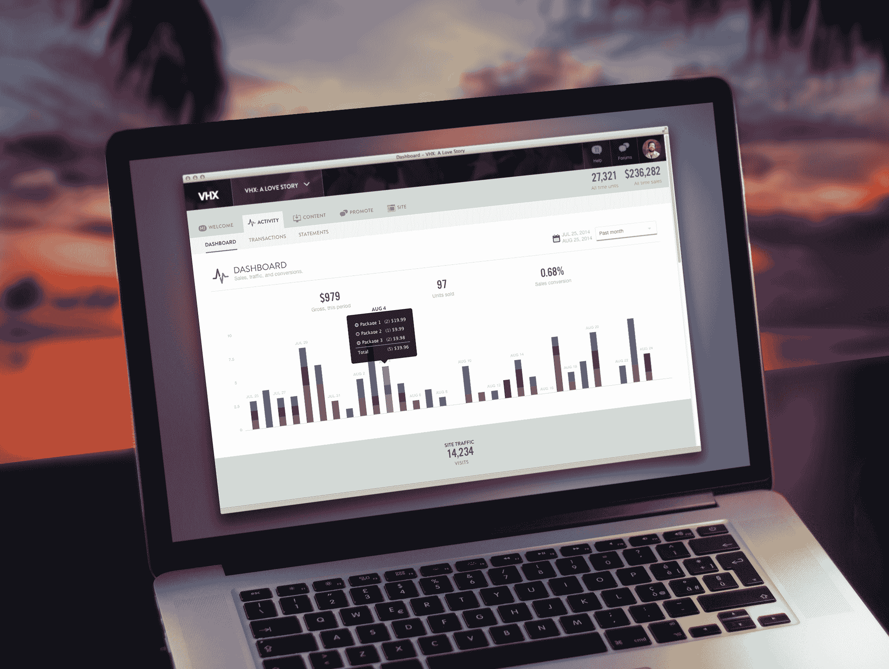

# VHX 更新其管理面板，让自己动手制作视频的销售变得更加容易 

> 原文：<https://web.archive.org/web/https://techcrunch.com/2014/08/28/vhx-admin-updates/>

两年多前， [VHX](https://web.archive.org/web/20221007042155/http://vhx.tv/) 推出了一个平台，该平台旨在允许几乎任何人开始在线销售他们的视频。现在，随着网站管理控制台的更新，它使这一过程变得更加容易，为独立生产商提供了成功在线销售产品所需的工具。

由于路易·CK 和阿齐兹·安萨里等大牌明星直接面向消费者的成功发行，越来越多的独立制作人正在寻找摆脱分销商的方法，让粉丝们可以看到他们的视频。VHX 已经成为他们这样做的最佳平台之一。

该公司自成立以来已经开设了 2000 家商店，自推出以来，客户在该平台上购买了约 50 万个视频。这些用户被这样一种功能所吸引，即无需像在苹果的 iTunes 或其他销售平台上那样经历重重困难，就可以上线运行。VHX 收取的佣金也比竞争对手的在线视频销售平台少。

它拥有广泛的内容，包括从安萨里等喜剧演员的喜剧特辑到健身系列，到独立发布的纪录片，再到 YouTubers 的长篇电影。

由于有如此多的不同用例，VHX 多年来一直在仪表盘上添加许多功能，但现在正在寻求简化平台，使制作人更容易启动和运行。因此，它发布了仪表板的更新版本，使其更容易被更广泛的用户群使用。

VHX 重建了平台的基础，以加快未来的设计和开发，并使其更加灵活。它还构建了一个 API，不仅使它能够更容易地添加功能，还能与其他第三方开发人员进行集成。

对于用户来说，新的仪表板将不同的工具集分组为“行为簇”，并根据不同的用户类型定义工作流。它还提供了指南和最佳实践来帮助制作人接触更多的观众。这一更新使得制作人可以更容易地将内容打包在一起，并在视频的同时销售相关商品。

新的仪表板也可以为 VHX 的新产品铺平道路。迄今为止，视频销售发生在不同的独立网站上，来自它们的制作者。但随着最新的更新，VHX 可以将来自多个不同生产商的内容聚合起来，作为统一平台的一部分出售。

对于 VHX 来说，希望简化上传和列出视频的过程将导致更多的独立制作人开始使用它的平台。更多的视频意味着更多的销售，这意味着更多的钱可以投资到它的平台上。

VHX 由 Casey Pugh 和 Jamie Wilkinson 创立，总部位于纽约市。自成立以来，VHX 已经从一批投资者那里筹集了 450 万美元的资金，其中包括 Union Square Ventures、William Morris Endeavor、Lerer Ventures、Lowercase Capital 和 Alexis Ohanian 等。