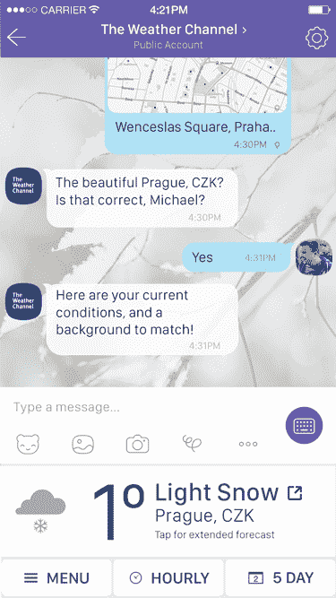

# Viber 关注 Messenger，推出企业和品牌公众账号

> 原文：<https://web.archive.org/web/https://techcrunch.com/2016/11/09/viber-follows-messenger-with-the-launch-of-public-accounts-for-businesses-and-brands/>

乐天(Rakuten)旗下拥有 8 亿用户的即时通讯应用 Viber ，今天在扩大其平台方面迈出了新的一步，它寻求与脸书的 Messenger 和 WhatsApp 等公司竞争，不仅仅是为了争夺用户，还有收入。今天，Viber 推出了公共账户，这是一种新的账户格式，适用于那些希望与 Viber 用户进行营销、客户服务或两者兼而有之的企业和品牌，用户无需先将该账户添加为联系人。

大约有 1000 个公众账号在发布时亮相，包括赫芬顿邮报、Yandex 和天气频道的账号，向选择订阅它们的用户发送更新和其他信息。

同时，客户服务组件将很快推出。Viber 的首席运营官 Michael Shmilov 在一次采访中告诉我，到 11 月底，Viber 的 API 将集成 10 到 15 个流行的 CRM 软件包。然后，企业可以发送和阅读他们的 Viber 消息以及所有其他社交媒体、电子邮件和消息交互。

Shmilov 告诉我，公共账户也将为 Viber 托管机器人打开大门——尽管 Viber 本身不会构建这些。

“我们专注于用可扩展的 API 构建最佳聊天体验，所以我们不会自己构建机器人，”他说。“我们为机器人开发者提供工具(来放置它们)。”

Shmilov 今天在里斯本的网络峰会上正式宣布的公共账户建立在 Viber 早在 2014 年就添加的名为“[公共聊天](https://web.archive.org/web/20230326022727/https://techcrunch.com/2014/11/18/messaging-app-viber-takes-a-step-into-social-networking-with-new-public-chats-feature/)的功能上。这实际上是让名人——或者任何人——与公众进行对话，尽管只有那些真正与演讲者有实际接触的人才能与他或她互动。

斯米洛夫指出，公共账户将是你(和一个企业)第一次能够在没有对方作为联系人的情况下相互交流。

公众账户使 Viber 成为其他几个以消费者为中心的通讯应用之一，这些应用已经开始向品牌和其他具有特殊功能的应用的用户群“说话”。

其中包括[微信](https://web.archive.org/web/20230326022727/http://technode.com/2014/09/19/wechat-business-api-released-expected/)和 [Line](https://web.archive.org/web/20230326022727/https://techcrunch.com/2015/02/12/line-at/) ，它们分别从 2014 年和 2015 年开始提供商业账户选项。虽然 Facebook Messenger 的业务推出比 T4 晚了一些，但它很快就用机器人和其他功能扩展和更新了这项服务，最近的是昨天更新了平台。

社交媒体平台正在利用其受众和分析数据来提供更直接的服务，这是一个更大的趋势，因为他们希望在基本的流内和显示广告之外扩大收入潜力。Twitter 也一直在开发客户服务功能。

但是，如果这是一个公认的趋势，并不是所有的消息应用程序都已经上市。WhatsApp 尚未宣布任何商业服务，尽管它表示计划在今年 1 月推出。(最晚的日期似乎是今年年底。)

有趣的是，在什米洛夫看来，所有其他消息应用程序都加入商业潮流的事实似乎是有意义的，甚至是一件好事。该公司在 8 亿总用户中有大约 2.66 亿活跃用户，他认为 Viber 的 CRM 功能只是补充了其他人正在做的事情，为所有消息应用程序创建了一个框架，成为合法的沟通渠道。

“当 Viber 是你使用的少数应用程序之一时，我们希望确保它是你如何与企业互动的一部分，”他说。

企业希望在即时通讯应用上做更多事情的原因非常清楚:对于使用即时通讯应用的很大一部分人来说，它们已经取代了大量(如果不是全部)电子邮件的使用，对一些人来说，更直接的格式已经取代了他们对脸书和 Twitter 等更开放平台的使用，成为以文本格式直接与他人互动的中心。这些互动是实时发生的，这是确保参与的一个关键方式(企业的圣杯)。

最重要的是，移动友好的信息平台正在发展成为全方位、多功能的平台，能够发送贴纸等媒体，打电话，与机器人说话，给你推荐吃饭的地方等等。

因此，对于企业、品牌或其他需要或希望与一大群用户交谈，或在客户服务中进行直接互动的人来说，他们将目光投向消息平台来尝试做到这一点是有道理的。Viber 拥有 2.66 亿活跃用户，足以让企业瞄准。

但是同样清楚的是为什么这些可能不是所有用户喜欢的原因。

正如我们在之前所写的[，信息平台已经崛起，几乎可以抗衡像脸书这样的开放式平台。尽管你可以在脸书或推特上看到任何事情和一切，但实际上你可以选择你想在信息平台上与谁交谈。如果处理不当，让企业开始参与其中，并利用它向你发送东西可能会污染这种体验。](https://web.archive.org/web/20230326022727/https://techcrunch.com/2016/11/08/facebook-opens-sponsored-messages-to-all-advertisers-in-newest-version-of-messenger/?ncid=mobilenavtrend)

至于公共账户将如何定价，斯米洛夫并没有完全向我说明这一点，但听起来它将仿照免费增值的想法:创建账户将是免费的，但添加功能或使用它发送东西将是有代价的。

“我们已经让企业和品牌能够通过公共聊天在 Viber 上发布自己的内容，我们从赞助贴纸和其他促销活动中获得收入，”他说，并解释了公共账户也可能产生销售的第一个领域。"除此之外，我们在这个阶段不会对公共账户收费."