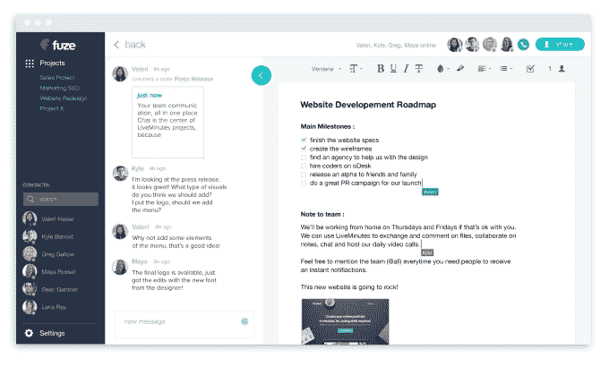

# 视频会议公司 Fuze 收购 LiveMinutes，筹集 2000 万美元用于团队协作 

> 原文：<https://web.archive.org/web/https://techcrunch.com/2015/05/20/video-conferencing-company-fuze-buys-liveminutes-raises-20m-to-expand-into-team-collaboration/>

总部位于旧金山的视频会议公司 [Fuze](https://web.archive.org/web/20221209210308/https://www.fuze.com/) 今天通过收购在线团队协作平台 [LiveMinutes](https://web.archive.org/web/20221209210308/https://www.crunchbase.com/organization/liveminutes) 扩展其平台。随着这一功能的增加，Fuze 不再仅仅专注于在线会议，现在还推出了一款名为 [Fuze Spaces](https://web.archive.org/web/20221209210308/https://www.fuze.com/fuze-spaces) 的新产品，允许同事们通过基于网络的仪表盘聊天、分享和评论文件、组织项目等。

Fuze 今天还宣布，它已经从 Hermes Growth Partners 获得了 2000 万美元的新资金，以继续扩大业务。

该公司已经通过其语音和高清视频会议解决方案，将自己确立为 WebEx 和 GoToMeeting 等服务的更现代替代方案，旨在帮助分散的团队通过云连接、共享内容和共享屏幕。这项服务现在被超过 100，000 家企业使用，包括像 Groupon，Starbucks，Macy's 和 Thoughtworks 这样的大公司。该公司表示，2014 年，有 650 万人使用 Fuze，比前一年增长了 100%。它每天主持近 200 万分钟的会议。

但在线会议只是团队协作的一个方面，这是新产品和收购的来源。规模较小的初创公司 LiveMinutes 此前一直在开发一个在线协作工具，员工可以在这里建立“工作区”,共享文件，包括 Office 文档、pdf、PSDs 等，还可以通过网络或 Skype 进行电话会议。LiveMinutes [去年](https://web.archive.org/web/20221209210308/http://allthingsd.com/20130723/liveminutes-brings-collaboration-to-evernote-also-raises-money/)也开始更深入地与 Evernote 整合，允许同事导入他们的笔记并查看实时编辑。

截至今天，Fuze 和 LiveMinutes 已经合并了各自的产品。Fuze 正在与少数精选客户一起测试其新产品，现在提供与许多云服务的集成，包括 Box、Dropbox、Google Calendar、Google Drive 等，用于文档共享。该公司解释说，这个想法是让企业继续使用他们知道对他们有意义的产品，而不是必须建立新的行为。

但 Fuze Spaces 与 Google Drive 的集成程度尤其高——用户可以在这些工作区中从 Google Drive 上传或访问他们的在线文件，在项目空间中点击创建新的 Google 文件，甚至可以通过选择“公共”或“每用户”等共享模式直接从 Fuze 管理 Google 文件权限。一旦在线并可在工作区中访问，其他人就可以查看文件并对其进行评论。他们还可以就整个项目进行交流，共同编辑笔记，创建待办事项列表，并邀请其他人加入工作区。

如果需要的话，点击一个按钮就可以将基于聊天的会议转变为与呼叫集成的面对面会议。Fuze 希望通过这款产品与其他成熟的项目管理平台竞争，比如 Basecamp。

下个月，Fuze 将为该产品添加另一项名为 Collaborative Notes 的功能，该功能将允许用户跟踪会议之外的讨论和任务。随着该产品在今年晚些时候退出 beta 测试，更多功能将在未来几个月内推出。

合并产品的定价细节尚未披露，但 Fuze 将继续为这两款产品提供免费增值服务。

交易完成后，LiveMintues 的联合创始人兼首席执行官 Kemal El Moujahid 将领导 Fuze 的产品战略，来自旧金山和巴黎的其他团队成员也将加入其中。Fuze 没有透露交易条款。

此次收购正值许多服务扩展到团队协作，以应对越来越多的员工在家或远程工作的趋势。

例如，Evernote 去年秋天推出了新的“工作聊天”功能，使其服务更具协作性。Dropbox 最近[一直在测试一项名为 Dropbox Notes](https://web.archive.org/web/20221209210308/https://beta.techcrunch.com/2015/04/23/dropboxs-collaborative-note-taking-service-dropbox-notes-heads-into-beta-testing/#.o0tzqc:Sa9M) 的协作笔记服务。[企业软件公司 Atlassian 也在本月早些时候收购了一家名为 Hall](https://web.archive.org/web/20221209210308/https://beta.techcrunch.com/2015/05/06/atlassian-acquires-team-chat-service-hall-to-bring-more-non-technical-users-to-hipchat/) 的团队聊天服务公司，以增强其 HipChat 产品。去年年底，企业内容协作公司 Huddle [又筹集了 5100 万美元](https://web.archive.org/web/20221209210308/https://beta.techcrunch.com/2014/12/11/enterprise-cloud-collaboration-service-huddle-raises-a-51m-growth-round-at-250m-300m-valuation/)来发展业务。甚至 WebEx 的所有者思科也在寻找用其[更新的产品思科 Spark](https://web.archive.org/web/20221209210308/https://beta.techcrunch.com/2014/11/17/ciscos-new-project-squared-collaboration-tool-gives-webex-a-run-for-its-money/) 实现团队协作现代化的方法。

当然，许多组织仍然满足于使用各种分散的服务进行文件共享和协作，包括 Microsoft Office、Google Drive、Box、Slack、Yammer 和其他网络呼叫、会议和项目管理解决方案。

这意味着 Fuze 在进入更广阔的团队协作空间时将面临很多竞争。