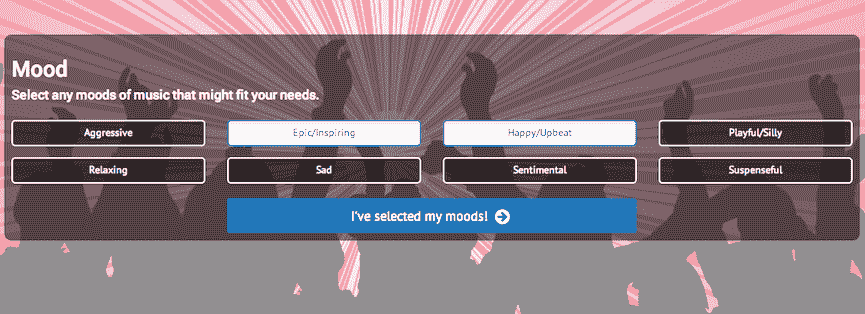
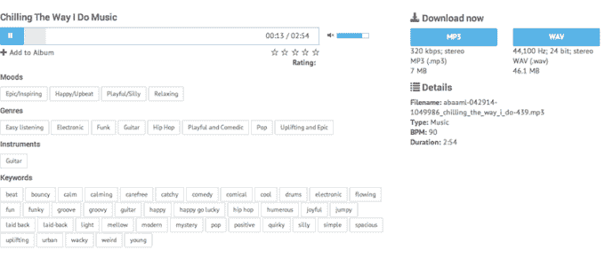

# VideoBlocks 推出基于订阅的股票音乐服务 

> 原文：<https://web.archive.org/web/https://techcrunch.com/2014/07/17/videoblocks-launches-subscription-based-stock-music-service/>

# VideoBlocks 推出基于订阅的股票音乐服务

为数字创意和专业视频制作公司提供价格合理的库存视频素材的供应商 VideoBlocks ，今天推出了一项名为 [AudioBlocks](https://web.archive.org/web/20221007010850/http://www.audioblocks.com/) 的免费服务，面向那些希望为他们的项目添加音乐和音效的人。

每年 99 美元的订阅费使内容创作者可以无限制地访问超过 10 万首歌曲、音效和循环的库，用于从智能手机应用程序到 YouTube 视频的项目。与面向消费者的订阅服务不同，当订阅结束时，你不会失去歌曲的权利——如果你为一个项目下载音乐，它将永远属于你。

[VideoBlocks](https://web.archive.org/web/20221007010850/http://www.crunchbase.com/organization/video-blocks) 首席执行官[乔尔·霍兰德](https://web.archive.org/web/20221007010850/http://www.crunchbase.com/person/joel-holland)强调了在当今以版权为中心的环境下，内容创作者获得免费音乐的重要性。“收录一首你无权收录的歌曲会玷污一个项目，”他在电话中说。“版权所有者可以——理所当然地——撤下一段视频，或者拿走你的广告收入，因为你在 YouTube 上放了一首不属于你的歌。”

当然，如果你找不到适合你特定需求的音乐，一个拥有 10 万首歌曲的图书馆也没什么用。 [AudioBlocks](https://web.archive.org/web/20221007010850/http://www.crunchbase.com/product/audio-blocks) “歌曲发现引擎”首先会询问您正在寻找的总体情绪:

一旦你找到了你要找的东西，它会让你通过选择更好地描述你的东西的特定工具或标签来更深入地研究推荐:

根据 Holland 的说法，AudioBlocks 已经有一堆内容准备添加到服务中，所以用户基本上每天都可以获得新歌。该公司正在使用其深度标签系统来确定用户更需要什么，对用户搜索中最常出现的内容进行优先排序。