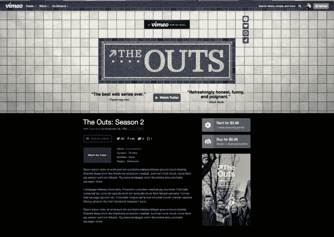

# Vimeo 推出了其下一组原创作品，包括其有史以来第一部故事片和音乐会 

> 原文：<https://web.archive.org/web/https://techcrunch.com/2016/03/10/vimeo-unveils-its-next-set-of-originals-including-its-first-ever-feature-film-and-concert/>

Vimeo 正在进一步投资于原创节目，该公司今天早上宣布推出视频网络的第二批节目和电影。新的一批包括该公司有史以来第一部故事片和第一部音乐会电影，代表着该公司旨在在其服务上托管的内容类型的扩展。

此前[的竞争对手 YouTube 上个月推出了自己的原创视频](https://web.archive.org/web/20221208042609/https://beta.techcrunch.com/2016/02/03/scary-pewdiepie/)，其中包括一部新的 PewDiePie 秀，以及三部独家电影。YouTube 的节目可以通过该公司最新的无广告订阅服务 YouTube Red 获得。

然而，与 YouTube 不同的是，它的目标是吸引更年轻的粉丝群，他们对 YouTube 明星的[比对传统好莱坞演员更熟悉，](https://web.archive.org/web/20221208042609/http://variety.com/2014/digital/news/survey-youtube-stars-more-popular-than-mainstream-celebs-among-u-s-teens-1201275245/) Vimeo 的目标是稍微年长一点的人群，这从它对原创节目的选择中可以看出。

例如，Vimeo 的第一部原创纪录片和第一部长篇电影《巫师模式》(Wizard Mode)通过讲述世界上最伟大的弹球运动员之一的故事，为观众提供了关于自闭症的个人视角。与此同时，它的第一部音乐会电影以独立“chillwave 先锋”Toro y Moi 为特色。

这些选择并不完全是“青少年观众想要的”

阵容中的另一个成员包括 CollegeHumor 的杰克·赫维茨和阿米尔·布卢门菲尔德(《杰克和阿米尔》)的另一个面向成人的节目，名为“[孤独和饥渴](https://web.archive.org/web/20221208042609/http://www.vimeo.com/lonelyandhorny)”它的名字本身就说明了一个事实，Vimeo 并不追求这里的 PewDiePie 人口统计。

同样到来的还有一部名为“加芬克尔和奥茨:努力变得特别”的喜剧特辑，由喜剧民谣组合[瑞琪·琳德赫姆和](https://web.archive.org/web/20221208042609/https://en.wikipedia.org/wiki/Garfunkel_and_Oates)凯特·米库奇主演，他们为国际金融公司制作了一部电视剧、一部网络连续剧、多张专辑、巡回演唱会和音乐视频。再一次，这是给成年人的，考虑到喜剧演员过去选择的话题。

这四个节目都将于今年 4 月开始在 Vimeo 上错开时间首播，并且可以租赁或购买。

该公司今天还宣布了其原创系列“The Outs”第二季的首播日期，该剧讲述了 20 多岁的同性恋男子在城市中挣扎生活并寻找爱情的故事。它将从 3 月 30 日开始推出新的剧集。

新系列和电影的推出是在 Vimeo [升级其 iOS](https://web.archive.org/web/20221208042609/https://beta.techcrunch.com/2016/03/03/vimeos-ios-app-gets-a-big-makeover-aimed-at-improving-discovery/) 移动应用程序后不久，重点是在其网络上查找视频，包括其原创视频。该应用程序改进后的界面现在可以将视频分成不同的类别，如音乐、纪录片、旅行和其他类别——这些选择反映了 Vimeo 的愿望，即远离个人视频之家，更好地反映独立创作者、作家、导演等更高质量的内容。

之前，[报道称【Vimeo 计划在 2016 年花费至少 1000 万美元在内容上。虽然该公司在今天的声明中没有谈到数字，但它确实表示，其新节目代表了对原创节目的“重大投资”。](https://web.archive.org/web/20221208042609/http://adage.com/article/media/vimeo-invests-slate-original-programs-3-shows/300815/)