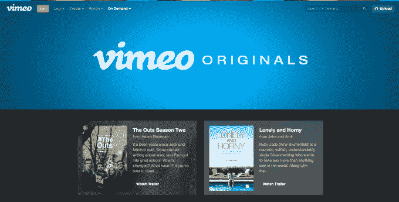
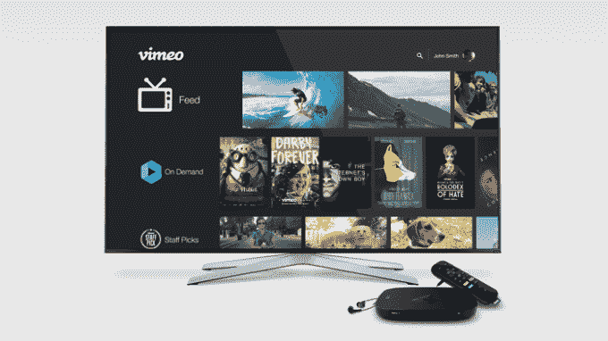

# Vimeo 推出面向消费者的订阅视频服务 

> 原文：<https://web.archive.org/web/https://techcrunch.com/2016/11/03/vimeo-will-launch-a-consumer-facing-subscription-video-service/>

Vimeo 周三在其收益报告中宣布，vimeo 正准备推出自己面向消费者的订阅服务，与网飞、亚马逊、YouTube 和其他公司竞争。在一封致股东的信中，IAC 首席执行官兼 Vimeo 临时首席执行官 Joey Levin 详细介绍了 Vimeo 在这一领域更广泛竞争的计划，同时也将其服务与现有的订阅玩家区分开来。

该公司今年早些时候收购了 VHX T3，这是一个提供付费视频订阅的平台，这表明了该公司进入这一领域的计划[。](https://web.archive.org/web/20221208085932/https://beta.techcrunch.com/2016/05/02/vimeo-acquires-vhx-to-boost-its-video-on-demand-business/)

莱文说，Vimeo 在这个市场的优势在于，它不必从零开始。如今，视频网络拥有 1.15 亿个视频，每月视频浏览量超过 10 亿次，每月观众达 2.4 亿人。这些观众中有 2400 万人高度参与，每个月观看三个或更多的视频。他说，数百万人已经从 Vimeo 创作者那里购买了内容。

迄今为止，消费者已经能够在 Vimeo 上以多种方式为创作者的内容付费——例如，他们可以直接为视频付费，或者根据创作者的选择提供订阅。创作者也可以免费分发视频，以增加他们的观众。

由于 Vimeo 内置的货币化工具，它吸引了一个由新兴电影制作人、编辑和导演组成的社区，他们在网站上分享自己的内容。莱文说，这反过来又让 Vimeo 相信，它不必像网飞这样的大型公司那样为内容开发提供同等水平的资金——它可以只花费数百万美元，而不是数十亿美元。

就其在视频内容方面的投资而言，Vimeo 迄今为止更具战略性地[通过](https://web.archive.org/web/20221208085932/https://beta.techcrunch.com/2015/10/08/1221093/)[资助精选节目、电影、音乐会和特别节目](https://web.archive.org/web/20221208085932/https://beta.techcrunch.com/2016/03/10/vimeo-unveils-its-next-set-of-originals-including-its-first-ever-feature-film-and-concert/)来播种其网络，作为其 [Vimeo Originals](https://web.archive.org/web/20221208085932/https://vimeo.com/ondemand/discover/originals) 计划的一部分。它的一个网络系列节目“High Maintenance”也被 HBO 采用，四分之三的奥斯卡提名短片来自 Vimeo 的导演。它还因自己的原创电影《加芬克尔和奥茨:努力变得特别》获得了今年的第一个艾美奖提名。

随着 Vimeo 开始尝试自己的专有订阅服务，它显然将面临很多竞争。莱文指出，这包括消费者方面的大型玩家，如网飞、亚马逊、Hulu、YouTube 等，但也包括 SaaS 方面的玩家，如 MLB 的流媒体技术平台 BAMTech，迪士尼现在拥有该平台 33%的股份。

特别是，Vimeo 经常被定位为 YouTube 的竞争对手，因为这两个网络都允许免费视频共享，并迎合了创作者社区的需求。

最近几个月，YouTube 也试图拓展订阅服务。然而，根据[最近来自 The Verge](https://web.archive.org/web/20221208085932/http://www.theverge.com/2016/11/2/13498470/youtube-red-subscribers-video-content-music) 的一份报告，其 YouTube Red 订阅服务正在努力获得付费用户。报道称，在其 150 万用户中，有 100 万仍在试用中。

不过，Vimeo 可能不会面临同样的阻力，因为它已经确立了为内容付费的地位。

莱文没有谈到 Vimeo 更大的商业模式的财务状况，以及它与今天的主要参与者相比如何。相反，他指出，其盈利的核心 SaaS 工具业务产生了超过 7500 万美元的收入，但 Vimeo 的整体业务亏损，短期盈利不是优先事项。

他说，目标是推动“创作者的数百万订阅和交易”，同时也增加“数百万直接客户”的订户基础

“Vimeo 已经催生了一个社区和市场，产生了有价值的内容，吸引了大量观众，让消费者打开他们的钱包，”莱文在股东信中写道。“现在，我们需要用营销、编程敏锐度、产品创新以及一家破坏性初创公司的原始能量和肆无忌惮的野心来推动这个系统，以在 5000 亿美元的电视和电影市场中占有一席之地，”他补充道。

除了订阅视频计划的消息，莱文还表示，Vimeo 正在重新设计其服务的消费者体验，将 Vimeo Originals、其图书馆和 creator marketplace 整合为一个更全面的产品。