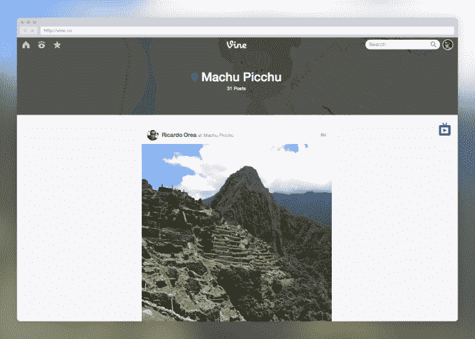

# Vine 发布了 6 秒钟的 YouTube 

> 原文：<https://web.archive.org/web/https://techcrunch.com/2014/05/01/vine-launches-a-six-second-youtube/>

当 Vine [第一次在 web](https://web.archive.org/web/20221206022222/https://beta.techcrunch.com/2014/01/03/vine-introduces-full-profiles-on-the-web-and-tv-mode-for-full-screen-viewing/) 上发布时，你所能做的就是查看你的信息流和个人用户的个人资料。桌面版也有电视模式，这无疑会让你沉迷于持续不断的全屏内容。

但是今天，Vine[在网络上变得越来越大](https://web.archive.org/web/20221206022222/http://blog.vine.co/)，将你在应用程序中习惯的许多导航和发现功能直接带到你的桌面上。此外，网络上的任何人都可以访问所有内容，无需登录。

除了你的 Vine feed 和用户资料流，Vine 现在还会显示一个特色部分，包括编辑精选、酷播放列表和特别特色视频。

您还可以访问频道、趋势标签和热门页面，就像在应用程序中一样。

也许更重要的是，用户不必在网络上登录 Vine，就可以浏览这些频道或特色 Vine 视频。以前，要在网上使用 Vine，你必须登录或者找到用户资料的 URL。现在，只需点击 Vine.co，你就可以访问 Vine 上所有最好的内容，并通过电视模式全屏播放。

这是一个令人耳目一新的更新，考虑到大多数以移动为先的公司只有有限的、设计糟糕的网站来让人们在主要(移动)体验中保持活跃。功能有限、性能糟糕的 Instagram.com 可能是最可耻的例子。

Vine 在 Twitter 长期计划中的未来仍不明朗。自一年多前推出以来，两位联合创始人已经离开了公司，但这款应用似乎仍然拥有活跃的用户群。然而，这一举措更明确地远离了在移动消费层面与 Instagram 竞争，而是更加关注移动视频创作和真正的视频消费如何相互影响。

在某种程度上，Vine 越来越接近 YouTube 的竞争对手，用户可以在移动设备上创建短视频，同时仍然可以体验悠闲的 YouTube 风格的消费体验的所有奇迹。

老实说，视频创作和消费是它像手机照片一样腾飞的必要条件，部分问题是视频本身固有的。一张照片需要完美或正确或任何一个瞬间的东西，除此之外还可以被增强。然而，视频需要这种完美性或正确性持续一秒又一秒。

创造一个令人愉快的视频需要更多的天赋、创造力和对细节的关注，就像 Twitter 对自己的产品所做的那样，该公司利用限制迫使用户提供优质内容。Vine 实际上有机会成为我们最终进入移动视频沉浸和成瘾世界的地方，将人们聚集到网络上消费是一个惊人的聪明的开始方式。

点击[此处](https://web.archive.org/web/20221206022222/http://vine.co/)查看新 Vine.co 的辉煌。不过，预先警告一下，看起来它可能还没有完全启动和运行。

