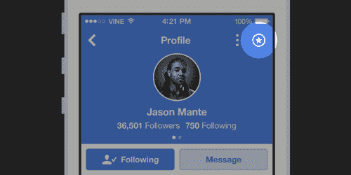

# Vine 现在可以让你从你最喜欢的账户 获取新内容的推送通知

> 原文：<https://web.archive.org/web/http://techcrunch.com/2014/11/25/vine-now-lets-you-get-push-notifications-for-new-content-from-your-favorite-accounts/>

# Vine 现在可以让你从你最喜欢的账户获得新内容的推送通知

Vine 正在迅速成为一个收藏来自一系列不同艺术家的有趣和娱乐内容的地方，现在 Twitter 旗下的公司希望通过推送通知来帮助你保持你的最爱。

[这个六秒钟的视频应用程序现在可以让你在账户上传新内容时收到通知](https://web.archive.org/web/20230320031616/http://blog.vine.co/post/103557732246/dont-miss-vines-from-your-favorite-viners),只要你点击账户资料页面右侧的新星。除了推送通知之外，新内容还会出现在你的活动订阅源中，这很有用，因为它让你可以在一个地方查看你最喜欢的帐户最近的“亮点”。

添加推送通知对用户有好处，但对 Vine 艺术家来说更好，因为他们有更有效的方法来确保他们的内容被尽可能多的观众看到。这与希望视频不会淹没在粉丝反馈的噪音中形成了鲜明对比，这种情况在 Twitter 或脸书上经常发生。

今年夏天早些时候，[应用程序增加了循环计数](https://web.archive.org/web/20230320031616/https://techcrunch.com/2014/07/01/vine-update-introduces-loop-counts-so-you-know-how-great-you-are/)——让用户了解他们的剪辑有多受欢迎，并帮助艺术家为品牌和赞助商提供明确的价值，这些品牌和赞助商通过应用程序向他们支付推广费用。多亏了循环计数，Vine 艺术家应该能够知道推送通知对于吸引更多观众有多有效——答案很可能是非常有效。

Vine 最近在帮助提高参与度和保持用户粘性方面做了更多工作。早在 10 月，该应用开始允许用户只需点击一下就可以关注艺术家的整个频道，今天的更新可能是那些赚钱或享受大量关注服务的人的又一个福音。

今天，新的推送通知选项刚刚在 [iOS](https://web.archive.org/web/20230320031616/https://itunes.apple.com/us/app/vine/id592447445?mt=8) 和 [Android](https://web.archive.org/web/20230320031616/https://play.google.com/store/apps/details?id=co.vine.android&hl=en) 的 Vine 应用中推出。