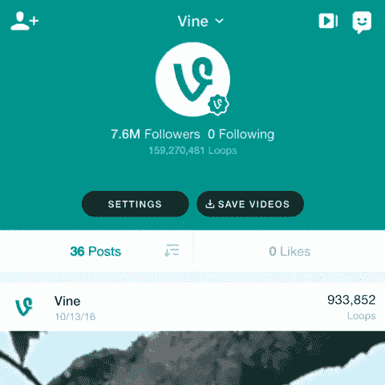

# Vine 不会从应用商店中移除，而是会以“Vine Camera” 的名义重新推出

> 原文：<https://web.archive.org/web/https://techcrunch.com/2016/12/16/vine-wont-be-removed-from-the-app-stores-will-instead-relaunch-as-vine-camera/>

# Vine 不会从应用程序商店中删除，而是会以“Vine Camera”的名义重新推出

10 月，Twitter 宣布关闭 Vine，这是一款允许用户创建和分享 6 秒钟循环视频的应用。今天，该公司表示，它不会像[早先暗示的那样](https://web.archive.org/web/20230404005630/https://medium.com/@vine/important-news-about-vine-909c5f4ae7a7#.vazjmwemb)真的从应用商店撤下 Vine 应用，而是会过渡到一个新的、低维护的应用，名为 Vine Camera。通过这个新的应用程序，你仍然可以录制 Vine 视频，但更大的 Vine 社区将会消失。

Vine Camera 将于明年 1 月推出，取代今天上线的 Vine 应用。

该公司表示，使用新应用程序录制的视频可以保存到你的相机胶卷中，或直接发布到 Twitter 上。脸书旗下的 Instagram 在其应用生态系统中也采用了类似的策略。Instagram 的 Hyperlapse、Boomerang 和 Layout 并没有试图将它们构建成自己的社交媒体品牌，而是将内容反馈给 Instagram 的主应用程序。

Vine Camera 也会这么做。

此外，Twitter 将试图将 Vine 用户群转移到 Twitter。

该公司表示，将在未来几天推出一种新的方式，在 Twitter 上关注你最喜欢的 Vine 明星。该公司在[的博客帖子](https://web.archive.org/web/20230404005630/https://medium.com/@vine/vine-update-59426a5adfab#.8rjlkrylk)中宣布了这一消息，但没有提供这一部分过渡的进一步细节。

正如 Twitter 早先承诺的那样，Vine 网站将继续存在。这里仍然是你可以浏览和观看多年来创作的所有 Vine 视频的地方。

虽然许多 Vine 的常客对关闭感到不安，但 Twitter 对这种情况的处理比大多数处于类似情况的公司都要好得多。事实上，它已经[拒绝了收购出价](https://web.archive.org/web/20230404005630/https://techcrunch.com/2016/11/07/revive-vine/)，而是自己处理关闭事宜。

不幸的是，对于表现不佳的产品来说，在给定的日期完全关闭(希望是在短暂的“数据导出”期之后)而不是至少保持部分在线是相当常见的。

当然，如果你准备永远离开 Vine，那也是一个选择。Twitter 曾表示，它将为 Vine 用户提供一种导出视频的方式，该功能现已在 Vine 网站上上线。在过渡到 Vine Camera 之前，它还将继续提供从其 iOS 和 Android 应用程序导出工具。