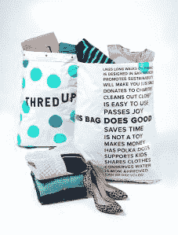

# 二手服装市场 thredUP 融资 8100 万美元 E 轮由 GSIP TechCrunch 领投

> 原文：<https://web.archive.org/web/https://techcrunch.com/2015/09/10/vintage-clothing-marketplace-thredup-raises-81m-series-e-led-by-gsip/>

# 二手服装市场 thredUP 募集 8100 万美元 E 轮融资，由 GSIP 牵头

有时在网上订购二手服装有点粗略。这件衬衫会很难闻吗？会不会有莫名其妙的污渍？

二手服装市场 ThredUP 希望通过对其网站上出售的每件二手服装进行单独审查，为消费者提供更优质的体验。

这家总部位于旧金山的公司刚刚筹集了由高盛投资伙伴牵头的 8100 万美元的 E 轮融资。迄今为止，ThredUP 已经筹集了超过 1.25 亿美元。

“我们很高兴与 thredUP 合作，”GSIP 私人投资公司的联席主管伊恩·弗里德曼在一份新闻稿中说。“我们的行业研究揭示了改变消费者购物和出售二手服装行为的巨大机遇。”

目前，这项服务只专注于女装和童装，迄今为止已经处理了多达 1100 万件商品。它是如何整理这么多项目的？他们有一大群员工在东海岸和西海岸的两个工厂里帮助他们，每个工厂都有超过 125，000 平方英尺的空间。

thredUP 的首席执行官兼联合创始人詹姆斯·莱因哈特(James Reinhart)告诉我，该公司打算利用这笔新资金继续扩大业务，以满足客户需求。

莱因哈特认为，该公司有机会为消费者提供一个更值得信赖的二手服装市场。

莱因哈特在一份新闻稿中说:“我们创立 thredUP 是为了让消费者清理衣柜和购买优质二手衣服变得非常方便。”“我们看到了一个巨大的机会，可以利用互联网的渗透和对在线买卖的日益接受，为大众带来愉快、无摩擦的二手体验。”