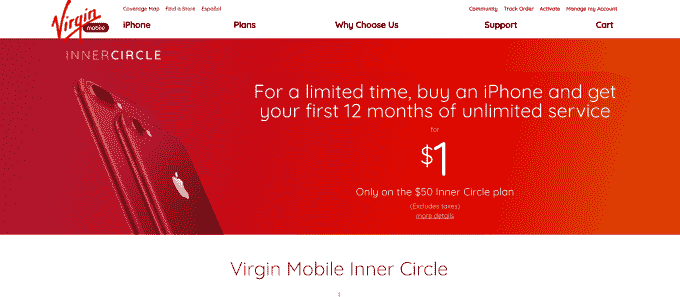
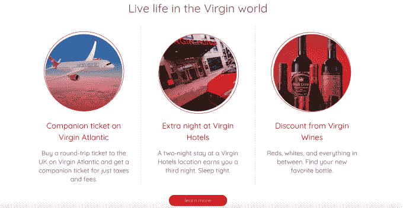

# 维珍移动仅支持 iPhone，提供一年服务，价格为 1 美元 

> 原文：<https://web.archive.org/web/https://techcrunch.com/2017/06/21/virgin-mobile-goes-iphone-only-offers-a-year-of-service-for-1/>

为了从竞争对手那里争取客户，维珍移动美国公司今天宣布了一项交易，将看到它过渡成为一个 iPhone 唯一的运营商。该公司还与苹果合作，在苹果商店中激活维珍的服务。为了启动这一变化，维珍推出了限时促销活动，将赠送价值一年的无限制通话、文本和数据，只需一美元。

当然，这笔交易有一些注意事项。

像大多数运营商一样，无限数据并不完全如此。维珍表示，在一个计费周期内使用超过 23 GB 数据的客户将被取消优先级——这意味着它将根据需要节流你的带宽，特别是在非常拥挤的地方。

另外，维珍的条款说，如果你的网外漫游使用超过 800 语音分钟或 100 兆字节，它有权终止你的服务。(该计划提供 800 分钟的国内语音漫游和 100MB 的国内数据漫游，此外还有不限量的数据、通话和文本)。

哦，当然，你需要从苹果或维珍购买一部 iPhone，然后把你的电话号码转移到维珍的内部圈子计划。

维珍在其网站上出售 iPhone SE、6、6s、6s Plus、7 和 7 Plus，配置各异，零售价基本相同。例外的是 SE 32 GB 和 128 GB 型号，与苹果的直接价格相比，它们在 T2 打了折扣。而且 iPhone 6 32 GB 停产，所以也是比较便宜的选择。

虽然 1 美元的交易听起来好得不像是真的，但其中也有一点陷阱。

该交易仅在 2017 年 7 月 31 日前有效；之后是 6 个月的优惠。换句话说，这是一根大胡萝卜，可以一下子吸引大量新用户。维珍本质上是在押注这样一个事实，即当每月 50 美元(需要自动转账)的常规计划价格稍后生效时，客户会留下来。

还有一些可选的国际电话附加服务，根据您的需要打包成 5 美元或 10 美元的套餐。这些服务的重点是向特定国家或座机提供无限通话、无限短信和其他优惠费率。(关于这些的全部细节在[这里](https://web.archive.org/web/20221206180918/https://www.virginmobileusa.com/plans)。)

尽管有这些警告(另一个，可以说，可能是维珍运行在 Sprint 的网络上，它有自己的一系列挑战)，维珍的核心圈子也有一系列额外津贴。这些都集中在将航空公司与更大的维珍品牌捆绑在一起，比如航空公司、连锁酒店和葡萄酒。

通过 Inner Circle，客户可以购买维珍航空公司飞往英国的往返机票，只需支付第二张同伴机票的费用和税款，还可以享受维珍美国航空公司 20%的折扣。入住维珍酒店，您可以免费享受第三晚住宿，并享受维珍葡萄酒折扣和 10 月份的维珍运动旧金山健身节。该公司指出，还将有机会赢得维珍赛车、维珍银河和其他公司的“遗愿清单体验”。

运营商总是在争夺客户，并提供越来越多的稀奇古怪的促销活动来赢得业务。例如，维珍移动的母公司 Sprint，就在这个月开始向那些从另一家移动运营商转来的用户提供免费的一年无限制的 T2 服务。

虽然促销本身最终会过去，但维珍更大的商业决定是只坚持 iPhones，这一点值得注意。这是 Sprint 首席执行官 Marcelo Claure [去年提到的事情，当时他说，在即将到来的战略转变之前，维珍将被削弱。](https://web.archive.org/web/20221206180918/https://www.recode.net/2016/1/26/11589076/sprint-ceo-promises-network-upgrades-wont-cause-disruption)

好吧，现在它在这里。之前，维珍一直是通过全国零售店销售的 Android 预付费业务。展望未来，它将转而宣传其无合约、纯 iPhone 模式。

与苹果的合作使维珍移动成为在苹果商店销售其服务的最新运营商，并使其成为美国第一家仅销售 iPhone 的运营商。

该公司认为，这一变化可能会给它带来新的机会，与表现更好的竞争对手竞争，如 T-Mobile 的 MetroPCS 和美国电话电报公司的 Cricket Wireless，以及非传统的新来者，如谷歌的低成本项目 Fi。

维珍集团创始人理查德·布兰森在一份声明中说:“维珍一直希望在我们进入的任何领域进行变革，挑战现状。”“手机也不例外，通过美国维珍手机公司，我们现在与苹果公司合作，为我们的新内圈计划创造了一个令人信服的报价。简而言之，当你购买 iPhone 时，你将获得最高质量的设备和服务，并获得我们公司集团的一系列处女体验和优惠，”他补充说。

维珍今天通过其脸书页面正式宣布了这一消息: