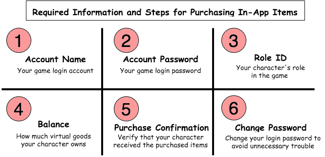
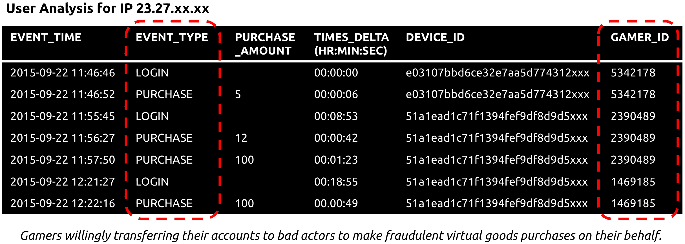
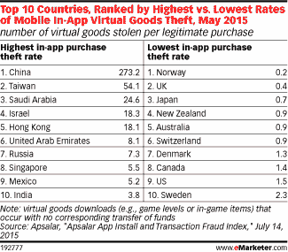

# 游戏中虚拟物品的地下市场存在真正的欺诈

> 原文：<https://web.archive.org/web/https://techcrunch.com/2016/01/20/virtual-goods-real-fraud/>

谢是联合创始人兼首席执行官

[DataVisor](https://web.archive.org/web/20221007135813/http://www.datavisor.com/)

.

动视暴雪最近宣布以惊人的 59 亿美元收购热门游戏《糖果粉碎》的制造商国王数字娱乐公司，这是对移动游戏前景光明(且有利可图)的认可。

全球游戏市场预计在 2015 年将达到 915 亿美元。虽然 PC 和主机游戏仍然是主流，但移动游戏是增长最快的部分，同比增长 21%，这要归功于智能手机在新兴市场的渗透以及免费游戏和应用内购买的成功“免费增值”收入模式。[报道显示](https://web.archive.org/web/20221007135813/https://www.techinasia.com/talk/tips-monetizing-mobile-game-china/)用户会很快为 VIP 身份支付金钱，虚拟 物品来提高游戏的可玩性，甚至以每用户每游戏 50 美元的平均花费[赢得游戏。](https://web.archive.org/web/20221007135813/http://www.cnbc.com/2015/08/03/the-shocking-truth-about-mobile-gaming.html)

随着市场的蓬勃发展，毫不奇怪，网络罪犯也找到了进入生态系统的方法，并为游戏中的虚拟商品创造了一个繁荣的地下市场。他们是怎么做到的？以下是我们在野外观察到的一些攻击技巧。

## 通过代理服务器的 Sybil 攻击

云服务出租的代理服务器允许在线犯罪分子显著扩大他们的操作，并绕过基于信誉的检测系统。在手机游戏欺诈的背景下，它们还允许攻击者通过模拟出现在不同的地理位置(取决于服务器的位置)来假设多个假身份。

这些假身份(或在点对点网络中被称为“女巫”)被用来利用游戏促销来购买稀有或有限的虚拟 物品，例如那些只在特定地区或每日限量发放的物品。

它们还被用于执行虚拟货币套利:通过模拟在不同国家的存在，攻击者可以在一个地方(货币较弱的地方)购买虚拟 商品，在另一个地方(货币较强的地方)转售，并将差价收入囊中。

攻击者通过海外代理服务器路由流量，以模拟在另一个地理位置的存在(1)，从游戏应用程序购买虚拟物品(2)并转售给游戏玩家以获取利润(3)。

这些位于不同网络和地区的“代理”服务器并不局限于云服务和托管提供商出租的主机。攻击者还利用位于家庭或商业 DSL 网络中的受损机器，使得恶意活动看起来与来自良性用户的活动相似(或混杂在一起)。

## 应用内购买代理

有些手游不允许虚拟 物品在玩家之间转移。在这种情况下，不能提前购买商品以便在以后转售，如上例所示。

为了不被打败，网络罪犯对这些类型的游戏和虚拟物品市场采取了不同的方法。他们会宣传如此诱人的价格折扣——25%或更多——以至于玩家交出他们的游戏应用登录凭证，让其他人代表他们购买虚拟物品。卖家甚至会在交易完成后提醒你更改密码，以“避免不必要的麻烦”

地下市场卖家给希望购买廉价虚拟商品的手机游戏玩家的指示。

下表显示了这种攻击的一个实例。每行对应一个手游 app 记录的事件。我们可以看到攻击者以不同用户(玩家 id)的身份重复登录进行购买，而没有生成任何其他类型的事件来指示实际的游戏。事实上，每个用户最多只能登录几分钟——直到购买完成。

## 伪造或被盗的信用卡

如果回报不好，没有人会冒险进入这个行业，那么地下市场怎么能提供如此大的折扣呢？这又回到了近年来许多[金融欺诈和令人头痛的](https://web.archive.org/web/20221007135813/http://www.informationisbeautiful.net/visualizations/worlds-biggest-data-breaches-hacks/)的源头——数据泄露导致的伪造或被盗信用卡。

与可以受到 EMV 芯片和密码技术保护的店内购买不同，游戏应用程序开发者验证应用内无卡交易的方法非常有限。现有的方法往往依赖于基于规则的系统或监督学习模型，它们只能对已知的攻击模式做出响应。

让事情变得更复杂的是，应用内交易通常由移动支付平台进行，如苹果应用商店或 Android Pay，因此应用程序缺乏对交易细节的可见性，无法区分合法和欺诈性购买。

## 内购的 r eal 费用 f raud

为什么所有这些对手机游戏都很重要？是的，虚拟 物品并不真正“耗费”任何东西，但这基本上意味着有大量金钱损失于未实现的收益。据估计，每销售和下载一个合法的虚拟物品，就有 [7.5 个虚拟物品下载输给了诈骗](https://web.archive.org/web/20221007135813/http://www.emarketer.com/Article/Rising-Tide-of-In-App-Fraud/1012731) 。这个数字在某些国家可能更高——例如，在中国，每下载一个合法项目，就有 273 个欺诈 虚拟 项目。这意味着令人震惊的 50-99%的虚拟商品都是非法的。

但是也许对游戏最大的担忧是[对用户体验的负面影响。当欺诈性的应用内购买污染了游戏的经济性，并让一些玩家获得不公平的优势时，它会破坏其他玩家的体验。随着游戏领域像今天这样竞争激烈，大多数玩家不会忍受这一点，游戏不能承受失去用户。](https://web.archive.org/web/20221007135813/http://www.huffingtonpost.com/natasha-starkell/what-to-do-about-fraud-in_b_5809200.html)

这些只是移动游戏应用面临的少数攻击技术，完整的列表不仅长得多，而且不断变化以逃避现有的检测方法。随着移动应用越来越依赖于应用内的虚拟购买，它们也必须准备好打击欺诈。损失虚拟 商品会产生真实成本，这对用户增长和公司利润都有巨大的负面影响。