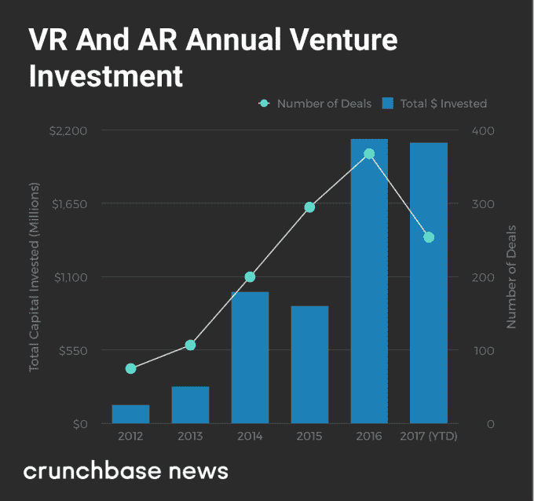
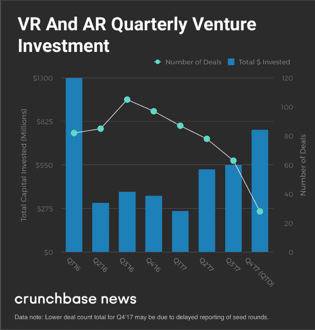
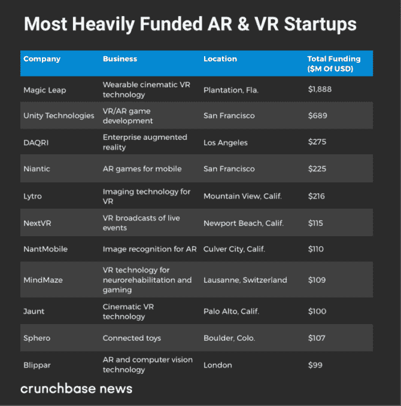

# 虚拟现实重回正轨 

> 原文：<https://web.archive.org/web/https://techcrunch.com/2017/12/02/virtual-reality-gets-its-groove-back/>

乔安娜·格拉斯纳撰稿人

More posts by this contributor

技术爱好者倾向于高估大众采用的速度。例如，虚拟现实爱好者期望我们更多的人戴着护目镜消磨时光，沉浸在虚拟世界中。

相反，我们仍然粘在我们的手机上，因为虚拟现实耳机制造商[努力取得进展](https://web.archive.org/web/20221208142619/https://haptic.al/latest-virtual-reality-headset-sales-so-far-9553e42f60b5)。虽然消费者去年抢购了超过 2 亿部 iPhones，但他们只购买了几百万部耳机。2017 年，这些比率预计不会有太大改善。

然而，尽管虚拟和增强现实的发展可能比支持者预期或希望的要慢，但风险投资并没有放缓。Crunchbase News 的一项分析发现，2017 年 VR 和 AR 初创公司的融资与 2016 年的水平大致相当。今年第一季度开始时很不景气，但是过去三个季度的投资已经加速弥补了赤字。

投资者本周对 Niantic 的 2 亿美元投资显示了他们的乐观态度，Niantic 的 Pokémon GO 增强现实游戏是媒体最知名的热门游戏。(它的流行无疑是因为它可以在普通智能手机上玩。)Niantic 的巨额融资正值该公司准备发布一款基于哈利波特系列的新游戏之际。

根据 Crunchbase 的数据，今年至少有 217 家 AR 和 VR 领域的公司进行了融资，筹集了 21 亿美元。其中，超过 9 亿美元流向了两家公司:Magic Leap 和 Unity Technologies。

## 历年的 VR 和 AR

在下图中，我们看了虚拟和增强现实初创公司的年度投资风险总额，包括种子期到成长期。

它显示，以虚拟现实和增强现实为重点的创业公司的完成轮次数量在 2016 年达到峰值，并在 2017 年呈下降趋势，尽管其中一些可能归因于最近种子期融资报告中常见的滞后时间。与此同时，投资总额在去年达到峰值，预计将在 2017 年持平。

在下一张图中，我们来看看过去两年的季度投资总额。它显示，2016 年 Q1 的总投资达到顶峰，这主要是由于总部位于佛罗里达州的电影虚拟现实技术开发商 Magic Leap 的一轮 8 亿美元的大规模融资。在去年年底放缓后，融资总额在 2017 年第二季度开始回升，并继续上升。

#### 跟着钱走

正如人们所料，少数公司占了投资资本的大部分。我们提到了 Magic Leap 和 Niantic，以及 Unity Technologies，这是一家开发增强和虚拟现实游戏的平台提供商。

总的来说，至少有 11 家 AR 和 VR 初创公司筹集了约 1 亿美元或更多的融资。我们将它们列举如下。

#### 出口逐渐增多

投资者不断向 VR 和 AR 公司投入资金，但他们仍然没有获得多少回报。

自 2014 年脸书以 20 亿美元收购 Oculus 以来，我们还没有在这个领域看到真正的大型收购。风险投资支持的虚拟和增强现实公司也尚未上市。很难找到甚至可能在短期内上市的候选人，因为许多人都是预营收。

尽管如此，随着一些大型科技公司加入竞争，收购者正在以相当快的速度收购早期公司。

> 什么时候兴奋最终会导致领养？

例如，本月早些时候，苹果以 3000 万美元的价格收购了加拿大增强现实耳机开发商 Vrvana。今年夏天，谷歌收购了风险投资支持的虚拟现实游戏开发商 [Owlchemy Labs](https://web.archive.org/web/20221208142619/https://crunchbase.com/organization/owlchemy-labs) 。

鉴于所有“五大”最大的美国科技公司(以及全球前 20 强中的大多数公司)都在围绕 VR 和 AR 投入大量开发工作，预计未来的收购步伐会更快并不现实。

#### 这与炒作无关

那么我们现在在 VR/AR 创业周期中处于什么位置呢？看到去年虚拟现实资金的大幅增长，加上令人失望的耳机销售，很容易陷入对这个空间被夸大的叙事。

然而，这种简化忽略了一点，即 VR 和 AR 是一种与生俱来的酷元素。例如，Magic Leap 有一个工作室，在那里它可以创造出与真人一样大小的霸王龙复制品。MindMaze 连接大脑和虚拟世界。预计这种东西会在企业家和投资者圈子里引起兴奋。

但是什么时候兴奋最终会导致领养呢？显然，VR 和 AR 还没有接触到大众。但似乎这项技术最忠实和最富有的粉丝仍然认为它会朝着那个方向发展。