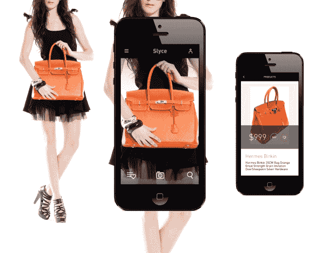

# 视觉搜索公司 Slyce 以 500 万美元的价格收购了来犯公司，为零售行业 TechCrunch 的其余部分构建了“亚马逊萤火虫”

> 原文：<https://web.archive.org/web/https://techcrunch.com/2014/09/16/visual-search-company-slyce-buys-pounce-for-5m-to-build-amazon-firefly-for-the-rest-of-retail/>

总部位于特拉维夫的移动购物应用[突袭](https://web.archive.org/web/20221225141545/http://crunchbase.com/organization/buycode)，一个展示零售商交易的应用，以及一个从你的智能手机上购买平面广告和目录的方法，已经被视觉搜索公司 [Slyce](https://web.archive.org/web/20221225141545/http://slyce.it/) 以 500 万美元的股票、现金和奖励的方式收购。Slyce 说，这笔交易也不完全是人才争夺战，因为该公司已经在推出自己面向消费者的应用程序。来自猛扑的技术正在帮助它加快速度。

此外，来犯公司的技术将提供给 Slyce 的零售商客户。

作为一点背景，来犯是 BuyCode 的主要产品，成立于 2012 年。这款应用[正在解决移动购物中最难的一个方面:结账过程。](https://web.archive.org/web/20221225141545/https://techcrunch.com/2013/11/12/pounce-the-app-that-helps-shoppers-find-items-using-image-recognition-is-now-a-deals-browser-too/)但是，该应用并没有严格地追求电子商务网站的整合，而是与零售合作伙伴和其他第三方合作，将商品照片与库存和定价信息联系起来。最终的结果是一个应用程序，允许消费者扫描商品——如零售商通知或杂志广告——或浏览一系列交易，然后只需点击几下就可以结账。

从本质上来说，这是一种电子商务体验，因为零售商的商务平台参与了销售的实现，但这是一种通过不同类型的用户活动开始的体验——扫描和抢购，而不是网上冲浪。

截至去年，该应用程序支持梅西百货、Ace Hardware、塔吉特百货、玩具反斗城、婴儿反斗城、史泰博、百思买等零售商。最近的整合包括其他大型品牌，如 Lord & Taylor 和 Hudson's Bay。

根据 Slyce 的说法，让猛扑的技术受到欢迎的一个原因是，它允许客户在输入一次支付信息后，继续从多个零售商的商业平台结账。这仍然是今天移动购物的一个困难方面，许多公司都在解决这个问题，包括 PayPal 的新 SDK 和单触式产品，以及谷歌的谷歌钱包，以及苹果最近的移动应用程序 Apple Pay。

现在图像识别初创公司 Slyce 也有类似的东西，这要归功于这次收购。

对于那些不熟悉 [Slyce](https://web.archive.org/web/20221225141545/http://slyce.it/) 的人来说，总部位于多伦多的图像识别初创公司[本身在其新的亚马逊 Fire 智能手机](https://web.archive.org/web/20221225141545/https://techcrunch.com/2014/03/04/image-recognition-startup-slyce-raises-9m-to-be-the-amazon-flow-for-everyone-else/)中提供了类似于“亚马逊流”或[亚马逊的 Firefly 功能的技术。Firefly 可以让你将亚马逊手机指向现实世界中的物体，然后购买它们(当然是从亚马逊！).](https://web.archive.org/web/20221225141545/https://techcrunch.com/2014/06/18/amazons-fire-phone-introduces-firefly-a-feature-that-lets-you-identify-and-buy-things-you-see-the-real-world/)

与此同时，Slyce 一直在与主要零售商合作，以便他们可以向自己的客户提供同样的产品，以及视频和音频识别、QR 和条形码扫描以及 NFC。一旦用 Slyce 扫描了商品，就可以立即购买。

然而，到目前为止，Slyce 一直专注于零售客户，而不是消费者。这将在 2014 年第四季度发生变化，届时该公司将推出自己的消费者应用，能够识别现实世界中的物体，并实现一键购买。或许，可以称它为“亚马逊萤火虫”。通过帮助 Slyce 节省其 B2C 战略的开发时间和投资，猛扑非常适合。

收购完成后，猛扑的团队将加入 Slyce，首席执行官 Avital Yachin 将加入公司的高管团队。

Slyce 首席执行官 Mark Elfenbein 在一份准备好的声明中表示:“我们非常兴奋能够获得技术和大量人才。“我们一直在寻求增加和完善我们可以通过 Slyce 视觉搜索平台为主要零售商提供的功能。”