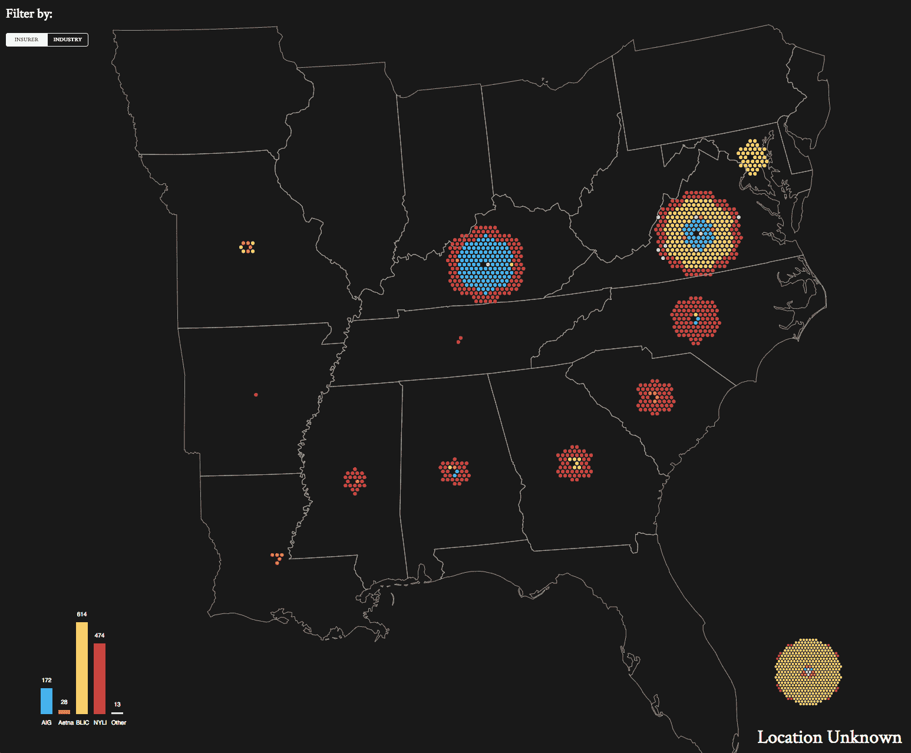
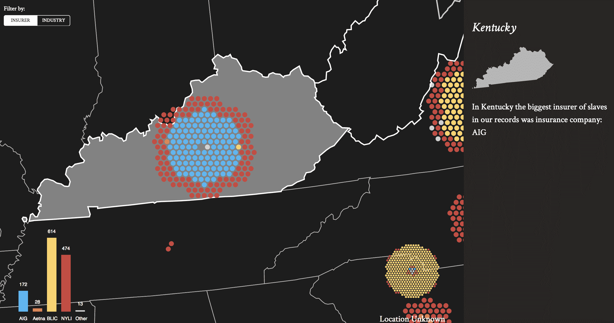

# 可视化奴隶保险业

> 原文：<https://web.archive.org/web/http://techcrunch.com/2018/02/22/visualizing-the-slave-insurance-industry/>

类似于人们给他们的汽车、房子和生命投保的方式，奴隶主有时也会给他们的奴隶投保。由于害怕从他们的奴隶那里得不到物有所值的东西，主人有时会为他们购买保险。

例如，在 19 世纪，一些出租奴隶的奴隶主会为他们投保，这样，如果他们的奴隶死于他人之手或在他人手中受重伤，奴隶主就不会遭受太大的经济损失，根据疲惫灵魂财政部的说法。

由纽约大学教授 Michael Ralph 和来自 [Resilient Coders](https://web.archive.org/web/20230328003303/http://www.resilientcoders.org/) 的工程师创建的 [Treasury of 疲乏灵魂，考察了 1808 年奴隶贸易被宣布为非法后奴隶制的样子，但通过走私、繁殖和租赁奴隶在美国继续存在。拉尔夫花了整整七年的时间研究奴隶政策，当要与世界分享时，他从坚韧的编码员那里雇佣了一些编码员。](https://web.archive.org/web/20230328003303/http://www.treasuryofwearysouls.com/)

Resilient Coders 是一个非盈利组织，为从事科技行业软件工程师工作的有色人种提供培训。训练营对有色人种进行为期 14 周的语义结构化 HTML、响应式 CSS、JavaScript、jQuery、git 等培训。

在过去一年左右的时间里，一些弹性编码人员与 Ralph 一起完成了该项目的概念、设计和最终创建，该项目利用了 JavaScript 数据可视化工具 D3.js。该项目由弹性实验室的 Muigai Unaka(东北大学讲师)牵头。

奴隶投保地图(来源:疲惫灵魂财政部)

拉尔夫的研究表明，奴隶主有时依赖金融公司如安泰、美国国际集团和纽约人寿保险公司为技能受到高度重视的奴隶提供保险。在阿拉巴马州，纽约人寿，当时被称为鹦鹉螺保险公司，是最大的奴隶保险公司，根据财政部的疲惫灵魂。在 1845 年到 1848 年间，NYLI 向奴隶主出售保险单，为他们的奴隶投保免于损失或死亡。

根据拉尔夫的说法，到 19 世纪 40 年代，南方投保的奴隶数量与拥有人寿保险的自由白人数量大致相当。然而，在这个数字中，拉尔夫说，在他研究 1300 份保单的 7 年时间里，他从未见过一个种植园奴隶投保。

“尽管种植园奴隶在市场上很有价值，但他们从未上过保险，”拉尔夫说。“他们更多地被视为牲畜。他们提高了种植园的价值，但他们的技能并不被视为有价值或有价值。”

相反，奴隶主会为煤矿工人、铁匠、木匠、铁路工人和其他有价值技能的奴隶投保。例如，根据该项目，矿工占被保险奴隶劳动力的 15.4%。根据账本，汽船工人占被保险人的 12.6%，家政工人占被保险奴隶人口的 14.6%。

1855 年 1 月，一位名叫托马斯·多斯韦尔的奴隶主为七名奴隶投保，让他们在现在的西弗吉尼亚州的煤矿工作。两名年长的奴隶每人投保 500 美元，年轻的奴隶每人投保 700 美元。根据拉尔夫的研究，1855 年，一个奴隶的平均价格是 600 美元。

拉尔夫说，疲惫灵魂的宝库是建设美国的熟练奴隶的最全面的分类账。拉尔夫说，在他的研究中，他发现这些奴隶比种植园的奴隶流动性更大。他说，有时他们能够就工作时间表和其他强迫劳动条款进行谈判。奴隶保险市场主要在城市地区。

“一方面，这是一个新的奴隶阶层，他们在奴隶制合法化的最后几十年中出现，更加精英化，”拉尔夫说。"尽管他们不如自由的白人自由，但他们在某些方面更有价值。"

拉尔夫的研究是基于加州保险部、奴隶制时代保险登记处、伊利诺伊州保险部、奴隶制时代保险单登记处和其他来源的数据。档案是不完整的，但是拉尔夫说他的证据表明至少 85%的政策记录可能已经丢失。

在他即将出版的新书《生活:美国历史上的奴隶制和保险》中，Ralph 探讨了在奴隶制接近尾声的时候，人寿保险业是如何腾飞的。他认为奴隶保险业帮助自由公民建立了人寿保险业。他说，当时，美国人对用金钱衡量生命价值持怀疑态度。

他说:“随着城市化的发展，越来越多的人开始接受这样的想法，即找到某种方式来防范他们去世后可能的收入损失。”"奴隶保险业让人们意识到这种机制的作用."