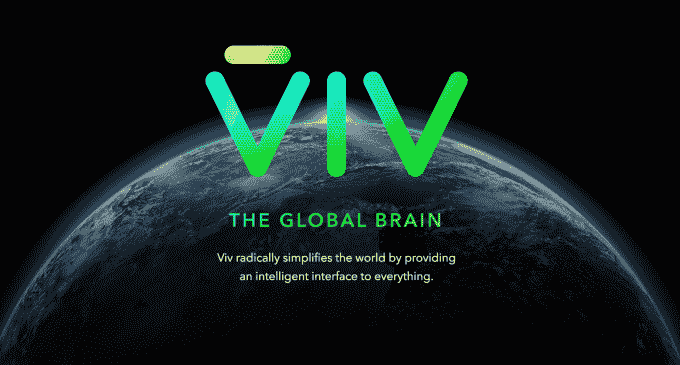
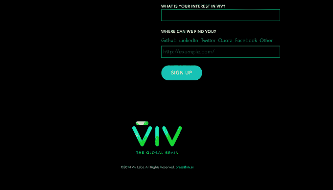

# 由 Siri 的创造者打造的 Viv 为一项能够自学的人工智能技术赢得了 1250 万美元 

> 原文：<https://web.archive.org/web/https://techcrunch.com/2015/02/20/viv-built-by-siris-creators-scores-12-5-million-for-an-ai-technology-that-can-teach-itself/>

由 Siri 的创造者打造的强大人工智能形式 Viv T1 背后的公司能够从世界中学习以提高其能力，该公司刚刚获得了 T2 1250 万美元的 B 轮融资。多个知情人士证实了这一轮融资，该轮融资获得了超额认购，对该公司的估值超过 9 位数。

这笔资金由 [Iconiq Capital、](https://web.archive.org/web/20221207144748/https://www.crunchbase.com/organization/iconiq-capital/)即[所谓的](https://web.archive.org/web/20221207144748/http://www.forbes.com/sites/briansolomon/2014/12/01/the-spider-of-silicon-valley-inside-zuck-friends-secret-billionaire-fund/)“硅谷亿万富翁俱乐部”牵头，该俱乐部是家族办公室和风险投资公司的结合体。

虽然 Iconiq 可能不是一个家喻户晓的名字，但《福布斯》对其客户名单的调查显示，像脸书的马克·扎克伯格、达斯汀·莫斯科维茨和雪莉·桑德伯格、Twitter 的杰克·多西、LinkedIn 的雷德·霍夫曼等名人都在它的名单上。

除了 Iconiq，李嘉诚的 Horizons Ventures 和 Pritzker Group VC 也和一些私人投资者一起参加了此次活动。在新一轮融资之前，该公司从 Horizons 获得了 1000 万美元的 A 轮融资，迄今为止总融资额为 2250 万美元。

Viv Labs 拒绝对这项投资发表评论。

我们知道 Viv Labs 并不需要新的资本，而是被与 Iconiq Capital 合作提供的可能性所吸引。这是一轮更具“机会主义”性质的融资，旨在加速 Viv 产品的愿景，这不仅意味着延续 Siri 的最初愿景，还意味着在许多领域超越它。

Viv 的联合创始人 Dag Kittlaus、Adam Cheyer 和 Chris Brigham 此前曾设想 Siri 是一个人工智能界面，将成为整个互联网的门户，解析和理解人们使用自然语言表达的查询。

当 Siri 首次推出其产品时，它支持 45 种服务，但最终该团队希望在第三方的帮助下扩展它，以访问当今互联网上成千上万的 API。

这并没有成为现实，因为苹果最终在 2010 年以 2 亿美元收购了 Siri 而不是 T1。该团队曾经寻求的人工智能革命没有完成，Siri 成为了一个以设备为中心的产品——在很大程度上把用户与苹果的服务和其他 iOS 功能联系起来。Siri 只能做它被编程做的事情，当它不知道答案时，它会把你踢出网络。

当然，苹果应该受到赞扬，因为它看到了将 Siri 这样的人工智能系统带给大众的机会，通过包装和营销它，让人们能够理解它的价值。Siri 投资者加里·摩根塔勒是摩根塔勒风险投资公司的合伙人，他也个人投资了 Viv Labs 的新一轮融资。

“现在全球有 5 亿人可以使用 Siri，”他说。“每月有 2 亿多人使用它，每天有 1 亿多人使用它。根据我的计算，这是历史上最快的技术吸收速度——比 DVD 快，比智能手机快——这真是太神奇了，”摩根塔勒补充道。

但如今的 Siri 功能有限。虽然她能够执行更简单的任务，比如检查你的日历或与 OpenTable 等应用程序互动，但她很难将信息拼凑在一起。她不能回答她还没有被编程理解的问题。

Viv 不一样。它可以解析自然语言和复杂的查询，将不同的第三方信息源链接在一起，以便回答手边的查询。它的速度非常快，在某种程度上，它将成为未来物联网的理想用户界面，也就是说，我们将使用语音命令与联网的日常物体进行交互。

《连线》杂志的一篇关于 Viv 及其创造者的文章将该系统描述为一个将“被世界教导，比它被教导的知道更多，并且它将每天学习新东西”的系统

摩根塔勒说他看过 Viv 的运行，称它“令人印象深刻”

“它做了它声称要做的事情，”他说。然而，仍然需要付诸行动的部分是最关键的:Viv 需要由世界编程，以便真正实现。

## 超越 Siri

虽然在某种程度上，Viv 是 Siri 的下一个版本，它将人们连接到一个通过语音命令访问的知识世界，但在许多方面它非常不同。它可能比其他通过语音访问的智能助手更强大，不仅包括 Sir，还包括 Google Now、微软的 Cortana 或[亚马逊的 Alexa](https://web.archive.org/web/20221207144748/https://beta.techcrunch.com/2014/11/06/amazon-echo/) 。

与 Siri 不同，该系统不是静态的。Viv 会有记忆。

“它将从总体上理解用户的语言、行为和意图，”摩根塔勒解释道。但它也会理解你和你自己的行为和偏好，他说。“它会调整自己的权重和概率，这样就能更经常地把事情做对。因此，它将从这方面的经验中学习，”他说。

在 [Wired 的简介中，](https://web.archive.org/web/20221207144748/http://www.wired.com/2014/08/viv/) Viv 被描述为对服务经济有价值，例如，因为你告诉系统“我喝醉了”而为你点了一杯优步，或者为你的 Match.com 约会做了所有的安排，包括汽车、预订甚至鲜花。

另一个选择可能是为商务旅行者预订航班，他们会提出多部分查询，如“我想要一个飞往旧金山的短途航班，三天后经由达拉斯返回。”Viv 会向你展示你的选择，你会告诉它订票——它会继续为你订票，已经知道你的座位和餐饮偏好以及你的常旅客号码等信息。

同样不同于今天的 Siri，Viv 将对第三方开发者开放。与过去的 Siri 相比，开发人员在 Viv 上添加新功能会容易得多。这种开放性将允许 Viv 更快地向其“全球大脑”添加新的知识领域。

Viv 实验室团队从与苹果的合作中吸取了经验，他们不打算向单一公司出售其人工智能，而是寻求一种商业模式，让任何人都可以使用 Viv，目标是成为一种无处不在的技术。未来，如果该团队取得成功，可能会在联网设备上发现一个 Viv 图标，通知你该设备的人工智能能力。

出于这个原因，Iconiq 的投资是有意义的，因为它的客户经营着当今一些最大的互联网公司。

我们知道 Viv 将在今年的某个时候推出其软件的测试版，这将是让它“由世界编程”的第一步。

摩根塔勒表示，毫无疑问，这个团队能够做到——毕竟，他们在短短 28 个月内就把 Siri 从白板变成了“改变世界的技术”，他指出。相反，Viv 实验室的问题在于可扩展性及其吸引开发者的能力。它需要向用户兑现所有这些承诺，并引起更广泛的开发者社区的足够兴趣。它还需要找到一条分销路径和将帮助它推向市场的合作伙伴——这也是 Iconiq 可以帮助的事情。

但是 Viv Labs 并不是唯一追求其目标的公司。谷歌[以超过 5 亿美元](https://web.archive.org/web/20221207144748/https://beta.techcrunch.com/2014/01/26/google-deepmind/)收购了人工智能初创公司 DeepMind，此后又去了[收购了更多的人工智能团队](https://web.archive.org/web/20221207144748/https://beta.techcrunch.com/2014/10/23/googles-deepmind-acqui-hires-two-ai-teams-in-the-uk-partners-with-oxford/)，并且[如《连线》所述](https://web.archive.org/web/20221207144748/http://www.wired.com/2014/08/viv/)，还聘请了人工智能传奇 Geoffrey Hinton 和 Ray Kurzweil[加入其公司](https://web.archive.org/web/20221207144748/https://beta.techcrunch.com/2012/12/14/ray-kurzweil-joins-google-as-engineering-director-focusing-on-machine-learning-and-language-tech/)。

Viv 可能不会在一开始就实现它的全部愿景，但它的核心引擎已经在这一点上建立起来了，而且它工作正常。此外，人工智能下一步的时机感觉是正确的。

“嵌入麦克风和互联网接入的想法价格直线下降，”摩根塔勒说。“如果获得全球智能和识别你的能力，识别你的讲话，理解你说的话，并以认证的方式为你提供服务——如果这是可行的，那真的是变革。”