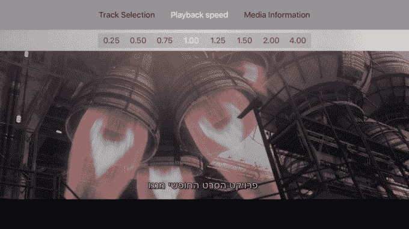

# VLC 登陆苹果电视，支持本地和网络文件的播放

> 原文：<https://web.archive.org/web/https://techcrunch.com/2016/01/12/vlc-arrives-on-apple-tv-with-support-for-casting-playback-of-local-and-network-files/>

VLC 是一款流行的视频播放软件，支持多种媒体格式，现在可以在苹果电视上使用。对于那些有大量视频收藏的人来说，这意味着您可以在电视的大屏幕上播放文件，而不必将其转换为支持的格式。新版本中更值得注意的一个特点是，VLC 应用程序现在通过“远程播放”功能支持“演员阵容”。也就是说，你可以将视频文件从浏览器或应用程序直接发送到苹果电视上，【VideoLAN，总部位于巴黎的 VLC 软件发行机构解释道。

此外，VLC 苹果电视应用程序将能够播放 Windows 共享、UPnP、FTP 和 Plex 服务器上的文件，以及本地机器上的文件。该应用程序实际上会自动发现网络存储和共享，然后让你使用遥控器或遥控器浏览它们，并选择你想要播放的内容。

例如，VLC 的媒体播放不像谷歌的 Chromecast 那样简单，但这将是该应用的突出特点之一。

除了按下按钮，你还必须将一个或多个文件拖放到你的网络浏览器中，打开苹果电视的页面。您可以继续将文件添加到此界面，以将它们排入播放队列，直到达到 Apple TV 上的存储限制，这些文件仍可在设备上本地使用。

你还可以从 VLC 提供的网络界面粘贴直接流媒体的网址，并控制播放。一旦网络流的回放结束，应用程序会将 URL 保存在“网络流”视图中，以便于将来访问。这一部分还将包括最近从 iPhone 或 iPad 上播放的网址。

您还可以粘贴多个 URL，以类似的方式将它们排队等待播放。

[gallery ids="1261322，1261324"]

[VideoLAN 说](https://web.archive.org/web/20221005191923/http://www.videolan.org/press/vlc-apple-tv.html)第四代苹果电视推出应用商店后不久，新版本的 VLC 软件已经在开发中。该软件于 11 月发布给 beta 测试人员，现在向公众开放——要找到它，只需在苹果电视的应用商店搜索“VLC”。

该软件提供了许多功能，除了回放所有文件格式，包括支持章节导航，多音频和字幕轨道，以及自定义回放速度。VideoLAN 指出，后一个功能是苹果电视上目前没有其他视频播放应用提供的。

他们说，加速回放的能力是许多人在消费教育内容或观看演讲时使用的功能，因此该团队认为从第一天起就包含这一功能是很重要的。

第一次，OpenSubtitles.org 集成了 VLC，允许用户在播放时下载丢失的字幕。字幕还可以包括从右向左的语言，如阿拉伯语和希伯来语，以及那些需要复杂文本布局的语言，如许多亚洲语言。

除了视频内容，VLC 的应用还可以用于网络广播和音乐，通过与服务 [hatchet.is](https://web.archive.org/web/20221005191923/http://hatchet.is/) 的集成，从网络上下载歌词和专辑封面，增强了这一功能。

虽然 VLC 的应用程序现在面向所有人开放，但 VideoLAN 已经在计划即将发布的一系列功能，包括与 Dropbox、box 和 OneDrive 等云服务的集成。

在过去的几年里，的 VLC[与 App Store 有着不稳定的历史，因为许可问题和其他未知的原因而被解雇。它在 Apple TV 上的首次亮相有助于为苹果如何在其 Apple TV 应用程序商店中处理此类视频播放应用程序树立一个先例。](https://web.archive.org/web/20221005191923/https://beta.techcrunch.com/2015/02/16/vlcs-media-player-for-ios-sneaks-back-into-the-app-store/)

[gallery ids="1261321，1261324，1261323，1261322，1261320"]