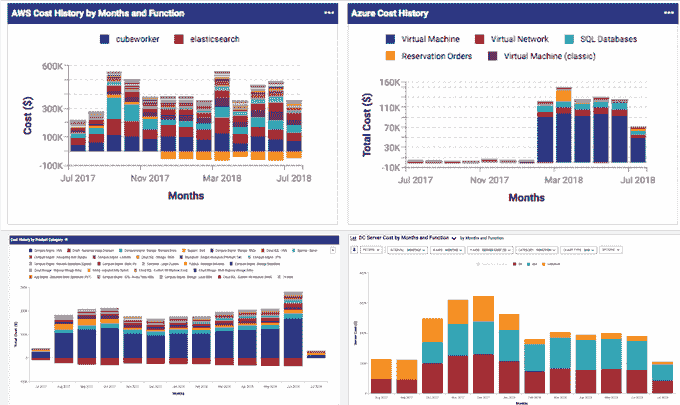

# VMware 收购 CloudHealth Technologies 用于多云计算管理

> 原文：<https://web.archive.org/web/https://techcrunch.com/2018/08/27/vmware-acquires-cloudhealth-technologies-for-multi-cloud-management/>

# VMware 收购 CloudHealth Technologies 用于多云管理

本周，VMware 将在拉斯韦加斯举办其 [VMworld 客户大会](https://web.archive.org/web/20230403171228/https://www.vmworld.com/en/us/index.html)，并宣布将收购位于波士顿[的 CloudHealth Technologies](https://web.archive.org/web/20230403171228/http://www.cloudhealthtech.com/) 。他们没有透露交易的条款，但是路透社报道价格为 5 亿美元。

CloudHealth 为 VMware 提供了一个跨 AWS、Microsoft Azure 和 Google 云平台工作的关键多云管理平台，为客户提供了一种从单一界面管理云成本、使用、安全性和性能的方法。

尽管 AWS 在云市场遥遥领先，但这是一个巨大且不断增长的市场，大多数公司都不会把鸡蛋放在单一供应商的篮子里。相反，他们正在寻找不同云服务的最佳选择。

这种多云方法对客户来说非常好，因为他们不依赖于任何单一的提供商，但这确实会造成管理上的麻烦。CloudHealth 为多云用户提供了一种通过单一工具管理其环境的方式。

CloudHealth 多云端管理。图片:云健康科技

VMware 负责产品和云服务的首席运营官 Raghu Raghuram 表示，CloudHealth 解决了多云运营的困境。Raghuram 在一份声明中说:“随着 CloudHealth 技术的加入，我们正在为跨多个云的应用程序提供一致和可操作的成本和资源管理、安全性和性能视图。”。

就在上个月，CloudHealth 开始为谷歌云平台提供支持[。首席技术官乔·金塞拉告诉 TechCrunch 为什么他们决定扩展他们的平台以包括 GCP 支持:“我认为自从黛安·格林(Diane Greene)加入谷歌(2015 年底)并开始真正推动企业以来，许多举措都取得了成果。因此，我们开始看到人们的兴趣大增。”](https://web.archive.org/web/20230403171228/https://techcrunch.com/2018/07/19/cloudhealth-adds-support-for-google-cloud-amidst-growing-demand/)

它还为他们提供了管理三大云供应商的完整解决方案。对于像 VMware 这样的公司来说，最后一点很可能使他们成为更有吸引力的目标，因为 VMware 显然正在寻找一种解决方案来帮助客户管理混合和云计算环境。

该公司一直在规划未来的扩展，不仅要从一个位置管理公共云，还要管理私有云和数据中心，这一战略应该非常符合 VMware 近年来试图帮助公司管理混合环境的做法，无论他们的虚拟机位于何处。

借助 CloudHealth，VMware 不仅获得了多云管理解决方案，还赢得了 3000 家客户，其中包括 Yelp、道琼斯、Zendesk 和 Pinterest。

CloudHealth 成立于 2012 年，已经筹集了超过 8700 万美元。其最近一轮融资是 2017 年 6 月由凯鹏华盈(Kleiner Perkins)牵头的 4600 万美元的 D 轮融资。前几轮的其他主要投资者包括 Sapphire Ventures、Scale Venture Partners 和. 406 Ventures。

https://vimeo.com/208307303