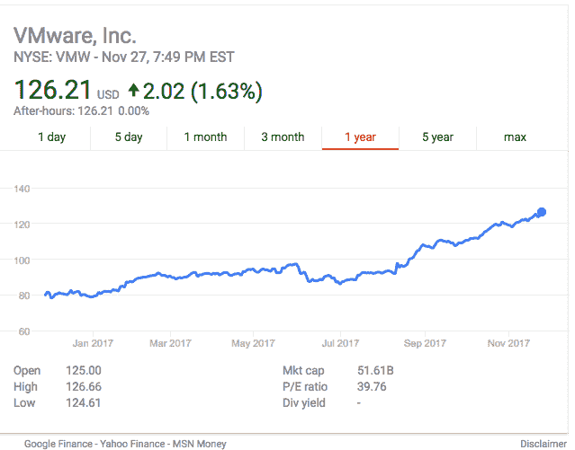

# VMware 借助新的迁移和灾难恢复工具扩展 AWS 合作伙伴关系 

> 原文：<https://web.archive.org/web/https://techcrunch.com/2017/11/28/vmware-expands-partnership-with-aws-with-new-migration-and-disaster-recovery-tools/>

# VMware 借助新的迁移和灾难恢复工具扩展 AWS 合作伙伴关系

还记得 VMware 是如何被 AWS 颠覆的吗？在这个过程中，它做了一个聪明的举动。与其对抗流行的云平台，[决定让它的](https://web.archive.org/web/20221005161501/https://beta.techcrunch.com/2017/08/28/vmware-cloud-is-now-live-on-aws-and-it-pros-just-did-a-little-happy-dance/)在 AWS 上更容易使用它的产品。今天，在 [AWS re:invent](https://web.archive.org/web/20221005161501/https://reinvent.awsevents.com/) 客户会议的开幕式上，它宣布了通过一些新的迁移和灾难恢复服务来扩展合作关系的计划。

正如 VMware 云平台业务部门的副总裁 Mark Lohmeyer 所指出的，自他们推出原始产品以来，仅过了一个季度。新产品旨在帮助简化向云的过渡。

VWmare 客户一直在努力解决的一个问题是将他们的任务关键型应用程序从数据中心迁移到云中。Lohmeyer 表示，新的迁移产品旨在快速移动应用程序，没有停机时间，并且成本合理(尽管这可能是旁观者的看法)。如果它像宣传的那样工作，它确实给了它两个世界最好的东西。

他们可以将其应用程序从数据中心全部转移到 AWS，并继续像以前一样监控和管理它们。如果真的没有宕机，这将有助于轻松实现云过渡，无论公司是希望缓慢启动并移动一两个应用程序，还是计划关闭公司数据中心并需要移动所有内容。

此外，VMware 还通过在传统的小时定价模式基础上提供保留定价折扣来增加收益。这意味着，如果你签约一年或三年，你会得到折扣，尽管金额会因数量和其他因素而异。他们还引入了混合许可证，允许客户在迁移到云时继续使用其内部许可证。与标准定价方法相比，所有这些因素都可以降低向云过渡的总体成本。

VMware 还发布了一款新的灾难恢复产品。这使 IT 能够在 AWS 上的云中保留应用程序和数据的副本。如果发生大规模飓风、停电或其他不幸事件，它们可以在中断最小的情况下继续运行。Lohmeyer 解释说:“如果你的本地云出现故障，你可以在 AWS 上组织重启。

灾难恢复工具还可以帮助那些缓慢迁移到云的公司更加适应这个想法。如果您可以将灾难恢复备份存储在云中，那么您也可以准备在某个时候移动实际的应用程序。

VMware 是推广虚拟机概念的公司，如今它是首屈一指的数据中心产品。VMware 面临的问题是，未来正在从数据中心转移到云中。它的第一个想法是试图建立自己的公共云服务，并与 AWS 竞争。当这个想法失败后，VMware 有了一个 B 计划，那就是让 T2 与其他云供应商合作。这些中最大的[当然是 AWS。](https://web.archive.org/web/20221005161501/https://dash.parsely.com/beta.techcrunch.com/posts/uQbmQXAl3U0-aws-continues-to-rule-the-cloud-infrastructure-market/?minutes=today)

在 Lohmeyer 看来，这种伙伴关系对每个人都有好处。“这对客户有好处，因为他们可以随时利用云模式。这对 VMware 来说是件好事，因为我们将客户留在了我们的平台上，并且增加了工作负载。这对 AWS 也有好处，因为有更多的工作负载在他们的平台上运行。”

如果它像描述的那样起作用，那就是理想伙伴关系的要素。

