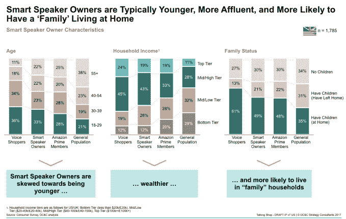

# 到 2022 年，美国和英国的语音购物预计将达到 400 多亿美元

> 原文：<https://web.archive.org/web/https://techcrunch.com/2018/03/02/voice-shopping-estimated-to-hit-40-billion-across-u-s-and-u-k-by-2022/>

根据 OC&C 战略咨询公司本周发布的一份新的市场研究报告，亚马逊 Echo 和谷歌 Home 等智能扬声器的日益流行将导致语音购物的爆炸。该公司乐观地预测，语音购物将在 2022 年增长到 400 多亿美元，高于目前美国和英国的 20 亿美元

报告称，这一可观的增长将特别受到亚马逊智能扬声器销售的推动。

这一预测远远超过了此前对未来几年语音购物收入的估计。虽然不是精确的比较，但加拿大皇家银行资本市场最近[预测](https://web.archive.org/web/20230327220332/https://www.cnbc.com/2017/12/21/buy-amazon-because-alexa-will-drive-10-billion-in-sales-rbc-capital.html)到 2020 年，亚马逊将从 Alexa 设备产生 100 亿至 110 亿美元的销售额——包括设备销售本身和语音购物。

[gallery ids="1603262，1603263"]

但这份新报告认为，智能扬声器的快速采用意味着我们也将看到语音购物的大幅增长。

报告称，今天，13%的美国家庭拥有智能扬声器，其中 36%的家庭经常使用该设备进行购物。在英国，10%的家庭拥有智能音箱，16%的家庭经常用它购物。

但是，更多的人已经使用智能音箱进行了至少一次购买，即使他们不是定期的语音购物者。62%的美国智能音箱用户购买了智能音箱，44%的英国用户购买了智能音箱

该报告还发现，拥有智能扬声器的人往往更年轻、更富有，更有可能生活在有孩子的“家庭”家庭中——所有这些因素都可能以自己的方式推动更多的语音购物购买。也就是说，年轻人通常更快接受新技术；富人会选择便利，即使有时价格更高；户主往往太忙，无法在本地购物，他们会向 Alexa 或 Google Home 寻求帮助。

但是，目前通过 voice 购物的产品是价值较低的商品，是一次性购买的。杂货(20%)、娱乐(19%)、电子产品(17%)和服装(8%)是购买量最大的类别。与此同时，只有 39%的消费者表示他们信任智能音箱的个性化产品建议，大多数人只是购买他们已经知道的东西。

如果公司，特别是亚马逊，不能想出如何改善他们的推荐，并推动更多人通过语音进行日常家庭购买，那么人们不使用语音扬声器进行产品发现的事实——他们在网络和移动设备上使用的方式——可能会在未来成为一个问题。这也可能影响这个高达 400 亿美元的估计，目前看来有点乐观。