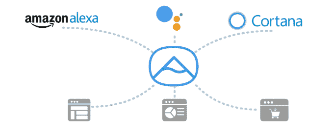
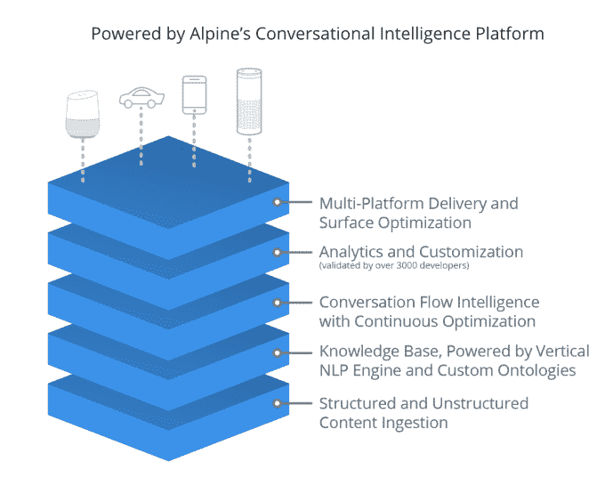
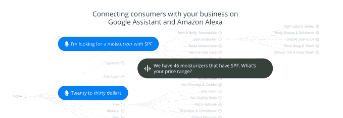

# Voicelabs 推出 Alpine，将零售商带入语音购物生态系统 

> 原文：<https://web.archive.org/web/https://techcrunch.com/2018/01/29/voicelabs-launches-alpine-to-bring-retailers-to-the-voice-shopping-ecosystem/>

Voicelabs 是一家已经在语音计算市场尝试了一段时间的公司，在广告和分析方面采取了一些举措，现在它再次将业务转向语音商务。该公司今天推出了最新的隐形产品: [Alpine。AI](https://web.archive.org/web/20221025223758/https://alpine.ai/product/) ，这是一个通过导入目录为零售商构建语音购物应用的解决方案，然后在其上部署人工智能技术，以更好地回答消费者的语音查询，并最终将这些查询转化为购买。

虽然这是 Voicelabs 在过去几年中开发的第三个产品，但这种程度的实验在新生的语音生态系统中是可以预期的。(我们应该注意到,“实验室”甚至出现在这家初创公司的名字中。)

最初，Voicelabs 认为涉足了第三方广告。它允许广告商通过将语音应用程序开发者聚集到一个网络中来接触大量的智能扬声器客户群，该网络的接触范围可以被整体出售给广告商。但是亚马逊对广告可能扰乱消费者体验的方式很敏感，[改变了政策，迫使 Voicelabs 关闭该产品](https://web.archive.org/web/20221025223758/https://beta.techcrunch.com/2017/06/15/the-first-ad-network-for-alexa-skills-shuts-down-following-amazons-policy-changes/)。

该公司随后转向语音分析，这是一个竞争更激烈的市场，有许多现有的参与者。从这里开始，高山人工智能的想法产生了。

虽然 Voicelabs 统计了超过 3500 名分析客户，但它发现其中一些人对电子商务感兴趣。但除了谷歌助手和亚马逊 Alexa 平台都提供的第一方购物体验之外，这两款平台都还没有语音购物应用。

当然，特别是在亚马逊的案例中，这可能是因为它希望家庭中的语音设备最终将成为消费者购买 Amazon.com 产品的一种主要方式，而不一定是直接从零售商那里购买。与此同时，谷歌对通过 Google Express 等服务与电子商务领域的合作伙伴合作持更开放的态度，例如，谷歌去年与大型零售商合作，包括沃尔玛(Walmart)在内的[和目标(Target)在内的](https://web.archive.org/web/20221025223758/https://beta.techcrunch.com/2017/08/22/walmart-and-google-partner-on-voice-based-shopping/)。

但零售商不一定想把整个语音问答过程，包括关于他们产品的回答、推荐和发现，以及最终的转化，完全交给亚马逊或谷歌。

这就是阿尔卑斯山的用武之地。

在几天之内，Alpine 可以消化零售商的网站和 CMS，然后使用这些数据自动创建一个语音应用程序。然后，该应用程序通过机器学习技术得到增强，该技术从消费者的来电查询中学习如何最好地回答问题。

有些改进甚至在应用程序上线之前就已经完成了。例如，Voicelabs 派了一名员工去记录顾客在零售店中对其客户的产品提出了什么样的问题。

Voicelabs 联合创始人兼首席执行官 Adam Marchick 解释说:“大约六个月前，我们开始看到消费者询问产品。“他们在问‘我应该买这个还是那个？’或者，“跟我说说这款睫毛膏。”或者，‘告诉我有什么新鲜事，’”他说。我们在第三方应用和平台本身上都看到了这种情况。"

随着客户引入新的查询，人工智能技术开始发挥作用，并更好地完善语音应用程序的响应。

例如，顾客可以向美容产品零售商索要“长效睫毛膏”，其中有几十种产品可供选择。基于早期的互动，人工智能可能知道缩小选择范围的最佳方式是通过价格。稍后，如果另一位顾客要求使用持续时间超过 12 小时的长效睫毛膏，系统必须适应这一新的查询。机器学习有助于为应用程序的响应建立一个新的定制路径，也是基于现有的数据。

虽然今天的零售商正在注意语音辅助空间，但尚不清楚平台制造商自己将在多大程度上允许其他零售商实现自己的语音购物体验。

但 Alpine 可以通过提供更简单的发现体验来解决任何限制，例如，随后通过客户电子邮件进行跟进。或者它可以与平台提供的语音购物体验结合起来——比如允许客户在 Amazon.com 上完成购买，如果这是给定零售商的一个选项的话。

然而，Marchick 认为这些平台欢迎零售商开发自己的语音购物应用。

“我们与他们两人都保持着良好的沟通。两个平台都知道 Alpine，我只能做到这一步，”他有点谨慎地说，指的是谷歌和亚马逊。

“在这里，我们对 Alpine 被平台接受(与早期的广告产品相比)更有信心，因为它百分之百符合他们的目标和政策。拥有最佳消费者体验的平台是赢家，”Marchick 说。" Alpine 将为最佳的购买体验提供动力."

该公司还不允许谈论其客户，但确实有来自电子商务 100 的客户。

Alpine 作为一种软件即服务解决方案出售，根据零售商的目标和电子商务量进行定制定价。

几个月前，在 Alpine 发布之前，该公司也结束了种子期融资。它现在得到了投资者的支持，包括 Chernin Group、Javelin Venture Partners、Betaworks，以及天使投资人蒂姆·塔利(Splunk 首席技术官)、乔恩·布雷利(InfoScout 首席技术官，已被收购)、坎侬(邮箱首席技术官，已被 Dropbox 收购)和 ApartmentList.com 首席执行官约翰·科布斯。

除了 Marchick 声称 Voicelabs 现在“资金充足”之外，这轮融资的规模尚未披露。

Voicelabs 的分析产品将持续到 2018 年 3 月 29 日，以便现有客户有时间进行迁移。与此同时，阿尔卑斯山今天开始营业，