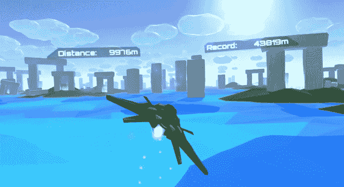

# 虚拟现实游戏初创公司 Lucid Sight 获得 350 万美元 A 轮融资 

> 原文：<https://web.archive.org/web/https://techcrunch.com/2016/05/16/vr-gaming-startup-lucid-sight-nabs-3-5m-in-series-a-funding/>

总部位于洛杉矶的 VR 游戏工作室 Lucid Sight，Inc. 今天宣布，他们已经完成了由 Rana Capital Partners，B.V .和 Salem Partners 领投的 350 万美元 A 轮融资。这次融资使公司的资金总额达到 400 万美元。之前的投资者包括 AdColony 创始人乔纳森·茨威格(Jonathan Zweig)。

在宣布融资的同时，Lucid Sight 发布了一款虚拟现实广告 SDK。Lucid Sight 希望游戏开发商可以利用这个平台，通过沉浸式应用内广告为用户实现内容货币化。该公司正在利用这次最新的融资建立自己的内容库，这样他们既可以增加自己在各种耳机上的存在，又可以展示自己的广告平台。游戏工作室目前在主要耳机上有三款游戏(Poly Runner VR、谷米 No Yume 和 Space Bit Attack ),他们希望在年底前将免费广告支持的游戏数量增加到 20 款。

聚流道虚拟现实

虚拟现实中的广告现在处于一个非常奇怪的位置，游戏开发商不想随意实施它并惹恼用户，但 Lucid Sight 希望它能在虚拟现实广告开始变大之前抓住这个机会。

这是 Lucid Sight 创始人兰迪·萨夫和奥克塔维奥·埃雷拉熟悉的立足点，他们之前在一个不同的范式转换平台移动上追求这条成功之路。两人在 2008 年共同创立了 Jirbo，这是一家 iPhone 游戏公司，在早期主导了苹果应用商店。该团队将很快把 Jirbo 的游戏业务发展成为应用内广告的视频广告网络。该团队后来将该公司的多数股权出售给了 Insight Venture Partners。Jirbo 很快更名为 AdColony，然后被[以 3.5 亿美元的价格卖给了 Opera】。](https://web.archive.org/web/20221005184512/https://beta.techcrunch.com/2014/06/24/confirmed-opera-buys-adcolony-for-75m/)

对于广告商来说，虚拟现实代表了一个非常诱人的平台来展示吸引人的赞助内容，但事实是，目前没有太多地方可以观看这些内容。

“在网络或移动屏幕这样的 2D 平台上，很难表达虚拟现实体验，”萨夫告诉我。“所以，你能真正展示虚拟现实体验的唯一地方是在另一个虚拟现实体验中。”

Lucid Sight 已经看到了早期的成功，他们一直通过自己的游戏在应用程序中推广 360 度内容。即使在 10 秒钟后选择退出，该公司告诉我，超过 20%的用户选择在他们的游戏 PolyRunner VR 中观看基于狮门电影*《分歧者系列:忠实者*的 4 分钟赞助广告。

在虚拟现实领域，有时很难找到相关的指标。Oculus 上周透露，三星 Gear VR 上个月的用户数已超过 100 万，因此我们开始获得更多关于设备和内容受欢迎程度的有用基准。Lucid Sight 仍未准备好给出确切的下载数量，但确实明确表示，他们的游戏在当前 Gear VR 设备中占据了令人印象深刻的“两位数百分比”。

广告可能不是用户在虚拟现实中吵着要的东西，但它可能会在各种耳机应用程序商店中获得更多免费的广告支持的内容，以便人们实际尝试虚拟游戏工作室正在创造的一些令人敬畏的东西。