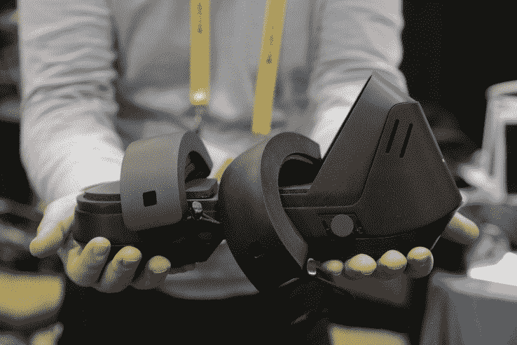
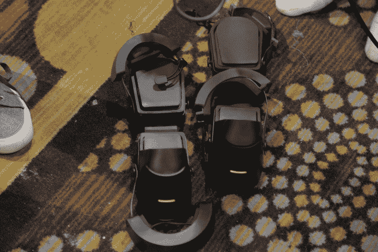
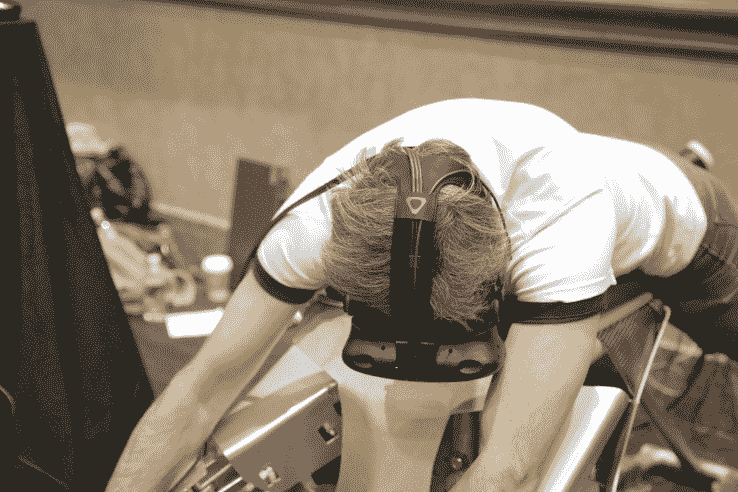

# 虚拟现实鞋和飞行器技术危机

> 原文：<https://web.archive.org/web/https://techcrunch.com/2017/01/04/vr-shoes-and-a-flying-machine/>

如果这种虚拟现实的东西不能再次起飞，伙计，我们会觉得所有的东西，我们在过去几年尝试愚蠢的。这是 CES 启动活动中的两个非常可靠的例子。两者都试图让虚拟现实更加身临其境，而且都让你在这个过程中看起来很傻。

让我们从虚拟现实鞋开始，因为，嗯，虚拟现实鞋。

[Cerevo 的 Taclim](https://web.archive.org/web/20221206014559/https://taclim.cerevo.com/en/) 是针对虚拟现实移动性问题的又一次尝试——在这个过程中提供了一些很酷的触觉反馈和高踢腿动作。一旦你放弃了把你的脚放在很多其他地方的想法，你就踩在两个塑料块上。如果您正在观看演示，Cerevo 的一名员工会用几条橡胶带保护您。

在虚拟现实中，很难从座位上站起来。让我先说一下。此外，该公司正在使用的演示耳机无法让我集中注意力——在这个过程中，前面突然出现了。我只是提到这一点，因为它有点影响了我的经历。

演示包括走动和踢腿。Taclim 提供触觉嗡嗡声来模拟不同的表面。这是一种奇怪的感觉。不太令人信服，但一旦完全沉浸其中，肯定会增加体验。至于踢腿——我被要求动作轻柔，以免在表演中踢到任何人的脸。负债，你知道吗？

[超级泳衣](https://web.archive.org/web/20221206014559/http://www.the-ory.com/)在公共场合也同样笨拙——正如该代表提到的，个人使用实在太贵了，所以很可能大部分都是在公共场合使用。您戴上耳机，平放在感觉像运动器材的东西上，抓住两个手柄。这个演示是为了模拟飞行，整个过程都是用风扇把你的头发吹回来。

这位销售代表警告我说，这种设备很难控制，他没有说错。我发现自己不断向上漂移，这让运行演示的人很沮丧。在虚拟世界中失去控制的体验本身就是一种相当令人沮丧的体验。但也许这是为飞行的承诺付出的小小代价。