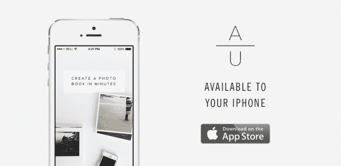

# VSCO 收购 Artifact 起义，帮助将更多摄影带到现实世界 

> 原文：<https://web.archive.org/web/https://techcrunch.com/2015/01/07/vsco-acquires-artifact-uprising-to-help-bring-more-creative-work-to-the-real-world/>

# VSCO 收购文物起义，以帮助把更多的摄影带到现实世界

视觉供应公司，更广为人知的名字是 [VSCO](https://web.archive.org/web/20221006075604/http://vsco.co/) ，已经收购了[神器起义](https://web.archive.org/web/20221006075604/http://www.artifactuprising.com/)，这是一家总部位于丹佛的初创公司，专注于将摄影师的作品从现代创意人士经常光顾的数字中心以有形书籍和印刷品的形式带到现实世界。

在昨晚的聊天中，VSCO 首席执行官乔尔·弗洛里告诉 TechCrunch，这笔交易是为了帮助神器起义实现其潜力。“作为一名摄影师，没有什么比拿着自己的照片更好的了，”他在描述 Artifact 起义的产品将如何融入 VSCO 目前的产品线时指出，该产品线目前专注于为摄影师提供在手机和桌面上编辑和分享照片的工具。

弗洛里说，艺术品起义在为摄影师提供产品方面已经做得非常出色，但将能够利用 VSCO 的资源进一步发展。这就是为什么 Artifact 起义的 14 名全职团队成员在合并后都将保留他们的职位，包括创始人詹娜·沃克(Jenna Walker)，她将继续担任首席执行官，并继续独立运营。

然而，“利用 VSCO 的资源”不仅仅是指去年 5 月 VSCO 在首轮融资中筹集的 4000 万美元。“在工程方面，我们在这个领域有自己的目标和抱负。我们正在构建其背后的架构和平台，这将是一个共享的资源，在 2015 年期间逐步推出。”

VSCO 还将帮助 Artifact 起义超越北美，这是目前其主要市场。VSCO 的情况正好相反，其 80%的用户群位于美国以外。