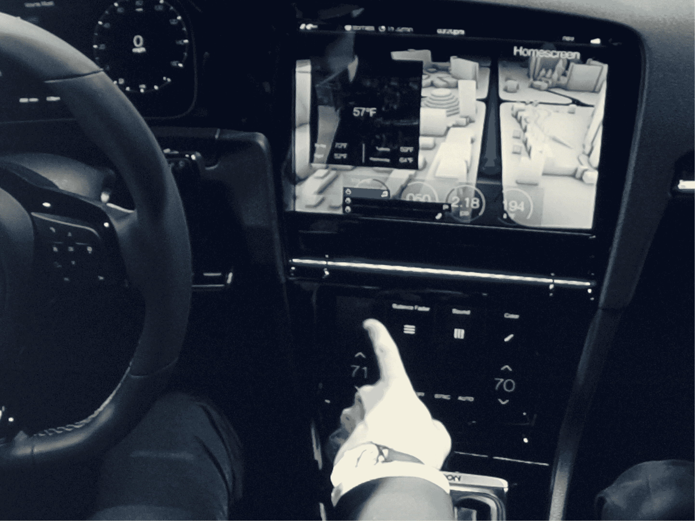

# 大众首次推出带有全触摸屏用户界面的高尔夫 R Touch，手势控制

> 原文：<https://web.archive.org/web/http://techcrunch.com/2015/01/05/vw-debuts-the-golf-r-touch-with-all-touchscreen-user-interface-gesture-control/>

# 大众首次推出带有全触摸屏用户界面和手势控制的高尔夫 R Touch

昨天在 CES 的新闻发布会上，Nvidia 谈论了很多关于它认为汽车的未来将涉及大量屏幕的事情。今天，[大众](https://web.archive.org/web/20230316061502/http://www.vw.com/)首次展示了其高尔夫 R Touch 的原型，其中包括汽车制造商对未来汽车用户界面的愿景。和英伟达的惊人的相似。

正如大众的 Heinz-Jakob Neuer 博士在今天的主题演讲中指出的那样，该公司正在“专注于改善从汽车到驾驶员的信息传输，反之亦然。”这意味着大量的触摸屏，但也侧重于手势控制。

例如，R Touch 的中央面板包括一个 12.8 英寸的主屏幕，用于所有的信息娱乐功能，下方有一个 8 英寸的控制中心屏幕，用于操作气候控制和类似功能。仪表板也被 12.3 英寸的宽屏显示器取代，取代了经典的仪表盘。

“我们从消费电子接口和用途领域取得领先，并针对汽车应用进行了改进。”

当然，汽车上的触摸屏并不都是新的，但直到现在，我们才看到可以达到我们当前期望的界面(主要是由最新一代的手机和平板电脑设定的)。

大众为这款车增加了两项有趣的创新。举起你张开的手两秒钟，一个类似 Kinect 的手势控制就会弹出(包括你手的幻影图像)，让你甚至不用触摸屏幕就可以控制汽车的所有功能。使用大众的多点触控滑块，你可以将一到三个手指放在屏幕上，根据你使用的手指数量，你可以控制收音机的音量或设置环境光(这看起来是一个非常可定制的功能)。所有这些都伴随着触觉反馈。

该车的所有其他传统按钮也已被电容按钮取代。

随着我们给汽车增加更多的技术，分心的风险只会增加。在某种程度上，触摸屏可能更容易分散注意力，因为你不能只是盲目地抓住一个按钮。相反，你至少要短暂地看一下屏幕。看起来大众正试图通过多点触摸滑动系统来解决这个问题。不过，手势控制的效果如何还有待观察。乍一看，它更像是一个分散注意力的东西，而不是一个安全功能。

因为这是一个原型，该公司没有透露它计划何时将这一系统用于生产汽车，也没有透露这一系统的成本。大众的一名代表也拒绝讨论其背后的技术栈(尽管如果是英伟达的，我也不会感到惊讶)。