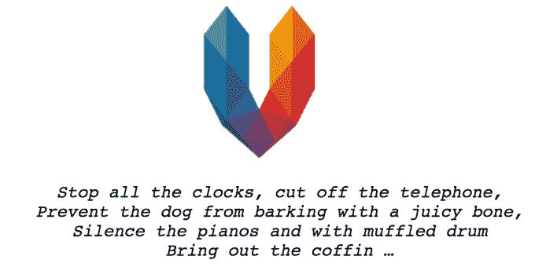

# Vyclone 进入死亡池 

> 原文：<https://web.archive.org/web/https://techcrunch.com/2016/07/07/vyclone-hits-the-deadpool/>

一款将同一事件中不同参与者拍摄的视频结合在一起的应用程序 [Vyclone](https://web.archive.org/web/20221207031608/https://www.vyclone.com/) 的末日已经到来。公司[今天“怀着沉重的心情”宣布](https://web.archive.org/web/20221207031608/https://www.vyclone.com/)，Vyclone 应用将于 2016 年 7 月 22 日关闭。

这家成立于 2012 年的公司[旨在](https://web.archive.org/web/20221207031608/https://beta.techcrunch.com/2012/07/18/vyclone/)帮助其用户“一起制作美丽的视频”,利用位置数据来确定在应用程序中拍摄视频时还有谁在附近(并使用 Vyclone)。通过将多个用户拍摄的视频拼接在一起，该应用旨在成为在音乐会、婚礼和家庭聚会等现场活动中制作可共享内容的理想工具。

该公司在洛杉矶有一个办公室，在伦敦有一个开发团队。

后来，Vyclone 与微软的 Internet Explorer 合作，推出了基于网络的视频编辑体验，允许“任何人开玩笑地重新混合视频，即使他们不是摄制组的一部分，”Vyclone 的发言人[当时告诉](https://web.archive.org/web/20221207031608/https://beta.techcrunch.com/2013/03/13/social-video-app-vyclone-brings-its-collaborative-video-editor-to-the-web/) TechCrunch。

“也许，有一天，我们会再次崛起，一起再次覆盖所有的角度，”Vyclone 团队今天的消息说。

Vyclone 建议用户在关闭之前下载他们可能已经存储在系统中的任何内容，因为他们将从商店中删除该应用程序并关闭他们的服务器。

我们已经联系了 Vyclone，以获得关于该公司倒闭的更多细节，一旦我们听到更多消息，我们将更新这篇文章。