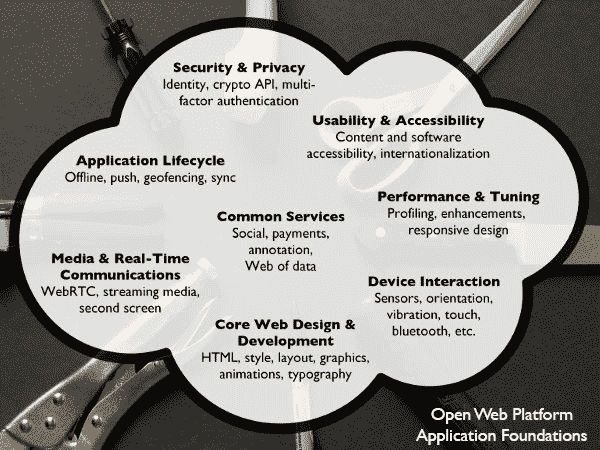

# W3C 宣布 HTML5 标准完成 

> 原文：<https://web.archive.org/web/https://techcrunch.com/2014/10/28/w3c-declares-html5-standard-done/>

四年多前，史蒂夫·乔布斯向 Flash 宣战，并宣布 HTML5 是大势所趋。如果你认为 [HTML5 标准](https://web.archive.org/web/20230125052349/http://www.w3.org/TR/html5/)——1997 年 HTML 4 的后续版本——早已是板上钉钉，你可以原谅，因为开发者、浏览器供应商和媒体已经谈论它很多年了。然而，事实上，HTML5 仍然在不断变化——[直到今天](https://web.archive.org/web/20230125052349/http://msopentech.com/blog/2014/10/28/w3c-charts-a-course-for-the-future-of-the-open-web-by-finalizing-html5-standard/)。W3C 今天发布了它的 HTML5 推荐标准——经过多年的添加功能和修改后的最终版本。

作为用户，你不会注意到任何变化。你的浏览器很可能已经支持大多数 HTML5 特性，比如元素和矢量图形(除非你的雇主强迫你使用一个非常老的版本的 ie 浏览器)。在过去几年中，HTML5 为 web 带来的其他重要新功能有:用于呈现 2D 形状和位图图像的

<canvas>元素，用于在浏览器中显示数学符号的 MathML 支持，以及从离线缓存到拖放支持的各种 API。</canvas> 

W3C 主管蒂姆·伯纳斯·李在今天的一份声明中说:“今天，我们认为在浏览器中观看视频和音频没什么，在手机上运行浏览器也没什么。”“我们希望能够在任何地方、任何设备上分享照片、购物、阅读新闻和查找信息。尽管大多数用户看不到它们，但 HTML5 和开放网络平台正在推动这些不断增长的用户期望。”

正如微软开放技术的 W3C HTML 工作组联合主席和合作伙伴组经理 Paul Cotton 本周早些时候告诉我的那样，他认为 HTML5 的主要成就是它“定义了 web 开发人员在构建他们的网站时可以依赖的一组可互操作的 HTML5 特性。”

该小组讨论的任何不可互操作的特性都被转移到了 HTML 5.1(包括在标准中加入对某些数字版权管理权利的支持这一有争议的想法)。HTML 5.1 最早可能在明年发布，工作组将继续致力于那些被排除在 HTML 5 之外的特性。

在 HTML5 的众多新功能中，Cotton 认为“HTML5 最重要的一个功能可能是视频标签，因为今天的网络正迅速转向视频。”

在标准化过程中的某个时刻，看起来可能需要 2020 年才能得到最终的推荐。多亏了 W3C 的“2014 计划”，我们今天有了最终版本。不过，正如科顿告诉我的，他也认为这是不同利益相关者同意的最大妥协。

“作为‘2014 年计划’的一部分，我们还鼓励工作组允许一些有争议的项目作为‘扩展规范’与 HTML5 并行进行，”他告诉我。“事实上，这些扩展规范中的一些是单独开发的(即 Ruby 和 elements ),并在完成之前被合并到了 HTML5 中，其他的如‘long description’正在作为单独的 W3C 推荐标准完成。”

 Cotton 指出，像 W3C 和 HTML 工作组这样的组织面临的挑战将是跟上开放标准的发展环境，并对这些变化做出反应。

“例如，开发人员今天用来完成日常工作的工具，如 GitHub、社交媒体等。与五年前有了很大的不同，如果我们希望 HTML 工作组的未来工作能够吸引 web 开发人员，那么我们需要随着环境的变化而发展，”Cotton 说。

同样，W3C 今天在其新闻稿中指出，下一版本的标准需要关注许多核心的"[应用基础](https://web.archive.org/web/20230125052349/http://www.w3.org/appfoundations/)"，如安全和隐私工具、设备交互、应用生命周期、媒体和实时通信以及围绕社交网络的服务、支付和注释。所有这些都是为了让开发者更容易支持 web 平台。

随着 HTML5 的最终推荐完成，W3C 现在将立即开始修复错误，但最重要的是，它将在 [HTML 5.1](https://web.archive.org/web/20230125052349/http://www.w3.org/html/wg/drafts/html/master/) 上工作。