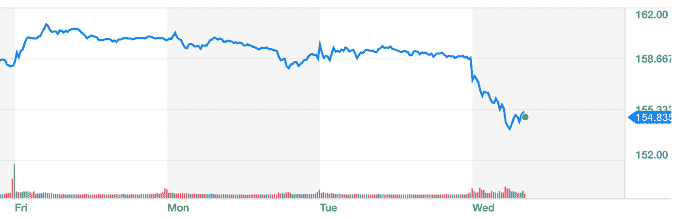

# 华尔街指责苹果新手表 TechCrunch 出现 LTE 连接问题

> 原文：<https://web.archive.org/web/https://techcrunch.com/2017/09/20/wall-street-dings-apple-after-some-reported-lte-connectivity-issues-on-the-new-watch/>

# 在报道了新手表的 LTE 连接问题后，华尔街对苹果进行了批评

今天早上有很多关于 Apple Watch Series 3 的评论报道，这些报道表明存在一些 LTE 连接问题——导致苹果今天早上小幅下跌，并在迈向 1 万亿美元的过程中减速。

苹果公司的股票今天早上下跌了大约 2.5%，这对苹果公司来说是一个相当大的损失，尽管这个数字看起来很小。苹果是一家价值超过 8000 亿美元的公司，所以这么小的跌幅就可以抹去数百亿美元的价值——相当于 Snap、Twitter 或其他一些较小的市值公司。这是图表:

新的 Apple Watch Series 3、iPhone 8 和 iPhone 8 Plus 将很快上市。在那之后，我们将看到这两个关键新产品的撞击坑，这两个产品应该为苹果创造一个相当大的季度。所有的目光或多或少都集中在 iPhone X 上，但新手表和 iPhone 的增量更新仍然是苹果即将到来的增长的关键部分。

苹果[告诉 The Verge，这些问题源于](https://web.archive.org/web/20221208035345/https://www.theverge.com/2017/9/20/16337874/apple-watch-lte-connectivity-problems-software-update)“当 Apple Watch Series 3 在没有连接的情况下加入未经认证的 Wi-Fi 网络时，它有时可能会阻止手表使用蜂窝网络。”该公司还告诉 The Verge，它正在“调查未来软件版本的修复程序。”

华尔街期待苹果再次加速其增长引擎，这主要是由 iPhone 驱动的。该公司发布了 iPhone X，这是对其 iPhone 产品线的一次重大重新设计，价格非常昂贵(T2)。苹果希望成为一家价值 1 万亿美元的公司，这并非完全不可能，这取决于它建立利基产品组合的能力，如 HomePod、AirPods 和新的 Apple Watch 产品，以及一款轰动一时的 iPhone。

这个季度对苹果来说将是一个重要的季度，但是下个季度将会更加重要。然而，推出一款遇到连接问题的新产品并不好看，因为它试图让消费者和华尔街相信，它将重新点燃智能手机市场的需求，这个市场已经开始达到饱和点——因此价值几十亿美元。