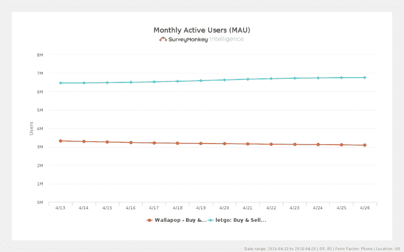

# Craigslist 的两个竞争对手 Wallapop 和 LetGo 合并进军美国市场，再融资 1 亿美元 

> 原文：<https://web.archive.org/web/https://techcrunch.com/2016/05/10/wallapop-and-letgo-two-craigslist-rivals-plan-merger-to-take-on-the-u-s-market/>

在线分类广告领域的整合正在进行，两家诞生于巴塞罗那的热门初创公司正就合并美国业务进行深入谈判..Wallapop 和[LetGo](https://web.archive.org/web/20230208113024/http://www.letgo.com/)——这两家公司都为消费者提供了发布二手物品并进行线下销售谈判的平台——正在合并他们在美国的业务，以扩大与 Craigslist 和易贝等大型现有公司的竞争，以及同一领域的新进入者，如 OfferUp、5miles 和脸书市场。与此同时，该集团从现有股东那里筹集了 1 亿美元的额外资金来扩大业务。

TechCrunch 从知情人士处了解到了谈判的情况，并向其他消息人士证实了这一消息。该交易于本周周四正式宣布。

我们联系了 Wallapop 和 LetGo，他们都拒绝置评。(而且，当我们四处询问更多信息时，我们看到西班牙出版物 Vanguardia 也在我们之前[发表了这方面的新闻](https://web.archive.org/web/20230208113024/http://www.lavanguardia.com/economia/20160510/401687093163/wallapop-letgo-fusion-estados-unidos.html)。)

美国业务将由 LetGo 控制，其团队和平台是运营的基础。

就员工而言，Wallapop 是一家更大的公司，但 LetGo 在美国更受欢迎，你可以从 SurveyMonkey Intelligence 的这些统计数据中看到这一点:

据报道，在此之前，这两家公司迄今都已经筹集了超过 1 亿美元的资金。Wallapop 从未公开证实它已经筹集了多少资金，尽管我们的消息来源说它是 1.5 亿美元，公司价值超过 5.7 亿美元(超过€5 亿美元)。其投资者包括 Insight Venture Partners 和 Accel。

与此同时，LetGo 得到了南非 Naspers 的支持，后者还从分类广告巨头 OLX 的创始人亚历克·奥克森福德手中收购了一家前公司。虽然两家公司都成立于巴塞罗那，但它们都在美国市场找到了观众。LetGo 称纽约为其总部。双方都没有透露用户数量，但据报道 Wallapop 有大约 2500 万次下载。

我们的消息来源告诉我们，两家公司合并的原因之一是为了更好地与现有的大玩家竞争，同时也是为了更好地与市场上的其他新贵竞争，这些新贵利用了最大的在线分类公司 Craigslist 创新缓慢的事实。

其中的关键是一个移动优先的方法，在一个易于浏览并带有地理标记和其他本地化功能的应用程序中为用户提供分类体验。

它们包括像 5miles 这样的小公司，5 miles 已经从阿里巴巴这样的公司获得了投资。还有像 OfferUp 这样的大公司，去年 11 月[确认融资 9300 万美元](https://web.archive.org/web/20230208113024/https://techcrunch.com/2015/11/04/with-93-million-in-spending-money-offerup-quietly-becomes-a-top-shopping-app/)和数百万客户。

也有来自更大更老玩家的新玩法。其中包括 Facebook Marketplace，据消息人士称，该网站[已经存在很久了](https://web.archive.org/web/20230208113024/https://www.facebook.com/notes/facebook/the-marketplace-is-open/2383962130/)，但已经悄然成长为一个威胁。就在几周前，脸书[移动](https://web.archive.org/web/20230208113024/http://www.ibtimes.com/facebook-marketplace-tab-allows-quick-access-location-based-selling-shopping-2357836)在其主要的脸书移动应用程序的下栏放置了一个市场链接——这可能是它自己计划如何更积极地进入这个电子商务市场的标志。

在这种背景下，这似乎是一个非常有趣的巧合，就在几周前，易贝决定披露 Close5 已经超过了 700 万次下载。

**从卖给 LetGo**

去年 12 月，Wallapop 的联合创始人 Agus Gomez 正式证实了该公司的第一次收购——收购纽约的竞争对手，并以未披露的价格出售。这笔交易很有趣，因为据报道，Wallapop 和美国的 LetGo 之间正在建立联系，因为 Sell It 的联合创始人 Fabrice Grinda 也与 Oxenford 共同创立了 OLX。

“Wallapop 的大赌注是扩大我们在美国的业务，”戈麦斯在 12 月份告诉 TechCrunch，确认了 Sell It 收购。“我们开始与 Fabrice Grinda 交谈。[他]是传统在线分类广告的巨头之一。

“我们希望在美国本土打造一支强大的团队。我们开始讨论加入 forced，我们对这个新类别的前景有着完全相同的看法。两支车队都有一种强烈的感觉，我们非常好斗，我们喜欢以同样的方式工作。这很自然地发生了。现在我真的真的很高兴 Fabrice 站在我们这边。他太棒了。他将帮助我们扩大在美国的业务。”

Wallapop 在美国拓展业务的一种方式是与一个直接竞争对手联合力量和资源——由于收购了 Grinda，这个竞争对手变得更容易接近。

*更新了 Wallapop 和 LetGo 的回复以及其他详细信息。*