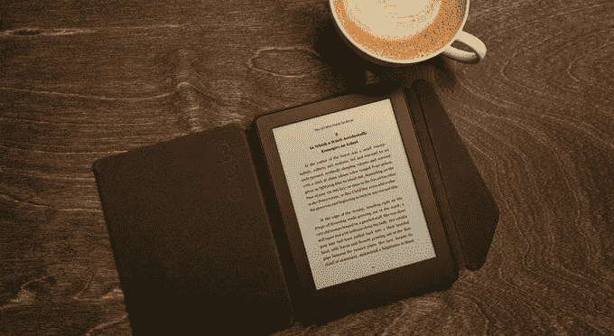
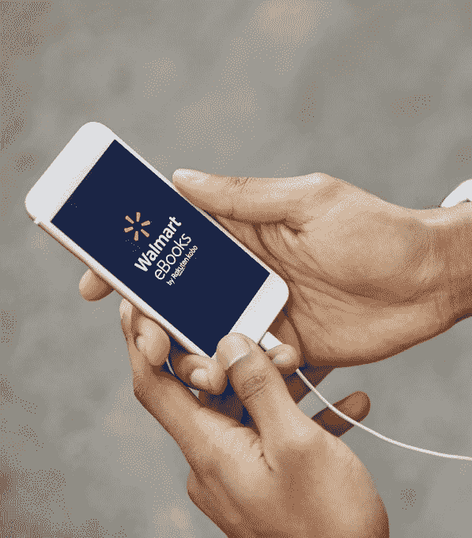
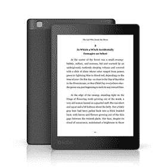

# 沃尔玛和 Kobo 推出在线电子书和有声读物商店 Walmart eBooks

> 原文：<https://web.archive.org/web/https://techcrunch.com/2018/08/22/walmart-and-kobo-launch-walmart-ebooks-an-online-e-book-and-audiobook-store/>

今年 1 月，沃尔玛[与日本电子商务巨头乐天(Rakuten)合作，在日本开展网上杂货业务，并在美国销售有声读物、电子书和电子阅读器。如今，沃尔玛正在利用这种关系，在 Walmart.com 推出完整的电子书和有声读物目录，以及各种实体书。](https://web.archive.org/web/20230320024955/https://techcrunch.com/2018/01/25/walmart-and-rakuten-partner-on-grocery-delivery-in-japan-kobo-e-books-and-audiobooks-in-u-s/)

新网站名为[沃尔玛电子书](https://web.archive.org/web/20230320024955/https://www.walmart.com/cp/5632020)，包括超过 600 万种图书，从 NYT 畅销书到独立书籍和儿童书籍。

与亚马逊的 Audible 类似，沃尔玛现在也将提供每月有声书订阅服务。

然而，沃尔玛在价格上低于亚马逊。Audible [订阅费](https://web.archive.org/web/20230320024955/https://www.amazon.com/gp/help/customer/display.html?nodeId=202162280)起价为每月 14.95 美元，而沃尔玛的订阅费仅为每月 9.99 美元。

此外，沃尔玛旨在利用其实体店来帮助推动沃尔玛电子书的发展。

该公司表示，它将通过电子图书卡的方式在商店出售近 40 种图书。这些卡片将用于流行书籍，如艾克哈特·托尔的《现在的力量》，尼尔·德格拉斯-泰森的《匆匆忙忙的人的天体物理学》和奇普·盖恩斯的《资本·盖恩斯》。从本周开始，这种卡片将在 3500 家沃尔玛商店铺开。

沃尔玛还将在网上和商店销售乐天旗下的 Kobo 电子阅读器。今天，顾客将在沃尔玛的电子商务网站上看到各种 Kobo 电子阅读器出售，本周晚些时候，Kobo Aura 电子阅读器将登陆 1000 家商店。

但是顾客不需要拥有 Kobo 设备来阅读这些书籍。相反，电子书可以通过联合品牌的 iOS 和 Android 应用程序访问，这些应用程序也于今天推出。

乐天表示，与沃尔玛的关系是该公司服务全球受众这一更大愿景的一部分。该公司成立于 2009 年，目标是在全球多个市场运营，包括不同的语言和货币。今天，它的内容覆盖 190 个国家，并在 24 个国家有本地化商店。

乐天 Kobo 总裁兼首席执行官迈克尔·坦布林(Michael Tamblyn)在一份声明中表示:“尽管我们是一家专注于销售数字产品的公司，但在我们开展业务的每个国家，零售商和商店体验一直是重要的组成部分。”。“这就是为什么随着我们在美国市场的发展，我们很高兴与沃尔玛合作。我们可以一起为更多的人提供出色的阅读体验，无论是纸质、数字还是两者兼而有之。”

显然，沃尔玛与乐天的合作是这家零售商更好地与亚马逊竞争的一种方式，因为它没有建立自己的电子阅读器和平板设备，也没有提供自己的电子书和有声读物目录。但顾客——尤其是倾向于在沃尔玛购物的有价值观念的顾客——可能不在乎电子书来自哪里，如果它们价格更低的话。

同时，Kobo Aura 设备是不错的产品。例如，有些是防水的 T2，非常适合在泳池边或洗澡时阅读。这些设备也有不同的屏幕尺寸和价位，起价 99 美元。

获得一系列电子书还可以帮助沃尔玛在以后充实自己的亚马逊主要竞争对手——这似乎更有可能，因为[报道](https://web.archive.org/web/20230320024955/https://variety.com/2018/digital/news/walmart-streaming-video-netflix-amazon-1202876004/)沃尔玛现在正在开发自己的流媒体视频服务(在 Vudu 之外)，该服务可能成为某个此类计划的一部分。

为了启动沃尔玛电子书的发布，该零售商为新客户提供 10 美元的优惠，以购买他们的第一本点菜电子书或有声读物。此外，有声读物订阅用户可以免费试用这项服务 30 天。