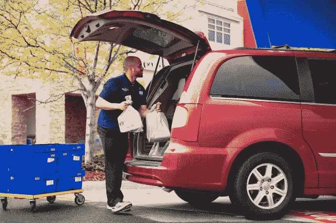
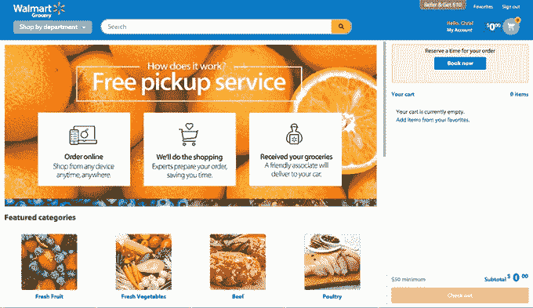

# 沃尔玛在网上杂货店购物上加倍下注，路边取货 

> 原文：<https://web.archive.org/web/http://techcrunch.com/2015/09/28/walmart-announces-a-significant-expansion-of-its-online-grocery-shopping-service/>

沃尔玛今天宣布扩大其在线杂货购物服务，在另外八个市场推出，并计划在未来几个月继续推广到更多地区。这一消息传出之际，许多初创公司和大公司，包括 T2、亚马逊和 T3，都在竞争成为消费者首选的网上杂货配送服务。

与此同时，沃尔玛在很大程度上采取了不同的策略，在美国的少数几家商店预先测试了网上杂货店购物(T5)和当地提货选项

沃尔玛认为，它在网上杂货购物领域的竞争优势来自零售商在美国相当大的实体足迹，美国 70%的人口居住在沃尔玛商店的 5 英里范围内。

此外，通过选择专注于本地取件而不是递送，消费者可以节省成本。这是因为一些送货服务[通过提高所送物品的价格或者收取送货费来产生收入](https://web.archive.org/web/20230129065710/http://blogs.wsj.com/digits/2015/01/13/heres-how-instacarts-grocery-delivery-pricing-model-works/)，而且他们往往还需要每年的订阅费。

例如，亚马逊一直在西雅图、纽约(布鲁克林)、费城以及北加州和南加州测试亚马逊生鲜食品配送。但是亚马逊的服务将收取 299 美元的年费，尽管[订阅的截止日期已经被一再推迟](https://web.archive.org/web/20230129065710/http://www.geekwire.com/2015/amazonfresh-delays-299year-prime-fresh-rollout-for-another-3-months/)(这可能表明定价可能是一个问题)。与此同时，亚马逊通过其一小时配送服务 Prime Now 扩大了其杂货配送选择，从而搅浑了水——包括亚马逊生鲜直播的一些相同市场。

另一方面，沃尔玛已经在一些商店测试网上杂货配送和本地取货。它尝试在丹佛和圣何塞送货，但似乎更喜欢当地取件，因为这项服务在 2015 年一直在扩展。

## 现在有十几个市场

在今天之前，本地皮卡在五个市场，包括加利福尼亚州圣何塞；阿肯色州本顿维尔；亚利桑那州凤凰城；科罗拉多州丹佛市；最近，阿拉巴马州的亨茨维尔。

截至目前，沃尔玛宣布一系列新市场将上线在线杂货购物。其中包括:佐治亚州亚特兰大市；北卡罗来纳州夏洛特和费耶特维尔；犹他州的盐湖城和奥格登；田纳西州的纳什维尔；亚利桑那州图森；科罗拉多州的科罗拉多泉。这些地区的客户今天就可以开始装满他们的网上购物车，但取件本身从 10 月 13 日开始。

此外，该零售商表示，计划在未来几周内将在线杂货购物推广到更多的商店和地区，但没有透露细节。

城市的选择也有些有趣。(奥格登？！)虽然杂货配送的竞争对手通常专注于密度更大的城市市场，但沃尔玛选择的是规模较大的城市，有些城市有数百万家庭，但也包括那些被杂货配送供应商忽略的城市。这表明，沃尔玛在顾客人口统计方面正在寻找更多的“秘方”。

在这方面，似乎有必要指出的是，在这项新服务中，在网上购买食品杂货的女性多于男性，同时忠实的沃尔玛购物者与新顾客相结合。

“我们看到未来的大部分以及沃尔玛顾客群的焦点主要是女性——这就是我们拥有的很多。我们看到许多妇女带着孩子坐在汽车座位上，整天从一个地方搬到另一个地方，”沃尔玛全球电子商务副总裁兼首席运营官解释说。

## 沃尔玛的网上购物是如何运作的

杂货店购物服务的工作方式包括顾客和零售商之间的在线和离线互动。顾客通过沃尔玛网站在线购物，将商品添加到他们的购物车中——如果他们愿意，他们甚至可以在一周内建立订单时保存这些商品。

大约有 30，000 个 SKU，和你在商店里找到的差不多。大多数是杂货，虽然也有有限的一般商品可供选择。价格和商店里的一样，而且使用这项服务是免费的。然而，不像你在商店购物，优惠券是不接受的。

订单完成后，客户在线付款，然后设定他们的提货时间。时间一到，他们就开车去当地的沃尔玛商店，把车停在商店前面或侧面为网上购物者保留的指定位置。停车后，他们通过原始确认电子邮件提供的号码给商店打电话，并在取车时间前几分钟通过提醒电话再次打电话。

然后，店员会推出一辆装满杂货的手推车，包括顾客到达之前挑选出来并分别存放在商店后面的冷却器和冰柜中的新鲜和冷冻商品。

## 混合电子商务

Bender 证实，这家零售商正在通过雇佣全职“私人购物者”来增加员工数量，这些人负责挑选顾客的订单。他表示，随着时间的推移，这项技术将变得更加个性化，允许杂货店购物者提出具体要求，比如询问水果的特定成熟度。
这位高管还指出，随着网上购物的不断推出，消费者的接受速度比前一个市场更快，这表明消费者对这项服务的兴趣越来越大。然而，该零售商拒绝谈论采用数字、交易量或其他具体指标。

专注于取件的战略并不是沃尔玛独有的，而是许多实体零售商正在考虑的事情，以便与越来越多的送货服务竞争。例如，[塔吉特和百思买正在与路边摊](https://web.archive.org/web/20230129065710/https://techcrunch.com/2015/06/25/same-day-shopping-app-curbside-picks-up-25-million-more/)合作测试本地皮卡。与此同时，美国一些主要零售商多年来一直提供店内取货和送货到店计划。

鉴于美国的网上杂货店购物仍处于早期阶段，尚不清楚未来几个月美国消费者会倾向于哪种服务——送货还是取货。但沃尔玛的战略一直是提供数字和实体融合的混合电子商务体验。

“这是我们作为一家公司的目标的更明显的表现之一，”Bender 说。他补充称:“我们认为，未来我们将成为(在线杂货购物领域)的重要参与者。”。