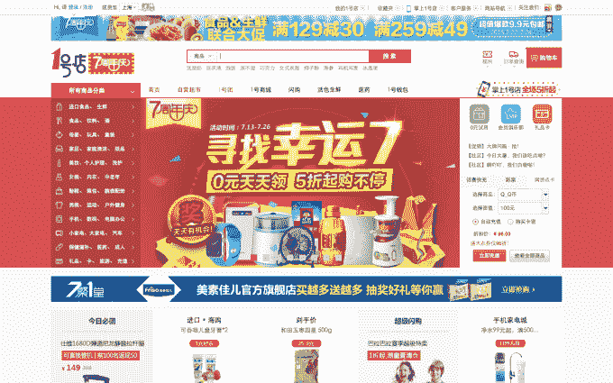

# 沃尔玛完全控制其在中国的在线零售业务一号店

> 原文：<https://web.archive.org/web/https://techcrunch.com/2015/07/22/walmart-buys-out-its-chinese-store-yihaodian/>

# 沃尔玛完全控制其在中国的在线零售业务一号店

全球最大的零售商[收购了其在中国的在线零售业务一号店](https://web.archive.org/web/20230320101527/http://news.walmart.com/news-archive/2015/07/22/walmart-acquires-remaining-shares-to-take-full-ownership-of-yihaodian-e-commerce-business-in-china)的全部所有权后，沃尔玛正在加大其在中国电子商务领域的努力。

这家美国公司将从其国内合作伙伴中国平安金融服务集团手中收购一号店剩余的 49%股份，一号店是在美国上市的阿里巴巴和 JD.com 的较小竞争对手。不过，该公司没有透露交易价格。

[三年前，沃尔玛增持了已有七年历史的 1 号店的股份。截至 2013 年底，该业务拥有 5700 万注册用户(高于一年前的 2900 万)，年销售额为 19 亿美元(T7)，后者(非盈利/亏损)使其跻身中国五大在线零售店之列。在今天的更新中，沃尔玛表示，1 号店现在有超过 1 亿的注册顾客，超过 800 万件商品可供选择。](https://web.archive.org/web/20230320101527/http://www.prnewswire.com/news-releases/walmart-global-ecommerce-completes-increased-investment-in-yihaodian-175907201.html)

“一号店已经成为中国最优秀的电子商务企业之一。沃尔玛全球电子商务总裁兼首席执行官尼尔·阿什(Neil Ashe)在一份声明中表示:“我们对 1 号店的团队及其丰富的本地电子商务经验感到兴奋。“我们对一号店的投资是我们在中国发展的长期承诺的一部分，我们期待继续在电子商务行业的发展中发挥积极作用。”

伴随着这条投资新闻，高层也发生了变化。1 号店的联合创始人——董事长余刚和前首席执行官刘俊岭——本月早些时候离开了该公司，而王璐——沃尔玛亚洲区总裁兼首席执行官——已经接手掌舵该公司。

阿里巴巴凭借一系列服务在中国在线零售领域占据主导地位，包括市场淘宝和品牌“商城”天猫，JD.com 是其主要竞争对手。然而，随着该国的电子商务预计将从去年的 3070 亿美元飙升至 2019 年的 1 万亿美元(T2)，这个蛋糕显然足够大，足以保证边缘玩家的大量投资。

例如，尽管在一定程度上落后于顶级玩家，亚马逊还是加大了对中国的关注。这家美国公司的本地战略甚至包括通过竞争对手阿里巴巴的平台销售商品，这就是机会的大小。