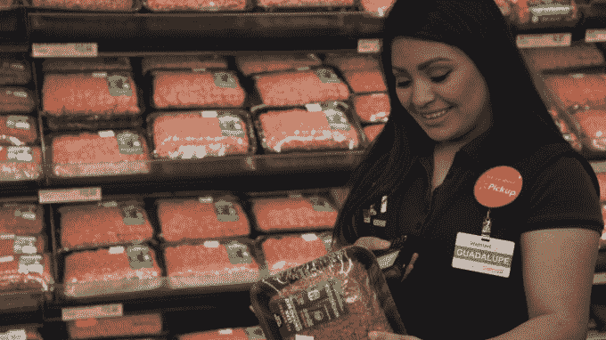

# 沃尔玛扩大其在美国的路边杂货店提货服务

> 原文：<https://web.archive.org/web/http://techcrunch.com/2016/04/13/walmart-expands-its-curbside-grocery-pickup-service-in-the-u-s/>

当亚马逊(Amazon)、[、谷歌(Google)](https://web.archive.org/web/20230403230119/https://www.google.com/express/)和一些初创公司，如[、Instacart](https://web.archive.org/web/20230403230119/https://www.instacart.com/) 、 [Postmates](https://web.archive.org/web/20230403230119/https://postmates.com/) 、 [Shipt](https://web.archive.org/web/20230403230119/https://www.shipt.com/) 和其他公司专注于食品杂货和家居用品的快速当天送达时，沃尔玛采取了不同的方式。相反，它利用其庞大的实体足迹，在美国各地的许多地方推出了路边杂货店，允许客户在线或移动购物，然后在当地商店停下来抢订单。

今天，该零售商宣布将这一服务扩展到许多新市场，并在其几个较大的既定市场中将门店提货点增加一倍。

新增市场包括堪萨斯城；爱达荷州博伊西；弗吉尼亚州的里士满和弗吉尼亚海滩；德克萨斯州奥斯汀；犹他州普罗沃；亚拉巴马州达芙妮；和南卡罗来纳州的查尔斯顿。与此同时，该公司表示，达拉斯、休斯顿和亚特兰大等市场的提货地点正在翻倍。

随着这些服务的增加，沃尔玛的杂货提货服务将在 30 多个市场上线。(你可以在这里看到更多支持地区的列表[)。这给了这个零售巨头一个竞争的角度来对抗通常更贵的在线杂货递送服务。](https://web.archive.org/web/20230403230119/https://techcrunch.com/2015/09/28/walmart-announces-a-significant-expansion-of-its-online-grocery-shopping-service/)

同样值得注意的是，通过路边取货，沃尔玛已经能够瞄准中小型市场，在许多情况下，这些市场还没有推出杂货配送。这是因为当天送达的经济效益——特别是一小时送达，就像亚马逊 Prime Now 一样——要求这些服务专注于密度更大的城市市场。与此同时，截至去年，据说沃尔玛商店位于 70%的美国人口的 5 英里范围内。(沃尔玛称这个数字没有改变，尽管一月份[商店关闭](https://web.archive.org/web/20230403230119/http://www.usatoday.com/story/money/business/2016/01/15/list-of-walmart-stores-closing/78852898/)。

公司高管[此前表示](https://web.archive.org/web/20230403230119/https://techcrunch.com/2015/09/28/walmart-announces-a-significant-expansion-of-its-online-grocery-shopping-service/)女性也更多地使用沃尔玛的杂货提货服务。这意味着它倾向于迎合忙碌的妈妈类型，她们带着孩子出去跑腿，想通过不用下车来节省时间。

就服务本身而言，这一点自去年以来一直没有改变。仍然有大约 30，000 个 SKU 可供路边取货，与你在商店里找到的差不多。这份清单包括杂货和普通家庭用品。价格也和店内一样，没有额外的费用。这解决了沃尔玛核心人群的一个更大的担忧，他们可能更关心成本而不是便利。

顾客可以在一周内在线购物，将商品添加到购物车中。或者他们可以通过沃尔玛手机应用程序快速下单。当他们的购物车装满时，他们可以选择一个时间段来取货，然后在当地商店的指定位置停车。上午 10 点前下的订单可以当天取货。

尽管沃尔玛没有透露目前有多少顾客在使用杂货提货，或者订单量是多少，但该零售商报告称，它确实有一个忠实的客户群。

90%的顾客是回头客，他们主要用它来购买新鲜食品，而不是普通商品。这是沃尔玛第一次公布其杂货提货业务的数据，之前它只会说，随着在每个新市场的推出，顾客的采纳率正在加快。

此外，沃尔玛表示，90%的网上购物篮包含新鲜商品，如乳制品、肉类和农产品。这说明了送货和取件服务都面临的一个问题——挑选合适的物品。比如说，自己购物的一个好处是可以亲手挑选合适的产品或肉块。这也是送货服务 Instacart [将店内购物者纳入工资单的原因之一–](https://web.archive.org/web/20230403230119/https://techcrunch.com/2015/06/22/instacart-makes-some-of-its-contractors-part-time-employees/)这样他们就可以接受如何正确挑选商品的适当培训。

沃尔玛的私人购物者也是员工。该公司还报告称，客户满意度得分在 90%以上。

沃尔玛表示，新的市场和扩张将于本月上线，先于 2016 年计划的几个新地点的扩张。