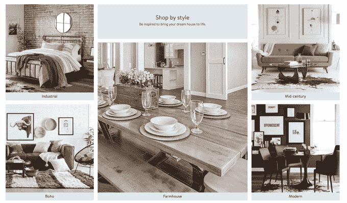
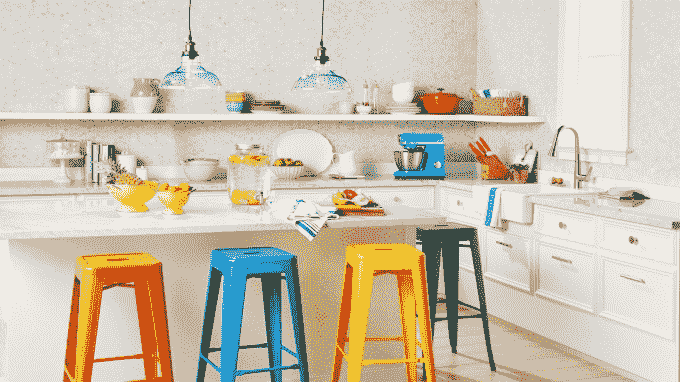

# 沃尔玛推出新的家具和家居装饰家居购物网站 

> 原文：<https://web.archive.org/web/https://techcrunch.com/2018/02/21/walmart-launches-a-new-home-shopping-site-for-furniture-and-home-decor/>

随着假期期间电子商务销售的放缓，沃尔玛今天准备了一个新的策略来吸引网上购物者，更加关注家庭商品。这家零售商现在正在网上推出重新设计的家居购物体验，这将更好地突出家居产品，如家具、配件和其他装饰品。

新网站的主页将展示 9 个风格类别的精选藏品，包括现代、中世纪、传统、魅力、工业、波西米亚、农舍、过渡和斯堪的纳维亚风格。与沃尔玛典型的购物体验不同，它还将使用编辑风格的图像，并将包括由内部员工撰写的设计技巧。

这一新举措是沃尔玛去年宣布的家庭集团部门重组的一部分。这包括两项额外的高管任命，前家居品牌 Dot & Bo 的首席执行官 Anthony Soohoo 成为 Walmart.com、Hayneedle 和 Jet.com 所有美国电子商务零售的家居集团的 SVP 和总经理，Scott Doughman 担任 Hayneedle 的总裁。

“作为沃尔玛美国电子商务家居的负责人，并且无可否认地痴迷于设计，我个人对我们正在进行的改变感到兴奋，这些改变旨在帮助我们的客户在沃尔玛网站上购买我们提供的高质量、潮流、当然还有实惠的家居产品，”Soohoo 在关于此次发布的声明中说。

据零售商称，网上购买家居商品必须采取不同的方式。虽然杂货和消费品等类别本质上更具交易性，但家居用品类别需要更具“灵感”也就是说，网上购物者想要一个更多关于浏览和获取想法的网站，而不仅仅是传统的“添加到购物车”体验。

沃尔玛没有公布其销售额中有多少是家庭用品，或者有多少属于这一类别。但它确实表示，在过去一年里，借助新家具和家居装饰系列的推出，它的品种增加了近一倍，比如宜家风格的斯堪的纳维亚儿童家具。

新的家居购物网站还将帮助展示沃尔玛自己的自有品牌和沃尔玛专属品牌，如 [Mainstays](https://web.archive.org/web/20221027230850/https://www.walmart.com/cp/mainstays/1228441) 、 [Better Homes and Gardens](https://web.archive.org/web/20221027230850/https://www.walmart.com/cp/better-homes-and-garden/1011919) 和[先锋女性](https://web.archive.org/web/20221027230850/https://www.walmart.com/cp/the-pioneer-woman/1231327)。这也是竞争对手亚马逊最近进入的领域，它在 11 月推出了第一条家居装饰线。塔吉特也在稳步扩大其家庭用品供应，推出了 Threshold 、 Project 62 、Hearth&Hand with Magnolia、等品牌，并且就在几天前，还推出了一个新的兼收并蓄的品牌，名为 [Opalhouse](https://web.archive.org/web/20221027230850/https://www.target.com/c/opalhouse/-/N-be4v3) 。

与此同时，沃尔玛将重点放在价格竞争上，推出低价产品，如起价 159 美元的沙发、起价 59 美元的双人床垫和起价 17 美元的地毯。这意味着它也将挑战其他家具零售商，比如宜家和 Wayfair。

新网站将在未来几周内在 Walmart.com 网站和手机上上线，在家庭类别下缓慢推出。它还将在今年晚些时候提供沃尔玛更大的电子商务网站设计的预览。

[gallery ids="1600916，1600915，1600914，1600913，1600912，1600911，1600910，1600909，1600907，1600906"]