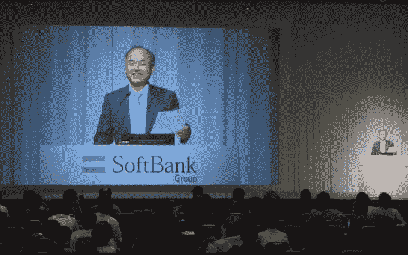

# 哎呦:软银 CEO 透露沃尔玛已经收购了 Flipkart 

> 原文：<https://web.archive.org/web/https://techcrunch.com/2018/05/09/walmart-softbank-flipkart-masayoshi-son/>

这里有一个方法可以确保亚马逊不会因为出价高于你而获得 Flipkart 在印度的控制权:直接收购。今天在软银的财报发布会上，首席执行官孙正义似乎透露了一点消息:他宣布，全球最大的零售商沃尔玛周二晚上达成了一项收购印度领先电子商务零售商 Flipkart 的协议，从而结束了数月(实际上是数年)的猜测。软银目前是 T2 Flipkart 最大的投资者之一。

“沃尔玛正在收购 Flipkart，”孙正义在演示中说(他用日语发言，软银代表提供了实时翻译)。"昨晚有官方声明。"

不久之后，情况迅速恢复，但有点混乱:在孙正义演讲的问答环节，第二位先生走近他，塞给他一张纸条，之后这位首席执行官读了纸条，然后说公告已经*不是*而是得到了确认。

“关于 Flipkart，还没有正式宣布，”他苦笑着说。“也许我不应该提到那件事……嗯，我不能把它拿出来！”

“尚未宣布”也是软银发言人采取的路线，我们还没有听到 Flipkart 和沃尔玛的评论。然而，它可能很快就会到来:我们被一个消息来源告知，官方消息将在印度时间下午 5 点发布。

如果玛莎的第一个声明是准确的，沃尔玛的收购将结束一个长期运行的传奇。几个月来，一直有传言称，世界上最大的零售商正准备收购这家印度公司的大量股份，以进入印度市场——有报道称，股份规模在[51%](https://web.archive.org/web/20230128055623/http://www.reuters.com/article/us-flipkart-online-m-a-walmart/exclusive-walmart-close-to-buying-majority-of-indias-flipkart-idUSKBN1HJ0YJ)和[70%](https://web.archive.org/web/20230128055623/https://www.businesstoday.in/current/corporate/flipkart-walmart-deal-sachin-bansal-exit-esop-employees-softbank-stake-valuation/story/276441.html)之间，价值在 150 亿至 200 亿美元之间，其他投资者[可能包括谷歌](https://web.archive.org/web/20230128055623/http://www.reuters.com/article/us-flipkart-m-a-walmart-talks/indias-flipkart-yet-to-finalize-stake-sale-deal-with-walmart-sources-idUSKBN1I517V)。

但是在上周，替代报道开始出现，称亚马逊将试图收购沃尔玛，并作为股东占据有利位置。

沃尔玛和亚马逊在其他市场一直在激烈竞争，特别是在美国——亚马逊在网上销售方面占据主导地位，但沃尔玛继续在实体销售方面领先，尽管亚马逊采取了许多积极举措，例如收购全食超市。

与此同时，印度——仅次于中国的亚洲第二大经济体，也是世界上增长最快的市场之一——在过去几年里已经成为亚马逊的一个关键国家，已经向亚马逊在那里的业务投入了数十亿美元，还为未来的投资预留了数十亿美元。因此，当沃尔玛似乎也打算通过入股美国最大的本土在线零售商来试图插手时，Flipkart 成为了这两家美国巨头之间的最新战场。

然而，沃尔玛显然不准备放弃。正如我们上周指出的那样，沃尔玛将其在英国 Asda 的股份转让给 Sainsbury's，将为该公司在印度的更大发展铺平道路，这似乎就是这里发生的事情。

目前还不清楚沃尔玛是否会收购这笔交易的所有投资者，还是只是获得控股权，并继续让其他第三方参与进来。

自 2007 年成立以来，Flipkart 已经筹集了约 73 亿美元的资金，其他投资者包括微软、易贝、Naspers、腾讯、Tiger Global、Accel 等，它本身也是一家整合公司，去年收购了易贝印度公司。

尽管它是美国最大的在线零售商，但就估值而言，它经历了一段艰难的时期，估值一度超过 150 亿美元，但在 2017 年的最后一轮交易中降至 116 亿美元，部分原因是来自亚马逊、Snapdeal 等公司的激烈竞争。

有趣的是，我们应该指出，这并不是孙正义第一次提前“宣布”一项印度技术交易。

两年前，在另一次季度报告中，软银老板无意中透露，OYO——软银视为投资者的酒店聚合服务公司——[收购了竞争对手 Zo Rooms](https://web.archive.org/web/20230128055623/https://techcrunch.com/2016/02/10/softbank-confirms-oyo-rooms-is-buying-rival-budget-hotel-network-zo-rooms/?_ga=2.227485598.2002202104.1525059458-1283936854.1506356256) ，这一交易当时在印度引起了广泛猜测。

尽管他透露，[OYO 和 Zo 的交易实际上从未发生过。事实上，两人争执不下，](https://web.archive.org/web/20230128055623/https://techcrunch.com/2017/10/26/oyo-zo-rooms-deal/)[甚至上了法庭](https://web.archive.org/web/20230128055623/https://economictimes.indiatimes.com/small-biz/startups/newsbuzz/zo-rooms-takes-oyo-to-court-for-data-theft/articleshow/62992227.cms)，因为拟议中的交易破裂后关系恶化。

Flipkart 和沃尔玛的结盟规模要大得多，Flipkart 是印度估值最高的初创公司，也是科技行业的典范。希望孙先生这次没弄错。