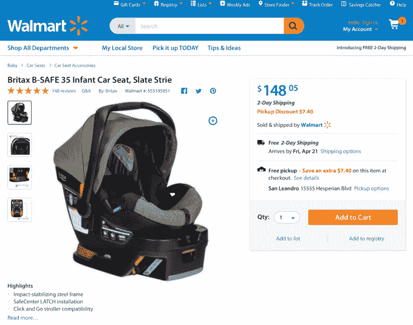

# 如果你选择商店提货而不是送货，沃尔玛将降低 100 万件网上商品的价格 

> 原文：<https://web.archive.org/web/https://techcrunch.com/2017/04/11/walmart-to-lower-prices-on-a-million-online-only-items-if-you-opt-for-store-pickup-over-shipping/>

Walmart.com 正准备推出一项名为“提货折扣”的新功能，如果顾客选择在当地商店提货而不是选择运输，该功能将很快降低多达 100 万件在线商品的价格。据说该功能的灵感来自于 Jet.com 开发的智能购物车技术，这家电子商务初创公司去年被沃尔玛以 30 亿美元收购。

Jet.com 的智能购物车系统为购物者提供了多种省钱的方式。在某些情况下，通过对与物品的仓储位置和与客户的距离相关的基础物流的综合理解，它突出了可以以更低的价格一起运输的物品。Jet 还可能鼓励客户放弃退货的权利，或使用特定的支付方式来降低价格。

该系统的根本思想是，Jet 可以了解电子商务中的成本，向消费者公开这些成本，然后当顾客利用智能购物车系统时，将节省的成本转移到结账处。

同样的透明精神也是沃尔玛提货折扣选项的目标，该选项将于 4 月 19 日在 Walmart.com 全境启动。

最初，该功能将在大约 10，000 种在线商品上提供，这意味着这些商品不在商店出售，但必须直接运送到商店或客户手中。沃尔玛表示，到 2017 年 6 月底，该网站最受欢迎的商品的折扣将超过 100 万件，不包括其第三方市场销售的商品。

在某些情况下，折扣只有几美元，但对于较大的项目，甚至可能更多。例如，网上售价为 148.05 美元的 [Britax B-SAFE 35 婴儿汽车座椅 Slate Strie](https://web.archive.org/web/20221002203330/https://www.walmart.com/ip/BRITAX-B-SAFE-35-E1A186R-SLATE/49550292) ，将获得 7.40 美元的额外提货折扣(140.65 美元是新价格)。但是对于价格为 1698 美元的 [VIZIO SmartCast M 系列 70″级 4K 超高清电视(M70-D3)](https://web.archive.org/web/20221002203330/https://www.walmart.com/ip/50314346) ，提货折扣为 50 美元，价格为 1648 美元。

折扣将在产品的详细信息页面上突出显示(如果有)。

提货折扣旨在利用沃尔玛现有的配送网络，其中包括一支由 6700 多辆卡车组成的车队，从其 4700 个履行中心运送产品。简而言之，沃尔玛运送到商店的成本比运送到顾客手中的成本要低。

然而，沃尔玛表示，它降低价格并不是为了提高自己的底线。这种说法是，无论它节省了什么，都是在回馈消费者。

“这实际上意味着对沃尔玛的财务保持中立，所有的好处都将传递给顾客，”沃尔玛的电子商务主管马克·洛尔指出，他曾是 Jet.com 的创始人。“我们的观点是，我们不希望这必然是一个比电子商务更有利可图的渠道。他指出:“我们的想法是，电子商务渠道有一定的盈利能力，在某种程度上，我们可以节省相关的资金，我们会与客户分享，这就是我们的想法。”。

也就是说，新折扣选项的推出可能会帮助沃尔玛进一步降低网上价格，最终有助于其与亚马逊的竞争。如果它最畅销的商品能以比其他地方更低的价格买到，那将有助于增加销售额。在顾客方面，提货不像在其他电子商务零售商那里那么困难——90%的美国人在 10 英里范围内就有一家沃尔玛商店。

如今，顾客必须到沃尔玛商店内取货，但沃尔玛已经为杂货订单开发了路边取货选项。它的在线杂货提货服务现在已在 600 家商店开展，今年还将增加 500 家。鉴于大多数问题已经得到解决，从人员配备到提醒，甚至到为接送顾客服务所需的停车位，未来看到沃尔玛为一些较小的在线销售提供路边服务并不奇怪。

不过，在近期，沃尔玛一直在测试[一座“提货塔”](https://web.archive.org/web/20221002203330/http://www.businessinsider.com/walmart-built-a-giant-online-pickup-tower-2016-10)，它将其比作网上订单的自动售货机。在一个巨大的店内塔楼里，有成吨的包裹，顾客可以通过订单号取回。该零售商表示，皮卡塔的测试已经取得了成功，因此它将在未来几个月内推广到其他地方。(沃尔玛拒绝透露有多少家，但在阿肯色州的罗杰斯就有一家。)

随着提货折扣的推出，Lore 表示，其他受 Jet.com 启发的储蓄功能也将进入 Walmart.com，但拒绝提供具体信息。

“随着时间的推移，它会变得支离破碎，”谈到 Smart Cart 将如何走向 Walmart.com 时，Lore 说。“这不会一蹴而就——只会有一些元素和片段出现，”他补充说，并表示更多功能预计将在“未来几个月”推出

提货折扣将于本月晚些时候在美国邻近地区的所有商店(总共超过 4，000 家)推出。

*图片来源:沃尔玛；Walmart.com；外勤特工途经[商业内幕](https://web.archive.org/web/20221002203330/http://www.businessinsider.com/walmart-built-a-giant-online-pickup-tower-2016-10)*