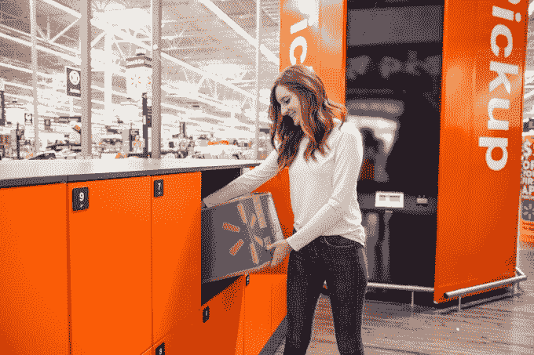

# 沃尔玛今年将在美国商场推出 500 多个提货塔 

> 原文：<https://web.archive.org/web/https://techcrunch.com/2018/04/06/walmart-to-roll-out-over-500-more-pickup-towers-to-u-s-stores-this-year/>

# 沃尔玛今年将在美国商店推出 500 多个提货塔

沃尔玛[本周宣布](https://web.archive.org/web/20221207030716/https://blog.walmart.com/innovation/20180405/hundreds-more-high-tech-pickup-towers-are-headed-your-way)将在今年内为其美国门店增设 500 多个提货塔。这些塔就像高科技自动售货机一样，分发客户的在线购物，于 2017 年首次引入近 200 家商店。

这些塔楼是沃尔玛通过利用其庞大的实体足迹来鼓励更多销售来挑战亚马逊的方式之一。去年 4 月，该公司还宣布，如果顾客选择商店提货而不是送货上门，将对[100 万件网上商品提供“提货折扣”。](https://web.archive.org/web/20221207030716/https://techcrunch.com/2017/04/11/walmart-to-lower-prices-on-a-million-online-only-items-if-you-opt-for-store-pickup-over-shipping/)

这个想法是，顾客可以节省更多的订单，然后在商店提货，他们可能会购买更多的东西，同时也节省了沃尔玛的运输费用。(沃尔玛使用其 6700 多辆卡车和 4700 多个履行中心将商品运送到商店的成本低于直接将商品运送到顾客家中的成本。)

提货塔与折扣计划相关联，因为它们是购物者更快检索在线购物的方式之一，并且无需支付运费，而对于不在[沃尔玛的免费 2 日运输计划](https://web.archive.org/web/20221207030716/https://www.walmart.com/cp/free-shipping/1088989)范围内的购物，可能需要支付运费。

要使用提货塔，顾客像往常一样在网上购物，然后等待电子邮件，告诉他们在当地商店的塔中可以买到他们的商品。当他们到达时，他们在塔的信息亭计算机上扫描他们收到的条形码，商品通过塔被直接送到顾客手中。

沃尔玛表示，自去年投入使用以来，已经有超过 50 万份订单通过这两座大楼被收回。由于该计划取得了成功，沃尔玛将在美国推出更多的塔，到年底将达到 700 多家商店，占美国人口的 40%。

此外，这些塔将获得一个新功能，允许购物者拿起更大的物品，如电视，这在以前是不合适的。每一个新安装的取件塔都将配备取件柜，在那里可以取回更多的购买物品。

沃尔玛的竞争对手亚马逊也有一个[储物柜项目](https://web.archive.org/web/20221207030716/https://www.amazon.com/b?ie=UTF8&node=6442600011)已经有一段时间了。随着对全食超市的收购，它开始将杂货店作为亚马逊储物柜的新位置，增加了商店的访问量。

沃尔玛的提货塔并不是这家零售商利用其商店为购物者提供新技术投资的唯一方式。它还提供网上杂货订购，当天路边取货，在一些市场还提供[杂货配送](https://web.archive.org/web/20221207030716/https://techcrunch.com/2018/03/13/walmart-to-expand-grocery-delivery-from-6-markets-to-100-by-year-end/)；随着[移动快速扫描&进行](https://web.archive.org/web/20221207030716/https://blog.walmart.com/innovation/20180109/why-were-helping-more-customers-scan-and-go)，用于跳过商店的结账队列；以及与谷歌的[合作关系](https://web.archive.org/web/20221207030716/https://blog.walmart.com/innovation/20170823/walmart-google-partner-to-make-shopping-even-easier-heres-how)，用于[语音订购和谷歌快递整合](https://web.archive.org/web/20221207030716/https://techcrunch.com/2017/08/22/walmart-and-google-partner-on-voice-based-shopping/)。

[https://web.archive.org/web/20221207030716if_/https://www.youtube.com/embed/W94X3EC9RPY?feature=oembed](https://web.archive.org/web/20221207030716if_/https://www.youtube.com/embed/W94X3EC9RPY?feature=oembed)

视频