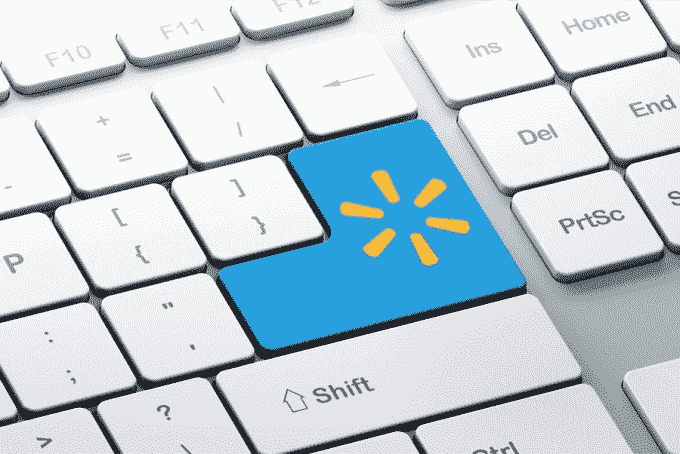

# 沃尔玛将测试三天免费送货服务，价格是亚马逊 Prime  的一半

> 原文：<https://web.archive.org/web/https://techcrunch.com/2015/05/13/walmart-to-test-a-free-three-day-shipping-service-thats-half-the-price-of-amazon-prime/>

沃尔玛正准备测试一种新的无限制运输服务，这种服务将在一定程度上与亚马逊 Prime 竞争，但价格更低，每年仅 50 美元。从今年夏天开始，运输服务将在邀请的基础上向精选客户提供，在三天或更短的时间内提供超过 100 万件产品的免费送货。

该公司尚未最终确定这项服务在未来几周推出测试版时的名称，但与亚马逊 Prime 一样，沃尔玛在线销售的产品中只有一部分可以免费送货。这些商品将在沃尔玛网站上标记或标示出来，这样顾客就可以很容易地识别哪些商品是合格的。

在网上，该公司提供超过 700 万种产品供销售，但在测试期间，100 多万件商品将有资格通过该计划免费送货。

沃尔玛尚未承诺向更广泛的公众推出这项服务，而是将其定位为其目前开展的众多市场测试中的又一项，旨在收集关于客户对不同在线和线下购物方式的兴趣和参与度的数据。

多年来，沃尔玛已经进行了许多电子商务实验，从[基于订阅的样品盒](https://web.archive.org/web/20230403230124/https://techcrunch.com/2012/11/14/undercutting-startups-walmart-launches-food-subscription-service-goodies-co-for-7-per-month/)到[当地杂货店送货](https://web.archive.org/web/20230403230124/https://techcrunch.com/2015/02/12/walmart-expands-its-online-grocery-shopping-with-store-pickup-option-to-two-more-markets/)。其中一些测试没有成功(像前者)，但该公司今天继续在阿拉巴马州亨茨维尔等市场试验当地商店提货和/或送货上门。，凤凰城，圣何塞，本顿维尔，阿肯色州。和丹佛。

然而，即将推出的亚马逊 Prime 替代品的想法不一定是为了测试客户是否想要快速、免费的送货(Prime 已经证明了他们的需求)，而是沃尔玛是否会以较低的价格吸引他们。

特别是，沃尔玛决心测试这一理论，即最吸引顾客的不是亚马逊服务的速度或现在越来越受欢迎的较新的“当天送达”服务，而是这些选择的可靠性。也就是说，你知道你的订单会在两天内到达。对于半价(Prime 现在是 99 美元/年)，客户会多等一天吗？

公司发言人 Ravi Jariwala 指出:“我们从顾客那里听到的一件事是，他们希望购物是可预测的，他们希望它是负担得起的。”。“[这个测试]真的是为了了解这是我们为客户服务的另一种新方式吗？”他说。

支持沃尔玛关于顾客对此事感兴趣的理论是[2013 年 comScore 的一项研究](https://web.archive.org/web/20230403230124/http://www.wsj.com/articles/is-same-day-delivery-overblown-1430343830)发现，如果提供免费送货，92%的消费者愿意等待四天或更长时间。这些顾客有四分之三的时间选择最经济的运输方式，只有 1%的时间选择最快的方式。

然而，亚马逊 Prime 的会员计划如今远比免费送货服务更广泛，尽管这是它最大的吸引力。它还为会员提供免费的流媒体视频和音乐，无限的照片存储，访问 Kindle 借阅图书馆等等。

沃尔玛的低成本替代方案只解决了运输方面的问题，尽管这可能会随着时间的推移而改变。如果该公司觉得有必要提供一个亚马逊的主要竞争对手，它可以利用其他资产，包括其视频流媒体服务 [Vudu](https://web.archive.org/web/20230403230124/http://www.vudu.com/) 。这项服务甚至提供了一个类似 Chromecast 的名为 [Vudu Spark](https://web.archive.org/web/20230403230124/http://www.technobuffalo.com/2015/01/25/25-vudu-spark-is-walmarts-chromecast-competitor/) 的棍子，零售价为 25 美元，如果沃尔玛想走这条路，它可以作为一个亏损领导者来鼓励注册。

沃尔玛表示，运输服务将“随着客户的反馈而发展”，这意味着它已经在考虑如何在未来使其服务与亚马逊的服务更加平等。

目前还不清楚沃尔玛计划如何选择谁将获得测试计划，但通常该公司在测试新计划时会试图找到沃尔玛购物者的代表性样本。这就是为什么它围绕杂货店送货等更有趣的实验不一定在旧金山这样的科技热点，而是在郊区甚至有点乡村的市场，在那里，在沃尔玛购物是日常生活的一部分。

该公司的官方声明紧随对沃尔玛业务的深入调查之后，今天由 [The Information](https://web.archive.org/web/20230403230124/https://www.theinformation.com/Walmart-Plans-Rival-to-Amazon-Prime) 发布。

**更新**:沃尔玛的新服务已经在 walmart.com/unlimited[上线](https://web.archive.org/web/20230403230124/http://www.walmart.com/unlimited)。