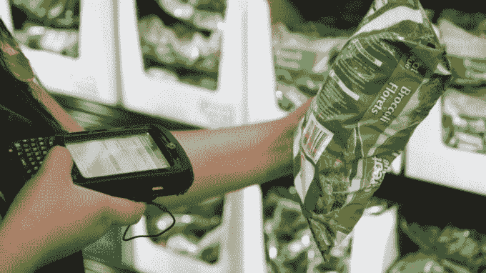
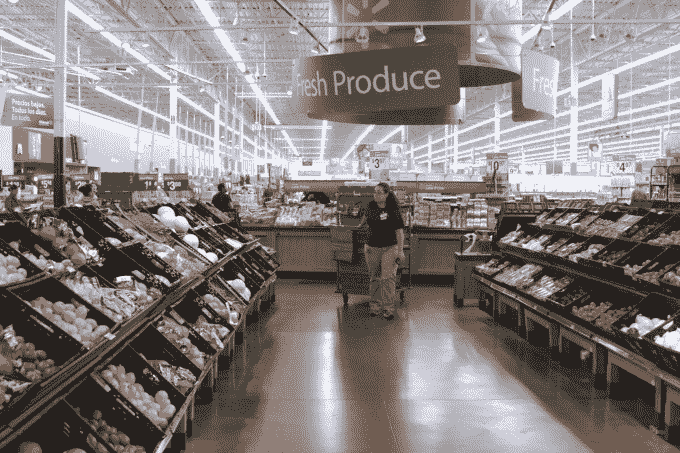

# 沃尔玛将通过优步、Lyft 和 Deliv  测试最后一英里的杂货配送

> 原文：<https://web.archive.org/web/https://techcrunch.com/2016/06/02/walmart-will-test-last-mile-grocery-delivery-via-uber-lyft-and-deliv/>

沃尔玛和山姆会员店将开始测试最后一英里杂货配送，使用包括优步、Lyft 和 Deliv 在内的服务，将顾客的订单送到他们的家。这一声明是在沃尔玛于阿肯色州举行的年度股东周上宣布的，此前一个类似的试点项目于 3 月份在迈阿密启动。在那里，沃尔玛(Walmart)旗下的山姆会员店(Sam's Club)正在使用包裹递送服务 Deliv，为该地区的企业会员测试一般商品和杂货的递送。

随着优步和 Lyft 参与新的试点项目，沃尔玛的顾客将能够在 grocery.walmart.com[的](https://web.archive.org/web/20230403234559/http://grocery.walmart.com/)使用该公司的在线杂货服务购物，然后在收银台要求交付少量费用。

该公司表示，他们将从“小规模”开始这些测试，并将让客户指导整个过程。

首批测试将于本周或下周在丹佛和凤凰城进行。在一个市场，优步将接受测试，而另一个市场将使用 Lyft。(该公司表示，将使用 UberX 驱动程序进行测试。)

顾客会像要求路边取货一样在网上下单，然后由受过专门训练的沃尔玛个人购物者来完成这些订单。这些沃尔玛员工接受过培训，知道如何挑选最好的肉类和农产品，他们会迅速将冷冻和新鲜商品放在商店后面指定的温控保存区。

沃尔玛的在线杂货店大约有 35，000 种新鲜食品、乳制品、肉类、冷冻食品、健康和美容产品、婴儿用品和消费品。

然而，在这些测试市场的结账处，沃尔玛的顾客将能够选择送货上门，而不是选择路边取货。(迈阿密 Sam's Club 的 Deliv 试验将像以前一样继续，并遵循类似的流程)

当沃尔玛购物者选择送货上门时，他们会选择一个时间框架，并支付 7 美元至 10 美元的额外送货费。这笔费用将有助于抵消使用第三方汽车服务的成本。

然后，沃尔玛的团队将要求优步或 Lyft 的司机使用普通的移动应用程序来商店。该公司表示，优步和 Lyft 正在与沃尔玛合作进行测试，当司机被召唤时，他们会以某种方式——也许是通过短信——得到警告，这些是杂货订单，而不是乘客接送。

司机拿起已经准备好的订单，前往客户的位置。沃尔玛会打电话给顾客，告诉他们订单已经在路上了。

这不是沃尔玛第一次尝试杂货配送。这家零售商在丹佛和加州圣何塞都有自己的长期 T2 杂货递送试点。然而，它还没有进一步扩大该计划。这表明该公司还没有想出如何让家庭杂货配送的经济效益作为一个内部项目取得成功，或者说客户需求没有那么强劲。

进军优步和其他第三方市场是沃尔玛现在似乎愿意考虑的另一个选择。

尽管对沃尔玛来说，杂货配送是一项漫长的实验，但最近它专注于路边取件，将其作为与越来越多的杂货配送服务的一大区别，如 Instacart、Peapod、Shipt、亚马逊和谷歌的服务。

沃尔玛一直表示，取货对其客户群更有意义，他们更关心食品的成本，而不是送货上门的便利性，后者往往价格昂贵。沃尔玛不加价，也不收取取件费。

“无论你为苹果或橙子或熟食肉片支付多少钱，都与你在网上支付的价格完全相同，”沃尔玛的公共关系总监 Ravi Jariwala 说。“pickup 的部分成功之处不仅在于节省时间，还在于节省金钱——您不必为便利支付更多费用……这就是为什么杂货提货如此受顾客欢迎的原因，”他补充道。

由于配送费用仅上涨约 10 美元，沃尔玛使用优步和 Lyft 的试点杂货配送服务可能会削弱竞争对手。

在股东大会上，沃尔玛还提供了路边提货计划的最新情况，该计划于 4 月份扩展至美国多个新市场，同时在一些较大的老牌市场的占有率也翻了一番。该公司当时表示，这使得沃尔玛能够将其足迹扩大到 30 个美国城市。它现在在 40 个市场上市，并宣布将在 6 月份扩大到 14 个。

与 2016 年 4 月初开始扩张时相比，到 7 月底，沃尔玛将把提供此项服务的商店和市场数量增加近两倍。

换句话说，尽管有这些以优步、莱夫特和迪利夫为动力的送货试验，但很明显，沃尔玛目前仍在路边捡货上下更大的赌注。