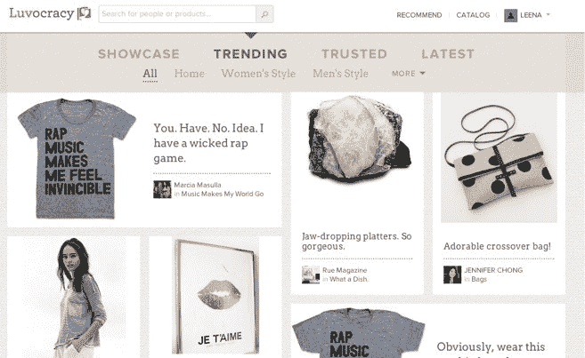

# 沃尔玛实验室收购凯鹏华盈支持的 Luvocracy，这是一个类似 Pinterest 的产品推荐市场 

> 原文：<https://web.archive.org/web/https://techcrunch.com/2014/07/29/walmartlabs-acquires-kleiner-perkins-backed-luvocracy-a-pinterest-like-marketplace-for-product-recommendations/>

[沃尔玛](https://web.archive.org/web/20221006072129/http://www.crunchbase.com/organization/walmart)的硅谷研发集团[@沃尔玛实验室](https://web.archive.org/web/20221006072129/http://www.walmartlabs.com/)今天早上宣布，它已经收购了其第 14 家初创公司，社交市场 [Luvocracy](https://web.archive.org/web/20221006072129/http://www.crunchbase.com/organization/luvocracy) 。作为交易的一部分， [@WalmartLabs](https://web.archive.org/web/20221006072129/http://www.crunchbase.com/organization/walmart-labs-2) 将从 Luvocracy 引进总共 16 名员工，包括创始人兼首席执行官[内森·斯托尔](https://web.archive.org/web/20221006072129/http://www.crunchbase.com/person/nathan-stoll)。Luvocracy 提供了类似 Pinterest 的体验，朋友和时尚人士可以为他人推荐产品。现在，该团队将致力于帮助 Walmart.com 改进其面向购物者的产品发现功能。

这个总部位于旧金山的在线社区是由斯托尔在 2011 年创建的，他在 2010 年将自己的社交搜索公司 Aardvark 出售给了谷歌。Luvocracy 的目标仍然是利用社会关系的力量，但这一次，不是建立更好的搜索，而是帮助人们从他们信任的人那里找到新产品。

Luvocracy 还为 [iOS](https://web.archive.org/web/20221006072129/https://itunes.apple.com/us/app/luvocracy/id684437187?mt=8) 和 [Android](https://web.archive.org/web/20221006072129/https://play.google.com/store/apps/details?id=com.luvocracy&hl=en) 提供移动应用，让你“喜爱”商品，并通过趋势、特色和可信的产品推荐来过滤你的订阅。

然而，在这家初创公司首次亮相后的几年里，Pinterest 已经开始主导社交产品推荐领域，尽管它在向商业方向发展方面比 Luvocracy 慢得多，Luvocracy 在推出“为我购买”服务时推出了一种简单的方式来购买你在网站上发现并喜欢的产品。包括 Fancy 和 Wanelo 在内的其他网站也迎合了这一群体。

由于斯托尔的关系和经验，Luvocracy [已经从凯鹏华盈、谷歌风投、玛丽莎·梅耶尔、阿里·平卡斯、吉姆·兰佐内、托尼·罗宾斯、CrunchFund(由 TechCrunch 创始人迈克尔·阿灵顿创建)、RPM Ventures 和 XG Ventures 获得了 1100 万美元的融资](https://web.archive.org/web/20221006072129/https://beta.techcrunch.com/2013/05/16/luvocracy-raises-11m-from-kleiner-perkins-google-ventures-and-others-to-master-ecommerce-and-social-recommendations/)。

沃尔玛实验室没有透露交易条款。

除了斯托尔之外，在与 Luvocracy 的交易中，这家初创公司的其他一些知名团队成员也加入了 WalmartLabs，包括设计副总裁布鲁克·汤普森(Brooke Thompson)，他曾是雅虎的高级设计总监，负责他们的通信、社区和主页产品；工程副总裁 Ajay Agrawal 曾是 Blurb 的工程 SVP，曾在易贝、微软和甲骨文任职；创意总监克里斯汀·马丁内斯(Christine Martinez)是 Pinterest 上的“Power Pinner”，拥有超过 500 万名粉丝，他还创建了 LAMA，这是一家代表全球艺术家和制造商的电子商务精品。

Luvocracy 的 20 名团队成员中，有 16 人将被调到沃尔玛电子商务公司位于加州圣布鲁诺的总部。

在很大程度上，沃尔玛对奢侈品背后的人才更感兴趣，而不是产品本身。

展望未来，该计划是关闭 Luvocracy 服务，但如何向 Luvocracy 的 50 万会员传达这一信息的细节尚未敲定。

然而，在沃尔玛，该团队将面临类似的挑战，尽管规模更大。具体来说，该团队将致力于“设计、产品和发现购物”方面的创新。

斯托尔说:“商业领域没有比沃尔玛更大的舞台，有机会将我们对社会发现和商业决策的愿景带给全球数亿观众，这是一件非常有吸引力的事情。”。“有机会与他们一直在打造的非常有才华的团队一起工作，我感到非常兴奋。他补充道:“现在，他们的全球电子商务组织的规模与我 2002 年加入谷歌时差不多——巨大的增长机会即将到来，因为他们有如此多尚未开发的潜力。”

沃尔玛实验室多年来一直通过收购帮助沃尔玛培养技术人才，其中许多收购为其电子商务属性的大规模改善和变化做出了贡献。例如，其早期收购的 Kosmix 是 2012 年在 Walmart.com 发布的改进后的搜索引擎的幕后推手。

该公司还收购了许多公司，以帮助它对抗竞争对手亚马逊，包括[网站速度优化器 Torbit](https://web.archive.org/web/20221006072129/https://beta.techcrunch.com/2013/07/24/walmart-labs-scoops-up-website-optimization-startup-torbit-to-help-it-keep-pace-with-amazon/) 、[数据分析和预测智能初创公司 Inkiru](https://web.archive.org/web/20221006072129/https://beta.techcrunch.com/2013/06/10/walmart-labs-buys-data-analytics-and-predictive-intelligence-startup-inkiru/) 、 [adtech 初创公司 Adchemy](https://web.archive.org/web/20221006072129/https://beta.techcrunch.com/2014/05/05/walmartlabs-buys-adtech-startup-adchemy-its-biggest-talent-deal-yet/) 、[移动代理小社会](https://web.archive.org/web/20221006072129/https://beta.techcrunch.com/2012/01/04/walmartlabs-acquires-mobile-agency-small-society/)、[云计算初创公司 OneOps、](https://web.archive.org/web/20221006072129/https://beta.techcrunch.com/2013/05/14/walmartlabs-acquires-cloud-computing-startup-oneops-delicious-founders-tasty-labs/)以及许多其他公司。