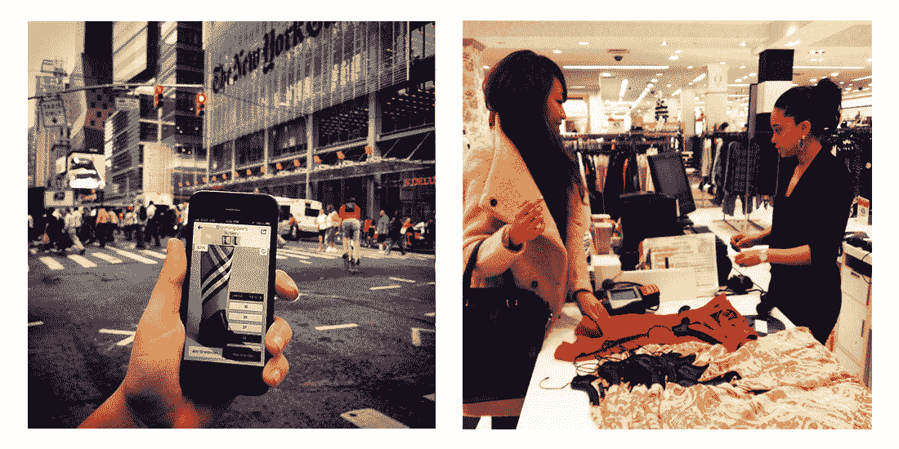
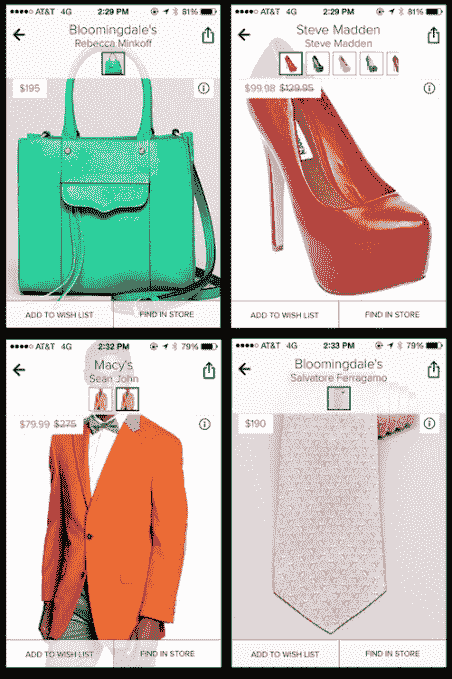

# @ WalmartLabs 通过收购时尚应用 Stylr TechCrunch 获得了其第一家“硅巷”初创公司

> 原文：<https://web.archive.org/web/https://techcrunch.com/2014/06/16/walmartlabs-grabs-its-first-silicon-alley-startup-with-acquisition-of-fashion-app-stylr/>

[@WalmartLabs](https://web.archive.org/web/20221205191853/http://www.walmartlabs.com/) ，这家零售商位于硅谷的研发和创新中心，今天宣布了它的第 13 次收购——也是第一次来自纽约的[硅巷](https://web.archive.org/web/20221205191853/http://en.wikipedia.org/wiki/Silicon_Alley)——收购时尚应用 [Stylr](https://web.archive.org/web/20221205191853/http://www.crunchbase.com/organization/stylr) 。这个帮助消费者在附近商店找到他们喜欢的衣服的应用程序将被关闭。它将于本月底从 iTunes 应用商店下架。

交易的条款没有披露，但我们知道这更像是将创始人 Eytan Daniyalzade 和 [Berk Atikoglu](https://web.archive.org/web/20221205191853/http://www.crunchbase.com/person/berk-atikoglu) 的才能引入沃尔玛。

Stylr 是一家较小的公司，收购时只有两位创始人。该公司得到了 dream it Ventures 2 万美元的支持，但没有其他外部投资。

两位创始人都是斯坦福大学毕业的工程师，都有在科技行业工作的经历。Stylr 首席技术官 Atikoglu 曾在思科和脸书工作，Daniyalzade 曾在 Adapt.tv、Chartbeat、微软和麦肯锡工作过。

至于[应用](https://web.archive.org/web/20221205191853/https://itunes.apple.com/us/app/stylr-local-shopping-for-clothing/id605656820?mt=8)本身，Stylr 提供了在智能手机上翻阅一架子衣服的体验。它从当地商店拉进库存，让你找到你想要的尺寸，然后直接通过应用程序的界面在商店预订。该公司已经发展到包括许多知名零售商的数千种产品，包括 Abercrombie & Fitch、American Apparel、American Eagle、Banana Republic、蔻驰、Gap、Guess、Neiman Marcus、Nordstrom、Saks Fifth Avenue、Steve Madden、The Limited 等。

Stylr 开发的技术不会集成到沃尔玛自己的移动应用程序中，但沃尔玛表示，它将“利用 Stylr 学到的最佳实践和见解”，在将数字功能与实体零售相结合方面，两家公司之间有“很多协同效应”。这可能意味着沃尔玛正在努力——更广泛地说——以新的方式更好地将其在线业务与零售商店结合起来。

目前，沃尔玛表示，Stylr 的联合创始人将负责“改善店内体验”。

今天，该公司报告称，超过一半的沃尔玛智能手机用户在商店购物时使用过他们的设备，80%的 35 岁以下顾客拥有智能手机，这一数字正在快速增长。特别是 Stylr 给沃尔玛团队留下深刻印象的是团队构建应用程序的速度、使用它的整体体验以及创始人对结合实体和数字零售的热情。

随着该应用的关闭，Stylr 的创始人现在将加入加州圣布鲁诺的@ WalmartLabs。