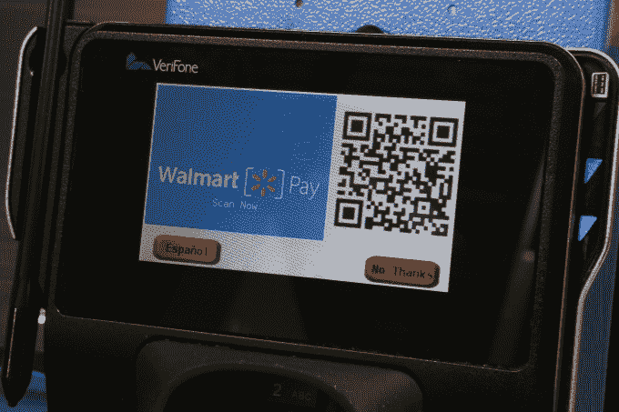

# 沃尔玛的应用程序现在将让药店和货币服务客户跳过排队 

> 原文：<https://web.archive.org/web/https://techcrunch.com/2017/02/27/walmarts-app-will-now-let-pharmacy-and-money-services-customers-skip-the-line/>

沃尔玛表示，该公司今天推出了一款更新的应用程序，可以让那些前往商店药房或货币服务柜台的人不必排队等候。在应用程序中输入个人信息后，客户可以通过手机订购处方药或填写其他必要的文书工作。当他们到达商店时，他们将进入一条新的“快速通道”，让他们排在队伍的前面，领先于那些已经在等待的人。

这一更新正值许多企业正在学习如何利用他们的移动存在来促进他们商店的更快交易。

星巴克、Dunkin' Donuts 和 Chipotle 等快餐餐厅已经在其应用程序中引入了“提前订购”功能，例如，顾客可以在到达之前下单并付款。与此同时， [CVS 今年夏天推出了一种方式](https://web.archive.org/web/20221209002720/https://beta.techcrunch.com/2016/08/11/cvs-pharmacy-launches-its-own-mobile-payments-and-loyalty-solution-cvs-pay/),可以支付产品费用、领取处方以及从其应用程序中获得忠诚度奖励。

虽然沃尔玛的应用程序不是关于订购食品或饮料，或一般购物，但概念是相似的:它使用移动设备来更快地进行现实世界的交易。

该公司解释说，在修改后的应用程序中输入您的处方信息后，客户将能够在短短几个步骤中完成交易。

对于处方，他们将打开应用程序并点击“处方准备好取药”，然后输入他们的 PIN 码或使用触控 ID 来激活相机。在收银台，他们会扫描显示在那里的代码，这将应用程序与当前交易联系起来。沃尔玛员工会交出处方，交易就完成了。支付由 Walmart Pay 处理，电子收据发送到应用程序。

以前，客户可以在应用程序中重新配药，但不能像现在这样跟踪订单状态、查看价格或管理取药详情。

提醒一下，Walmart Pay 是沃尔玛自己的移动支付服务。这项服务依赖于可扫描的二维码，它作为连接手机和收银机的手段，在零售商店获得了惊人的收益。沃尔玛的移动支付服务于 2015 年 12 月在首次宣布[，去年 7 月](https://web.archive.org/web/20221209002720/https://beta.techcrunch.com/2015/12/09/walmart-pay/)[在全国](https://web.archive.org/web/20221209002720/http://news.walmart.com/2016/07/06/walmart-pay-now-available-in-all-walmart-stores-nationwide)所有美国商店推出，此前该零售商更灾难性地试图与一个财团支持的 Apple Pay 竞争对手 Current C 合作，后者于去年分崩离析。

像沃尔玛药房一样，货币服务台将使用类似的技术通过应用程序发送资金。该公司表示，如今，每个月都有数百万顾客从沃尔玛商店转账。现在，他们可以在应用程序中填写他们的文书工作，然后点击“准备汇款”开始转账过程。

同样，他们将使用一个 PIN 或触控 ID 来激活摄像头，并扫描收银台的代码。然后，客户将验证他们的信息并付款。收据和参考号被发送到应用程序，可以通过短信或电子邮件发送给收件人。

近 1200 家商店将提供货币服务，沃尔玛将为应用程序用户提供快速通道。

包括货币服务和药房“快速通道”在内的新功能将于今年 3 月开始推出，预计到今年秋天将支持沃尔玛几乎所有的 4700 家门店。该应用每月覆盖超过 2600 万用户，将在 iOS 和 Android 上引入新功能。