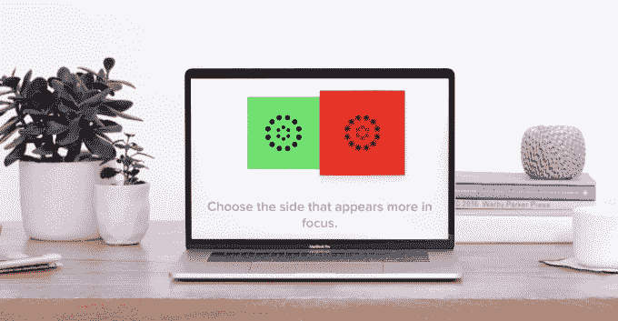

# Warby Parker 的处方检查应用程序让你跳过眼科医生 

> 原文：<https://web.archive.org/web/https://techcrunch.com/2017/05/23/warby-parker-prescription-check/>

# Warby Parker 的处方检查应用程序让你跳过眼科医生

Warby Parker 希望为您提供合适的处方眼镜，而不会强迫您亲自进行视力测试。现在[正在测试](https://web.archive.org/web/20221206112648/https://www.warbyparker.com/prescription-check-app)其新的[处方检查应用](https://web.archive.org/web/20221206112648/https://itunes.apple.com/us/app/prescription-check/id1209102842?ls=1&mt=8)，该应用使用你的手机和电脑进行一系列 20 分钟的眼部测试，然后由医生进行审查，最后给你开处方。这可能会让 Warby Parker 凭冲动向人们出售处方眼镜，而不是希望顾客在通过传统方式获得处方后再次光顾。

目前，Warby Parker 表示，只有加利福尼亚、佛罗里达、纽约和弗吉尼亚年龄在 18 至 40 岁之间、已经拥有 Warby Parker 眼镜的人才有资格进行测试。最初，Warby Parker 只会确认某人现有的处方仍然正确，然后才允许该应用程序在未来为用户提供更新的处方。

最终，Warby Parker 可以更广泛地推出处方检查，让来自更广泛地区的新客户加入进来。尽管值得注意的一件重要事情是，Warby Parker 强调人们仍然需要定期的眼科检查来检查医疗状况，所以你不能完全抛弃眼科医生。[公司](https://web.archive.org/web/20221206112648/https://www.inc.com/magazine/201706/tom-foster/warby-parker-eyewear.html)昨天在这家初创公司的简介中提到了这项新功能。

没有处方检查，Warby Parker 的用户不得不要么自己找医生开处方，要么去这家初创公司大约 50 个零售点中的一个，这些零售点大多都在大城市。处方检查的技术工作原理与初创公司 [Opternative](https://web.archive.org/web/20221206112648/https://www.opternative.com/) 极其相似，后者[已经筹集了 950 万美元](https://web.archive.org/web/20221206112648/https://www.crunchbase.com/organization/opternative)，并且自 [2014](https://web.archive.org/web/20221206112648/https://beta.techcrunch.com/2014/02/25/do-i-need-glasses/) 以来一直在做[在线视力测试](https://web.archive.org/web/20221206112648/https://beta.techcrunch.com/2015/07/27/online-eye-test/)。然而，它遇到了来自验光师和眼科医生组织的监管阻力，试图保护他们的店内视力测试业务。

处方检查测试让用户站在显示视力测试的电脑屏幕前，同时阅读他们手持的手机上的说明。手机的摄像头可以测量放在电脑屏幕角落的信用卡，以确定距离和屏幕大小，以便正确配置测试。

有消息称，Warby Parker 长期以来一直致力于处方检查的想法，并考虑建立和购买必要的技术。现在，Warby Parker 似乎已经自己建造了它。“我们已经探索视觉技术很长时间了，”Warby Parker 的发言人告诉我。“我们无法找到用户体验符合我们标准的现有技术，所以我们决定自己开发。”具体来说，Warby Parker 已经申请了一项专利，可以用手机摄像头测量到屏幕的距离，而不是像 Opternative 那样用脚或其他方式测量。

由于 Warby Parker 已经专注于互联网销售，处方检查应用程序和技术可能会使其比零售店更具优势。电子商务的全部意义在于消除麻烦，没有什么比必须先预约医生更能破坏网上购物体验的了。