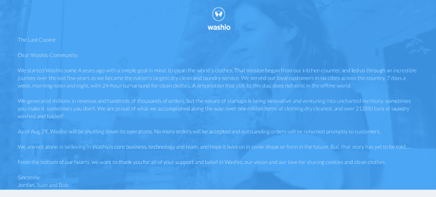

# Washio 按需洗衣服务关闭运营 

> 原文：<https://web.archive.org/web/https://techcrunch.com/2016/08/30/washio-on-demand-laundry-service-shuts-down-operations/>

2013 年推出的按需洗衣初创公司 Washio 今天宣布将停止服务。

在网站上发布的一封信中，Washio 创始人宣布公司将停止运营，立即生效。没有新的订单将通过该服务，未完成的订单将立即返回给客户。

下面可以看完整封关停信。

消息人士告诉 TechCrunch，Washio 正在四处寻找可能对收购感兴趣的各种竞争对手，但似乎这些对话都没有取得成果。

据 [CrunchBase](https://web.archive.org/web/20230130235315/https://www.crunchbase.com/organization/washio#/entity) 报道，Washio 在四轮投资中筹集了总计 1682 万美元的资金，投资者包括迦南合伙公司、AME 风险投资公司以及阿什顿·库彻和 Nas 等知名天使投资人。

当 Washio 最初推出时，它提供了一项服务，可以在预定时间提取用户的衣物或干洗衣物，有时最早可以在下单后 24 小时内提取。2015 年，该公司推出了 Washio Now，保证在订购后一小时内提货，衣服的周转时间为 24 小时。

Washio 发展到为波士顿、洛杉矶、芝加哥、旧金山、奥克兰、纽约和华盛顿特区提供服务

不幸的是，按需经济通常利润率很低，需要快速增长和扩张来弥补开拓地盘的成本。Washio 并不是唯一一家遭受按需定制成长之痛的公司——Handy cleaning service 去年经历了一些[的艰难时期](https://web.archive.org/web/20230130235315/http://www.slate.com/articles/business/moneybox/2015/07/handy_a_hot_startup_for_home_cleaning_has_a_big_mess_of_its_own.html)和 [Homejoy 完全关闭](https://web.archive.org/web/20230130235315/https://techcrunch.com/2015/07/17/homejoy-is-shutting-down-at-the-end-of-the-month/)。

最重要的是，Washio 在过去几年里经历了来自纽约的 [Flycleaners](https://web.archive.org/web/20230130235315/http://flycleaners.com/) 、 [Rinse](https://web.archive.org/web/20230130235315/https://www.rinse.com/) 和[cleanely](https://web.archive.org/web/20230130235315/https://cleanly.com/)等公司的激烈竞争，这些公司已经在纽约运营，并将在未来几周内在华盛顿特区推出。

以下是 Washio 写给顾客的信:

> 亲爱的瓦希欧社区:
> 
> 大约 4 年前，我们怀着一个简单的目标创立了 Washio:清洗全世界的衣物。这个使命从我们的厨房柜台开始，并在过去几年里带领我们走过了一段不可思议的旅程，我们成为了美国最大的干洗和洗衣服务公司。我们为全国六个城市的忠实顾客提供服务，一周 7 天，早中晚，24 小时提供干净衣服。直到今天，这个命题仍然不存在于线下世界。
> 
> 我们创造了数百万美元的收入和数十万份订单，但创业公司的本质是创新和冒险进入未知领域:有时你会成功，有时不会。我们为自己一路走来所取得的成就感到自豪:干洗了 100 多万件衣物，洗涤和折叠了 21，000 多吨衣物！
> 
> 截至 8 月 29 日，Washio 将关闭其业务。我们将不再接受订单，未完成的订单将立即退还给客户。
> 
> 我们并不是唯一相信 Washio 的核心业务、技术和团队的人，并希望它在未来以某种形式存在。但是，这个故事还没有被讲述…
> 
> 我们衷心感谢你们对 Washio 的支持和信任，我们的愿景以及我们对分享饼干和干净衣服的热爱。
> 
> 真诚地，
> 乔丹、胡安和鲍勃
> 瓦希欧联合创始人

我们联系了 Washio 寻求置评，但他们没有回应。

